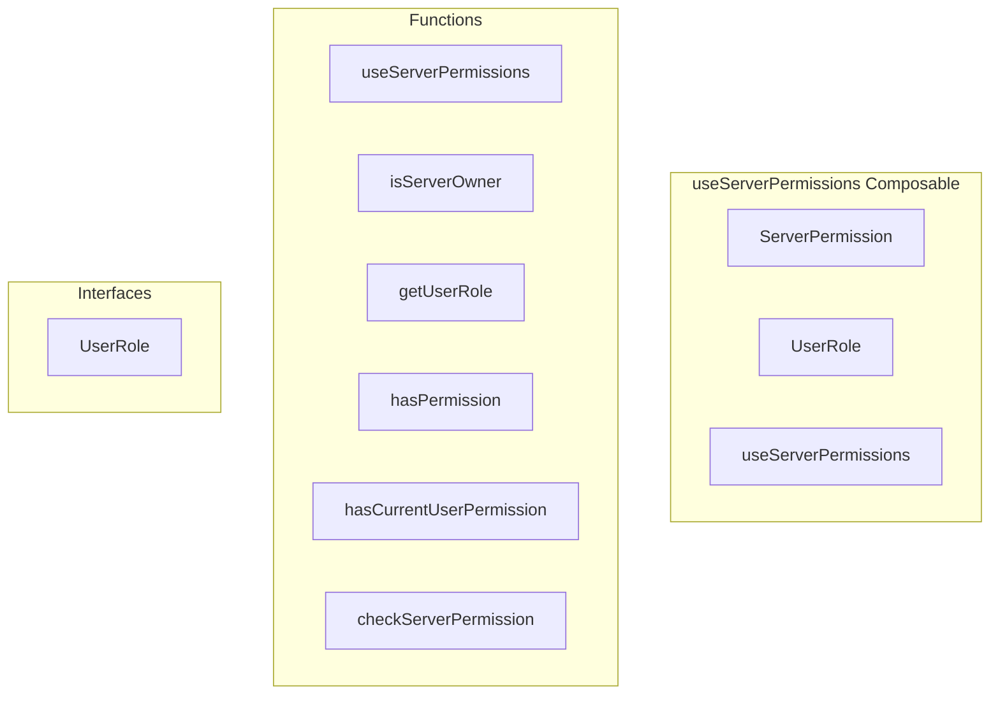

# useServerPermissions Composable

**File:** `src/composables/useServerPermissions.ts`

## Overview


```mermaid
graph TB
    subgraph "useServerPermissions Composable"
        SERVERPERMISSION[ServerPermission]
        USERROLE[UserRole]
        USESERVERPERMISSIONS[useServerPermissions]
    end
    
    subgraph "Functions"
        FN_USESERVERPERMISSIONS[useServerPermissions]
        FN_ISSERVEROWNER[isServerOwner]
        FN_GETUSERROLE[getUserRole]
        FN_HASPERMISSION[hasPermission]
        FN_HASCURRENTUSERPERMISSION[hasCurrentUserPermission]
        FN_CHECKSERVERPERMISSION[checkServerPermission]
    end
    
    subgraph "Interfaces"
        INT_USERROLE[UserRole]
    end
```


## Exports

- **ServerPermission** - enum export
- **UserRole** - interface export
- **useServerPermissions** - function export

## Functions

### `useServerPermissions()`

No description available.

**Parameters:**
None

**Returns:** `void`

```typescript
export function useServerPermissions()
```

### `isServerOwner(serverId: string, profileId?: string)`

No description available.

**Parameters:**
- `serverId: string`
- `profileId?: string`

**Returns:** `boolean`

```typescript
const isServerOwner = (serverId: string, profileId?: string): boolean =>
```

### `getUserRole(serverId: string, profileId?: string)`

No description available.

**Parameters:**
- `serverId: string`
- `profileId?: string`

**Returns:** `UserRole`

```typescript
const getUserRole = (serverId: string, profileId?: string): UserRole =>
```

### `hasPermission(serverId: string, profileId: string, permission: ServerPermission)`

No description available.

**Parameters:**
- `serverId: string`
- `profileId: string`
- `permission: ServerPermission`

**Returns:** `boolean`

```typescript
const hasPermission = (
    serverId: string, 
    profileId: string, 
    permission: ServerPermission
  ): boolean =>
```

### `hasCurrentUserPermission(permission: ServerPermission)`

No description available.

**Parameters:**
- `permission: ServerPermission`

**Returns:** `boolean`

```typescript
const hasCurrentUserPermission = (permission: ServerPermission): boolean =>
```

### `checkServerPermission(serverId: string, permission: ServerPermission, userId?: string)`

No description available.

**Parameters:**
- `serverId: string`
- `permission: ServerPermission`
- `userId?: string`

**Returns:** `boolean`

```typescript
const checkServerPermission = (
    serverId: string, 
    permission: ServerPermission, 
    userId?: string
  ): boolean =>
```


## Interfaces

### UserRole

No description available.

```typescript
interface UserRole {

  id: string
  name: string
  permissions: ServerPermission[]
  isOwner: boolean
  isModerator: boolean
  isAdmin: boolean
  color?: string
  position: number

}
```


## Source Code Insights

**File Size:** 7208 characters
**Lines of Code:** 224
**Imports:** 7

## Usage Example

```typescript
import { ServerPermission, UserRole, useServerPermissions } from '@/composables/useServerPermissions'

// Example usage
useServerPermissions()
```

---

*This documentation was automatically generated from the source code.*