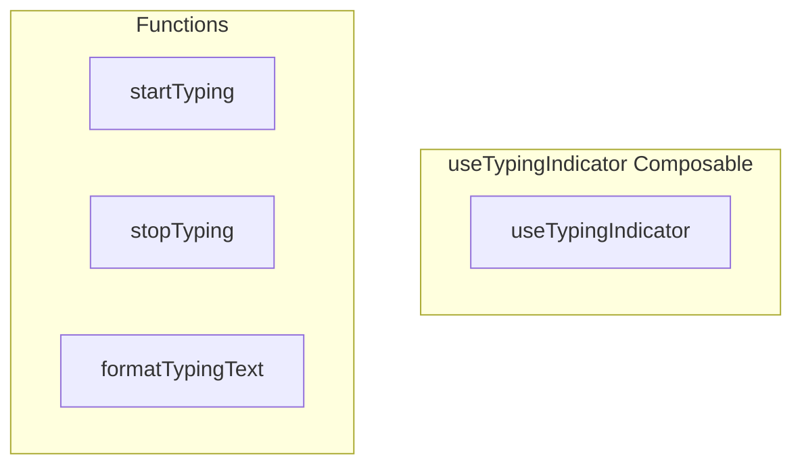

# useTypingIndicator Composable

**File:** `src/composables/useTypingIndicator.ts`

## Overview




## Exports

- **useTypingIndicator** - function export

## Functions

### `startTyping()`

No description available.

**Parameters:**
None

**Returns:** `Unknown`

```typescript
/**
 * useTypingIndicator - Composable for typing indicators
 * 
 * Provides a simple, DRY way to:
 * - Track typing in channels, threads, or conversations
 * - Display typing indicators
 * - Automatically handle cleanup
 */

import { ref, onUnmounted, watchEffect } from 'vue'
import { typingIndicatorService, type TypingContext, type TypingUser } from '@/services/TypingIndicatorService'
import { useAuthStore } from '@/stores/auth'

/**
 * Composable for tracking and displaying typing indicators
 */
export function useTypingIndicator(context: TypingContext | null | (() => TypingContext | null)) {
  const typingUsers = ref<TypingUser[]>([])
  const authStore = useAuthStore()
  let unsubscribe: (() => void) | null = null
  let currentSubscribedKey = ''
  let isSubscribing = false

  // Handle both computed refs and direct values
  const getContext = () => {
    if (typeof context === 'function') {
      return context()
    }
    return context
  }

  // Get serialized context key for comparison
  const getContextKey = (ctx: TypingContext | null): string => {
    if (!ctx) return 'null'
    if ('channelId' in ctx) return `channel:${ctx.channelId}`
    if ('threadId' in ctx) return `thread:${ctx.threadId}`
    if ('conversationId' in ctx) return `conversation:${ctx.conversationId}`
    return 'unknown'
  }

  // Subscribe to typing updates for a given context
  const subscribeToContext = async (ctx: TypingContext | null, key: string): Promise<void> => {
    // Skip if already subscribed to this exact context
    if (key === currentSubscribedKey && unsubscribe) {
      return
    }
    
    // Prevent concurrent subscription attempts
    if (isSubscribing) {
      return
    }
    
    // Cleanup previous subscription
    if (unsubscribe) {
      unsubscribe()
      unsubscribe = null
      currentSubscribedKey = ''
    }
    
    if (!ctx) {
      typingUsers.value = []
      currentSubscribedKey = ''
      return
    }
    
    // Ensure we have auth before subscribing
    if (!authStore.session?.user?.id) {
      return
    }
    
    isSubscribing = true
    
    try {
      await typingIndicatorService.initialize()
      
      unsubscribe = typingIndicatorService.subscribeToTyping(ctx, (users) => {
        typingUsers.value = users
      })
      currentSubscribedKey = key
    } catch {
      // Silently fail - typing indicators are non-critical
    } finally {
      isSubscribing = false
    }
  }

  // Use watchEffect to automatically track reactive dependencies
  watchEffect(async () => {
    const session = authStore.session
    const userId = session?.user?.id
    const ctx = getContext()
    const key = getContextKey(ctx)
    
    if (ctx && key !== 'null' && userId) {
      await subscribeToContext(ctx, key)
    } else if (!ctx || key === 'null') {
      if (unsubscribe) {
        unsubscribe()
        unsubscribe = null
      }
      typingUsers.value = []
      currentSubscribedKey = ''
    }
  })

  // Cleanup on unmount
  onUnmounted(() => {
    if (unsubscribe) {
      unsubscribe()
      unsubscribe = null
    }
    currentSubscribedKey = ''
    isSubscribing = false
  })

  /**
   * Start tracking typing (call when user types)
   */
  const startTyping = async () =>
```

### `stopTyping()`

No description available.

**Parameters:**
None

**Returns:** `Unknown`

```typescript
/**
   * Stop tracking typing (call when user sends message or stops typing)
   */
  const stopTyping = async () =>
```

### `formatTypingText(users: TypingUser[], getUserDisplayName: (userId: string)`

No description available.

**Parameters:**
- `users: TypingUser[]`
- `getUserDisplayName: (userId: string`

**Returns:** `Unknown`

```typescript
/**
   * Format typing indicator text
   */
  const formatTypingText = (users: TypingUser[], getUserDisplayName: (userId: string) =>
```


## Source Code Insights

**File Size:** 4492 characters
**Lines of Code:** 158
**Imports:** 3

## Usage Example

```typescript
import { useTypingIndicator } from '@/composables/useTypingIndicator'

// Example usage
startTyping()
```

---

*This documentation was automatically generated from the source code.*