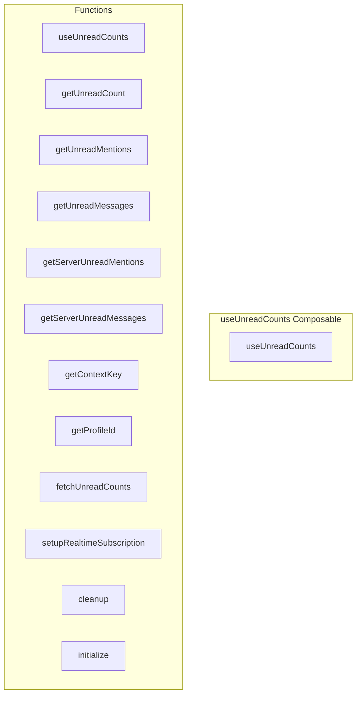

# useUnreadCounts Composable

**File:** `src/composables/useUnreadCounts.ts`

## Overview




## Exports

- **useUnreadCounts** - function export

## Functions

### `useUnreadCounts()`

No description available.

**Parameters:**
None

**Returns:** `void`

```typescript
/**
 * Composable for managing unread message and mention counts
 * Tracks unread counts per channel, server, and conversation
 * 
 * OPTIMIZED: Uses AuthContextService for cached profile ID lookup
 */
export function useUnreadCounts()
```

### `getUnreadCount(context: {
    serverId?: string
    channelId?: string
    conversationId?: string
  })`

No description available.

**Parameters:**
- `context: {
    serverId?: string
    channelId?: string
    conversationId?: string
  }`

**Returns:** `UnreadCount | null`

```typescript
/**
 * Composable for managing unread message and mention counts
 * Tracks unread counts per channel, server, and conversation
 * 
 * OPTIMIZED: Uses AuthContextService for cached profile ID lookup
 */
export function useUnreadCounts() {
  const unreadCounts = ref<Map<string, UnreadCount>>(new Map())
  const isLoading = ref(false)
  let realtimeSubscription: any = null
  let cachedProfileId: string | null = null

  /**
   * Get unread count for a specific context
   */
  const getUnreadCount = (context: {
    serverId?: string
    channelId?: string
    conversationId?: string
  }): UnreadCount | null =>
```

### `getUnreadMentions(context: {
    serverId?: string
    channelId?: string
    conversationId?: string
  })`

No description available.

**Parameters:**
- `context: {
    serverId?: string
    channelId?: string
    conversationId?: string
  }`

**Returns:** `number`

```typescript
/**
   * Get unread mentions count for a specific context
   */
  const getUnreadMentions = (context: {
    serverId?: string
    channelId?: string
    conversationId?: string
  }): number =>
```

### `getUnreadMessages(context: {
    serverId?: string
    channelId?: string
    conversationId?: string
  })`

No description available.

**Parameters:**
- `context: {
    serverId?: string
    channelId?: string
    conversationId?: string
  }`

**Returns:** `number`

```typescript
/**
   * Get unread messages count for a specific context
   */
  const getUnreadMessages = (context: {
    serverId?: string
    channelId?: string
    conversationId?: string
  }): number =>
```

### `getServerUnreadMentions(serverId: string)`

No description available.

**Parameters:**
- `serverId: string`

**Returns:** `number`

```typescript
/**
   * Get total unread mentions for a server (sum across all channels)
   */
  const getServerUnreadMentions = (serverId: string): number =>
```

### `getServerUnreadMessages(serverId: string)`

No description available.

**Parameters:**
- `serverId: string`

**Returns:** `number`

```typescript
/**
   * Get total unread messages for a server (sum across all channels)
   */
  const getServerUnreadMessages = (serverId: string): number =>
```

### `getContextKey(context: {
    serverId?: string
    channelId?: string
    conversationId?: string
  })`

No description available.

**Parameters:**
- `context: {
    serverId?: string
    channelId?: string
    conversationId?: string
  }`

**Returns:** `string`

```typescript
/**
   * Generate a unique key for a context
   */
  const getContextKey = (context: {
    serverId?: string
    channelId?: string
    conversationId?: string
  }): string =>
```

### `getProfileId()`

No description available.

**Parameters:**
None

**Returns:** `Promise&lt;string | null&gt;`

```typescript
/**
   * Get profile ID (uses cached AuthContextService)
   */
  const getProfileId = async (): Promise<string | null> =>
```

### `fetchUnreadCounts(_userId?: string)`

No description available.

**Parameters:**
- `_userId?: string`

**Returns:** `Promise&lt;void&gt;`

```typescript
/**
   * Fetch unread counts from database
   * OPTIMIZED: Uses AuthContextService for cached profile ID lookup
   */
  const fetchUnreadCounts = async (_userId?: string): Promise<void> =>
```

### `setupRealtimeSubscription()`

No description available.

**Parameters:**
None

**Returns:** `Promise&lt;void&gt;`

```typescript
/**
   * Setup real-time subscription for unread counts
   * OPTIMIZED: Uses cached profile ID from AuthContextService
   */
  const setupRealtimeSubscription = async (): Promise<void> =>
```

### `cleanup()`

No description available.

**Parameters:**
None

**Returns:** `void`

```typescript
/**
   * Cleanup real-time subscription
   */
  const cleanup = (): void =>
```

### `initialize()`

No description available.

**Parameters:**
None

**Returns:** `Promise&lt;void&gt;`

```typescript
/**
   * Initialize - fetch counts and setup real-time
   * OPTIMIZED: Uses AuthContextService for cached auth lookup
   */
  const initialize = async (): Promise<void> =>
```


## Source Code Insights

**File Size:** 7343 characters
**Lines of Code:** 265
**Imports:** 5

## Usage Example

```typescript
import { useUnreadCounts } from '@/composables/useUnreadCounts'

// Example usage
useUnreadCounts()
```

---

*This documentation was automatically generated from the source code.*