# useUserData Composable

**File:** `src/composables/useUserData.ts`

## Overview

```mermaid
graph TB
    subgraph "useUserData Composable"
        USEUSERDATA[useUserData]
    end
    
    subgraph "Functions"
        FN_USEUSERDATA[useUserData]
        FN_GETUSER[getUser]
        FN_GETUSERAVATARURL[getUserAvatarUrl]
        FN_GETUSERDISPLAYNAME[getUserDisplayName]
        FN_GETUSERSTATUSTEXT[getUserStatusText]
        FN_GETUSERCOLOR[getUserColor]
        FN_ISUSERONLINE[isUserOnline]
        FN_GETUSERSTATUS[getUserStatus]
        FN_GETUSERCREATEDAT[getUserCreatedAt]
        FN_GETUSERPROFILE[getUserProfile]
        FN_GETUSERBIO[getUserBio]
        FN_GETUSERROLES[getUserRoles]
        FN_GETUSERMESSAGECOUNT[getUserMessageCount]
        FN_GETUSERVOICETIME[getUserVoiceTime]
        FN_GETUSERBANNERURL[getUserBannerUrl]
        FN_ISUSERLOCAL[isUserLocal]
        FN_GETUSERDOMAIN[getUserDomain]
        FN_FETCHUSERPROFILE[fetchUserProfile]
        FN_FETCHMULTIPLEUSERPROFILES[fetchMultipleUserProfiles]
        FN_ENSUREPROFILESAVAILABLE[ensureProfilesAvailable]
        FN_INITIALIZE[initialize]
        FN_INITIALIZEBACKGROUNDFEATURES[initializeBackgroundFeatures]
        FN_SUBSCRIBETOCONTEXT[subscribeToContext]
        FN_UNSUBSCRIBEFROMCONTEXT[unsubscribeFromContext]
        FN_UPDATECURRENTUSERSTATUS[updateCurrentUserStatus]
        FN_SETCUSTOMSTATUS[setCustomStatus]
        FN_CLEARCUSTOMSTATUS[clearCustomStatus]
        FN_ISUSERMOBILE[isUserMobile]
        FN_GETUSERCUSTOMSTATUS[getUserCustomStatus]
        FN_UPDATECURRENTUSERPROFILE[updateCurrentUserProfile]
        FN_REFRESH[refresh]
        FN_GETUSERSINCONTEXT[getUsersInContext]
        FN_SUBSCRIBETODMPRESENCE[subscribeToDMPresence]
        FN_SUBSCRIBETOPROFILEPRESENCE[subscribeToProfilePresence]
        FN_SUBSCRIBETOFRIENDSPRESENCE[subscribeToFriendsPresence]
        FN_GETPRESENCEAWARESTATUS[getPresenceAwareStatus]
        FN_UNSUBSCRIBEFROMPROFILEPRESENCE[unsubscribeFromProfilePresence]
        FN_UPDATEDMPRESENCE[updateDMPresence]
        FN_UPDATEFRIENDSPRESENCE[updateFriendsPresence]
    end
```




## Exports

- **useUserData** - function export

## Functions

### `useUserData()`

No description available.

**Parameters:**
None

**Returns:** `void`

```typescript
export function useUserData()
```

### `getUser(userId: string)`

No description available.

**Parameters:**
- `userId: string`

**Returns:** `Unknown`

```typescript
/**
 * useUserData Composable
 * 
 * Clean, simple wrapper around userDataService for component usage.
 * Provides reactive user data without the complexity of the old system.
 */

import { computed, ref } from 'vue'
import { userDataService } from '@/services/userDataService'
import { UserStatus } from '@/types'
import { getAvatarUrl } from '@/utils/avatarUtils'
import { debug } from '@/utils/debug'

export function useUserData() {
  const isInitialized = ref(false)
  const forceUpdate = ref(0)
  
  // Force reactivity by updating the counter
  const triggerUpdate = () => {
    forceUpdate.value++
  }
  
  // Setup event listeners
  const setupEventListeners = () => {
    const listeners = [
      { type: 'user-updated', listener: triggerUpdate },
      { type: 'status-changed', listener: triggerUpdate },
      { type: 'custom-status-changed', listener: triggerUpdate },
      { type: 'presence-sync', listener: triggerUpdate },
      { type: 'data-refreshed', listener: triggerUpdate },
      { type: 'context-updated', listener: triggerUpdate },
      { type: 'global-presence-updated', listener: triggerUpdate }
    ]
    
    listeners.forEach(({ type, listener }) => {
      userDataService.addEventListener(type, listener)
    })
  }
  
  // Initialize immediately when composable is used
  const ensureInitialized = () => {
    if (!isInitialized.value) {
      setupEventListeners()
      isInitialized.value = true
    }
  }
  
  // Initialize immediately
  ensureInitialized()
  
  // User Data Getters (all reactive)
  
  /**
   * Get complete user data
   */
  const getUser = (userId: string) =>
```

### `getUserAvatarUrl(userId: string)`

No description available.

**Parameters:**
- `userId: string`

**Returns:** `Unknown`

```typescript
/**
   * Get current user data
   */
  const getCurrentUser = computed(() => {
    forceUpdate.value // Force reactivity
    return userDataService.getCurrentUser()
  })
  
  /**
   * Get user avatar URL
   */
  const getUserAvatarUrl = (userId: string) =>
```

### `getUserDisplayName(userId: string)`

No description available.

**Parameters:**
- `userId: string`

**Returns:** `Unknown`

```typescript
/**
   * Get user avatar URL for current user
   * Always use getAvatarUrl to handle null/undefined and optimization
   */
  const getUserAvatarUrlCurrent = computed(() => {
    forceUpdate.value // Force reactivity
    const currentUser = userDataService.getCurrentUser()
    if (!currentUser) {
      return '/default_avatar.webp'
    }
    // Always use getAvatarUrl - it handles null/undefined and optimization
    return getAvatarUrl(currentUser.avatarUrl)
  })
  
  /**
   * Get user display name
   */
  const getUserDisplayName = (userId: string) =>
```

### `getUserStatusText(userId: string)`

No description available.

**Parameters:**
- `userId: string`

**Returns:** `Unknown`

```typescript
/**
   * Get user status text
   * Takes into account whether user is actually online (present)
   */
  const getUserStatusText = (userId: string) =>
```

### `getUserColor(userId: string)`

No description available.

**Parameters:**
- `userId: string`

**Returns:** `Unknown`

```typescript
/**
   * Get user color
   */
  const getUserColor = (userId: string) =>
```

### `isUserOnline(userId: string)`

No description available.

**Parameters:**
- `userId: string`

**Returns:** `Unknown`

```typescript
/**
   * Check if user is online
   */
  const isUserOnline = (userId: string) =>
```

### `getUserStatus(userId: string)`

No description available.

**Parameters:**
- `userId: string`

**Returns:** `Unknown`

```typescript
/**
   * Get current user status
   */
  const getCurrentUserStatus = computed(() => {
    forceUpdate.value // Force reactivity
    const currentUser = userDataService.getCurrentUser()
    return currentUser?.status ?? UserStatus.Offline
  })
  
  /**
   * Get user status
   */
  const getUserStatus = (userId: string) =>
```

### `getUserCreatedAt(userId: string)`

No description available.

**Parameters:**
- `userId: string`

**Returns:** `Unknown`

```typescript
/**
   * Get user creation date (Member Since)
   */
  const getUserCreatedAt = (userId: string) =>
```

### `getUserProfile(userId: string)`

No description available.

**Parameters:**
- `userId: string`

**Returns:** `Unknown`

```typescript
/**
   * Get user profile data (complete profile info for compatibility)
   */
  const getUserProfile = (userId: string) =>
```

### `getUserBio(userId: string)`

No description available.

**Parameters:**
- `userId: string`

**Returns:** `Unknown`

```typescript
/**
   * Get user bio
   */
  const getUserBio = (userId: string) =>
```

### `getUserRoles(userId: string)`

No description available.

**Parameters:**
- `userId: string`

**Returns:** `Unknown`

```typescript
/**
   * Get user roles
   */
  const getUserRoles = (userId: string) =>
```

### `getUserMessageCount(userId: string)`

No description available.

**Parameters:**
- `userId: string`

**Returns:** `Unknown`

```typescript
/**
   * Get user message count
   */
  const getUserMessageCount = (userId: string) =>
```

### `getUserVoiceTime(userId: string)`

No description available.

**Parameters:**
- `userId: string`

**Returns:** `Unknown`

```typescript
/**
   * Get user voice time
   */
  const getUserVoiceTime = (userId: string) =>
```

### `getUserBannerUrl(userId: string)`

No description available.

**Parameters:**
- `userId: string`

**Returns:** `Unknown`

```typescript
/**
   * Get user banner URL
   */
  const getUserBannerUrl = (userId: string) =>
```

### `isUserLocal(userId: string)`

No description available.

**Parameters:**
- `userId: string`

**Returns:** `Unknown`

```typescript
/**
   * Check if user is a local user (not federated)
   */
  const isUserLocal = (userId: string) =>
```

### `getUserDomain(userId: string)`

No description available.

**Parameters:**
- `userId: string`

**Returns:** `Unknown`

```typescript
/**
   * Get user's domain (for federated users)
   */
  const getUserDomain = (userId: string) =>
```

### `fetchUserProfile(userId: string, forceRefresh: boolean = false)`

No description available.

**Parameters:**
- `userId: string`
- `forceRefresh: boolean = false`

**Returns:** `Unknown`

```typescript
/**
   * Fetch user profile (with caching)
   */
  const fetchUserProfile = async (userId: string, forceRefresh: boolean = false) =>
```

### `fetchMultipleUserProfiles(userIds: string[], forceRefresh: boolean = false)`

No description available.

**Parameters:**
- `userIds: string[]`
- `forceRefresh: boolean = false`

**Returns:** `Unknown`

```typescript
/**
   * Fetch multiple user profiles efficiently
   */
  const fetchMultipleUserProfiles = async (userIds: string[], forceRefresh: boolean = false) =>
```

### `ensureProfilesAvailable(userIds: string[])`

No description available.

**Parameters:**
- `userIds: string[]`

**Returns:** `Unknown`

```typescript
/**
   * Professional cache method to ensure profiles are available
   * Use this in components that need to display user data
   */
  const ensureProfilesAvailable = async (userIds: string[]) =>
```

### `initialize(userId: string, username: string, avatarUrl?: string, existingProfile?: any)`

No description available.

**Parameters:**
- `userId: string`
- `username: string`
- `avatarUrl?: string`
- `existingProfile?: any`

**Returns:** `Unknown`

```typescript
/**
   * Initialize the service
   */
  const initialize = async (userId: string, username: string, avatarUrl?: string, existingProfile?: any) =>
```

### `initializeBackgroundFeatures()`

No description available.

**Parameters:**
None

**Returns:** `Unknown`

```typescript
/**
   * ✅ PERFORMANCE FIX: Initialize background features after critical path
   */
  const initializeBackgroundFeatures = async () =>
```

### `subscribeToContext(contextId: string, type: 'server' | 'dm' | 'profile' | 'friends', userIds: string[])`

No description available.

**Parameters:**
- `contextId: string`
- `type: 'server' | 'dm' | 'profile' | 'friends'`
- `userIds: string[]`

**Returns:** `Unknown`

```typescript
/**
   * Subscribe to a context
   */
  const subscribeToContext = async (contextId: string, type: 'server' | 'dm' | 'profile' | 'friends', userIds: string[]) =>
```

### `unsubscribeFromContext(contextId: string)`

No description available.

**Parameters:**
- `contextId: string`

**Returns:** `Unknown`

```typescript
/**
   * Unsubscribe from a context
   */
  const unsubscribeFromContext = async (contextId: string) =>
```

### `updateCurrentUserStatus(status: UserStatus)`

No description available.

**Parameters:**
- `status: UserStatus`

**Returns:** `Unknown`

```typescript
/**
   * Update current user status
   */
  const updateCurrentUserStatus = async (status: UserStatus) =>
```

### `setCustomStatus(customStatus: { text: string; emoji?: string; expiresAt?: string } | undefined)`

No description available.

**Parameters:**
- `customStatus: { text: string; emoji?: string; expiresAt?: string } | undefined`

**Returns:** `Unknown`

```typescript
/**
   * Set custom status (Discord-style "Playing X", etc.)
   */
  const setCustomStatus = async (customStatus: { text: string; emoji?: string; expiresAt?: string } | undefined) =>
```

### `clearCustomStatus()`

No description available.

**Parameters:**
None

**Returns:** `Unknown`

```typescript
/**
   * Clear custom status
   */
  const clearCustomStatus = async () =>
```

### `isUserMobile(userId: string)`

No description available.

**Parameters:**
- `userId: string`

**Returns:** `Unknown`

```typescript
/**
   * Get current user's custom status
   */
  const getCustomStatus = computed(() => {
    forceUpdate.value // Force reactivity
    return userDataService.getCustomStatus()
  })

  /**
   * Check if current user is on mobile
   */
  const isCurrentUserMobile = computed(() => {
    forceUpdate.value // Force reactivity
    return userDataService.isCurrentUserMobile()
  })

  /**
   * Check if a specific user is on mobile
   */
  const isUserMobile = (userId: string) =>
```

### `getUserCustomStatus(userId: string)`

No description available.

**Parameters:**
- `userId: string`

**Returns:** `Unknown`

```typescript
/**
   * Get a specific user's custom status
   */
  const getUserCustomStatus = (userId: string) =>
```

### `updateCurrentUserProfile(profileData: {
    displayName?: string
    avatarUrl?: string
    bannerUrl?: string
    color?: string
    bio?: string
  })`

No description available.

**Parameters:**
- `profileData: {
    displayName?: string
    avatarUrl?: string
    bannerUrl?: string
    color?: string
    bio?: string
  }`

**Returns:** `Unknown`

```typescript
/**
   * Update current user profile
   * Broadcasts profile updates to all connected clients for real-time updates
   */
  const updateCurrentUserProfile = async (profileData: {
    displayName?: string
    avatarUrl?: string
    bannerUrl?: string
    color?: string
    bio?: string
  }) =>
```

### `refresh()`

No description available.

**Parameters:**
None

**Returns:** `Unknown`

```typescript
/**
   * Force refresh all data
   */
  const refresh = async () =>
```

### `getUsersInContext(contextId: string)`

No description available.

**Parameters:**
- `contextId: string`

**Returns:** `Unknown`

```typescript
/**
   * Get service stats for debugging
   */
  const getStats = computed(() => {
    forceUpdate.value // Force reactivity
    return userDataService.getStats()
  })
  
  /**
   * Get users in a specific context (server, DM)
   */
  const getUsersInContext = (contextId: string) =>
```

### `subscribeToDMPresence(conversationUserIds: string[])`

No description available.

**Parameters:**
- `conversationUserIds: string[]`

**Returns:** `Unknown`

```typescript
/**
   * Get all online users
   */
  const getOnlineUsers = computed(() => {
    forceUpdate.value // Force reactivity
    return userDataService.getOnlineUsers()
  })
  
  /**
   * Get all users
   */
  const getAllUsers = computed(() => {
    forceUpdate.value // Force reactivity
    return userDataService.getAllUsers()
  })

  /**
   * Context-Aware Presence Management
   * Professional approach: Only track users we actually need to see
   */
  
  /**
   * Subscribe to DM presence context
   * Tracks users we have active conversations with
   */
  const subscribeToDMPresence = async (conversationUserIds: string[]) =>
```

### `subscribeToProfilePresence(userId: string)`

No description available.

**Parameters:**
- `userId: string`

**Returns:** `Unknown`

```typescript
/**
   * Subscribe to profile presence context  
   * Tracks a single user when viewing their profile
   */
  const subscribeToProfilePresence = async (userId: string) =>
```

### `subscribeToFriendsPresence(friendUserIds: string[])`

No description available.

**Parameters:**
- `friendUserIds: string[]`

**Returns:** `Unknown`

```typescript
/**
   * Subscribe to friends presence context
   * Tracks users on our friends list
   */
  const subscribeToFriendsPresence = async (friendUserIds: string[]) =>
```

### `getPresenceAwareStatus(userId: string)`

No description available.

**Parameters:**
- `userId: string`

**Returns:** `Unknown`

```typescript
/**
   * Get presence-aware status for avatar (replaces getUserStatusForAvatar)
   * Uses real-time presence if available, falls back to database status
   */
  const getPresenceAwareStatus = (userId: string) =>
```

### `unsubscribeFromProfilePresence(userId: string)`

No description available.

**Parameters:**
- `userId: string`

**Returns:** `Unknown`

```typescript
/**
   * Context Management Utilities
   * Professional methods for managing presence subscriptions
   */
  
  /**
   * Unsubscribe from specific profile presence
   */
  const unsubscribeFromProfilePresence = async (userId: string) =>
```

### `updateDMPresence(conversationUserIds: string[])`

No description available.

**Parameters:**
- `conversationUserIds: string[]`

**Returns:** `Unknown`

```typescript
/**
   * Update DM conversations presence
   * Call this when DM list changes (new conversations, removed conversations)
   */
  const updateDMPresence = async (conversationUserIds: string[]) =>
```

### `updateFriendsPresence(friendUserIds: string[])`

No description available.

**Parameters:**
- `friendUserIds: string[]`

**Returns:** `Unknown`

```typescript
/**
   * Update friends list presence
   * Call this when friends list changes
   */
  const updateFriendsPresence = async (friendUserIds: string[]) =>
```


## Source Code Insights

**File Size:** 17582 characters
**Lines of Code:** 652
**Imports:** 5

## Usage Example

```typescript
import { useUserData } from '@/composables/useUserData'

// Example usage
useUserData()
```

---

*This documentation was automatically generated from the source code.*