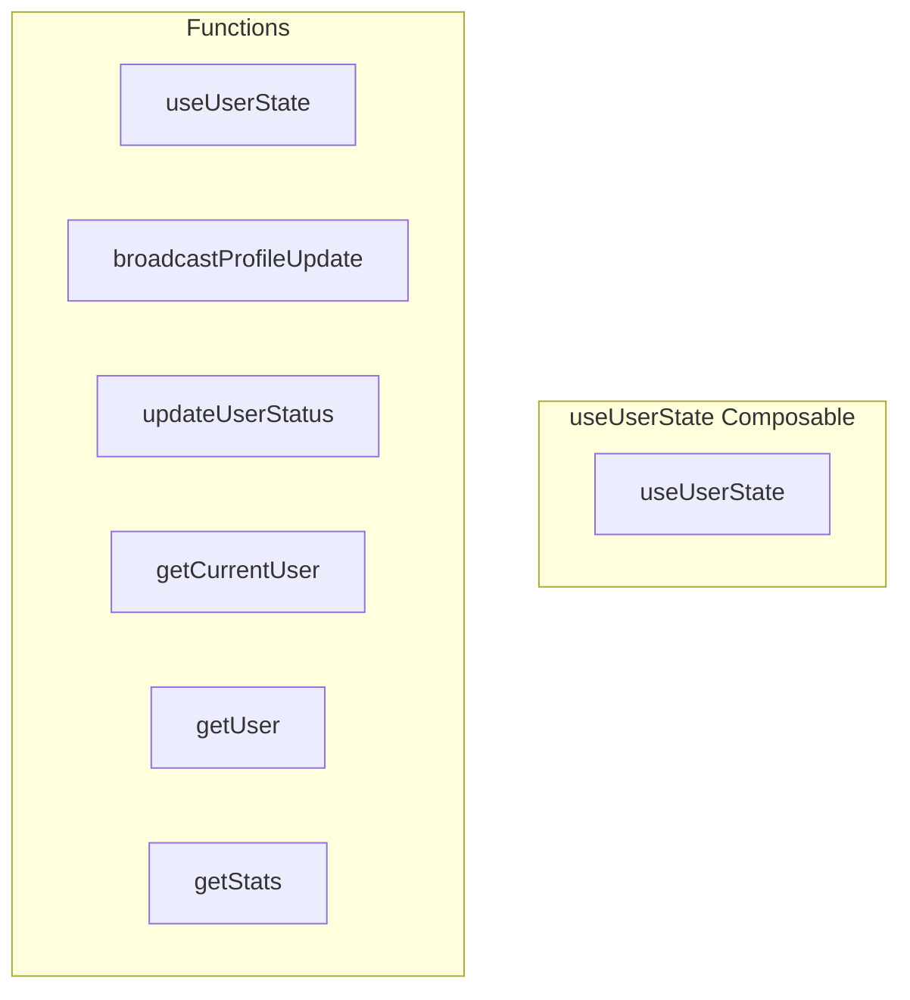

# useUserState Composable

**File:** `src/composables/useUserState.ts`

## Overview




## Exports

- **useUserState** - function export

## Functions

### `useUserState()`

No description available.

**Parameters:**
None

**Returns:** `void`

```typescript
/**
 * useUserState Composable
 * 
 * Provides reactive access to user state management and profile broadcasting
 * This replaces the old useCleanUserStatus composable with broader scope
 */
export function useUserState()
```

### `broadcastProfileUpdate(profileData: {
    displayName?: string
    avatarUrl?: string
    color?: string
    bio?: string
  })`

No description available.

**Parameters:**
- `profileData: {
    displayName?: string
    avatarUrl?: string
    color?: string
    bio?: string
  }`

**Returns:** `Unknown`

```typescript
/**
 * useUserState Composable
 * 
 * Provides reactive access to user state management and profile broadcasting
 * This replaces the old useCleanUserStatus composable with broader scope
 */
export function useUserState() {
  
  /**
   * Broadcast profile updates to all connected clients in context
   * This ensures real-time profile updates across all UI views
   */
  const broadcastProfileUpdate = async (profileData: {
    displayName?: string
    avatarUrl?: string
    color?: string
    bio?: string
  }) =>
```

### `updateUserStatus(status: number)`

No description available.

**Parameters:**
- `status: number`

**Returns:** `Unknown`

```typescript
/**
   * Update current user status (online, away, busy, offline)
   */
  const updateUserStatus = async (status: number) =>
```

### `getCurrentUser()`

No description available.

**Parameters:**
None

**Returns:** `Unknown`

```typescript
/**
   * Get current user data
   */
  const getCurrentUser = () =>
```

### `getUser(userId: string)`

No description available.

**Parameters:**
- `userId: string`

**Returns:** `Unknown`

```typescript
/**
   * Get user data by ID
   */
  const getUser = (userId: string) =>
```

### `getStats()`

No description available.

**Parameters:**
None

**Returns:** `Unknown`

```typescript
/**
   * Get service statistics
   */
  const getStats = () =>
```


## Source Code Insights

**File Size:** 1793 characters
**Lines of Code:** 78
**Imports:** 2

## Usage Example

```typescript
import { useUserState } from '@/composables/useUserState'

// Example usage
useUserState()
```

---

*This documentation was automatically generated from the source code.*