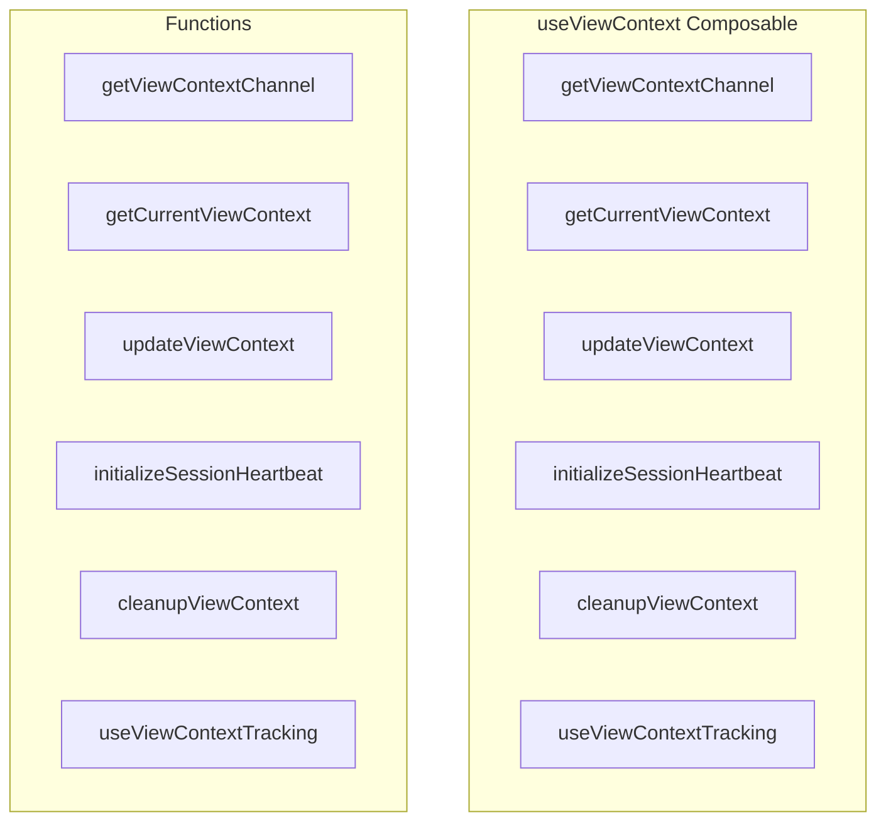

# useViewContext Composable

**File:** `src/composables/useViewContext.ts`

## Overview




## Exports

- **getViewContextChannel** - function export
- **getCurrentViewContext** - function export
- **updateViewContext** - function export
- **initializeSessionHeartbeat** - function export
- **cleanupViewContext** - function export
- **useViewContextTracking** - function export

## Functions

### `getViewContextChannel()`

No description available.

**Parameters:**
None

**Returns:** `void`

```typescript
/**
 * Composable to track and update user's current view context in ephemeral presence
 * This enables database-level notification suppression (Discord-like behavior)
 * Uses Supabase Realtime presence - completely ephemeral, no database table needed
 * 
 * Architecture:
 * - Frontend tracks view context in presence
 * - Database triggers read presence to suppress notifications for active contexts
 * - Session heartbeat syncs to DB for push notification smart delivery
 */

import { watch } from 'vue'
import { useRoute } from 'vue-router'
import { supabase } from '@/supabase'
import { debug } from '@/utils/debug'
import { viewContextTracker } from '@/services/ViewContextTracker'
import { sessionHeartbeat } from '@/services/SessionHeartbeat'

let viewContextChannel: ReturnType<typeof supabase.channel> | null = null
let currentUserId: string | null = null

/**
 * Get the view context presence channel (for use in other modules)
 */
export function getViewContextChannel()
```

### `getCurrentViewContext()`

No description available.

**Parameters:**
None

**Returns:** `void`

```typescript
/**
 * Get current view context from presence state
 */
export function getCurrentViewContext()
```

### `updateViewContext(viewType: 'server_channel' | 'dm' | 'activitypub_home' | 'settings' | 'home', serverId?: string, channelId?: string, conversationId?: string)`

No description available.

**Parameters:**
- `viewType: 'server_channel' | 'dm' | 'activitypub_home' | 'settings' | 'home'`
- `serverId?: string`
- `channelId?: string`
- `conversationId?: string`

**Returns:** `Promise&lt;void&gt;`

```typescript
/**
 * Update the user's current view context in ephemeral presence
 * Called when navigating to channels/DMs to suppress notifications
 */
export async function updateViewContext(
  viewType: 'server_channel' | 'dm' | 'activitypub_home' | 'settings' | 'home',
  serverId?: string,
  channelId?: string,
  conversationId?: string
): Promise<void>
```

### `initializeSessionHeartbeat(userId: string)`

No description available.

**Parameters:**
- `userId: string`

**Returns:** `Promise&lt;void&gt;`

```typescript
/**
 * Initialize session heartbeat for smart push notifications
 * Call this when user logs in
 */
export async function initializeSessionHeartbeat(userId: string): Promise<void>
```

### `cleanupViewContext()`

No description available.

**Parameters:**
None

**Returns:** `Promise&lt;void&gt;`

```typescript
/**
 * Cleanup view context channel on logout
 */
export async function cleanupViewContext(): Promise<void>
```

### `useViewContextTracking()`

No description available.

**Parameters:**
None

**Returns:** `void`

```typescript
/**
 * Composable to automatically track view context based on route
 */
export function useViewContextTracking()
```


## Source Code Insights

**File Size:** 5867 characters
**Lines of Code:** 175
**Imports:** 6

## Usage Example

```typescript
import { getViewContextChannel, getCurrentViewContext, updateViewContext, initializeSessionHeartbeat, cleanupViewContext, useViewContextTracking } from '@/composables/useViewContext'

// Example usage
getViewContextChannel()
```

---

*This documentation was automatically generated from the source code.*