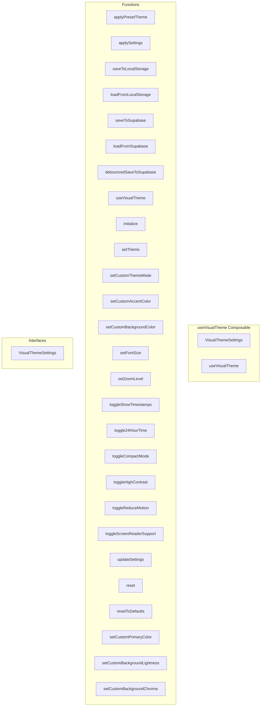

# useVisualTheme Composable

**File:** `src/composables/useVisualTheme.ts`

## Overview




## Exports

- **VisualThemeSettings** - interface export
- **useVisualTheme** - function export

## Functions

### `applyPresetTheme(themeName: 'dark' | 'light' | 'midnight')`

No description available.

**Parameters:**
- `themeName: 'dark' | 'light' | 'midnight'`

**Returns:** `void`

```typescript
/**
 * Visual Theme Composable
 * 
 * Manages visual theme settings including:
 * - Preset themes (dark, light, midnight)
 * - Custom OKLCH-based themes
 * - Real-time theme application
 * - Persistence to localStorage and Supabase
 */

import { ref, computed, watch } from 'vue'
import { generateThemePalette, applyThemePalette, type ThemePalette } from '@/utils/colorUtils'
import { supabase } from '@/supabase'
import { useAuthStore } from '@/stores/auth'
import { useProfileStore } from '@/stores/useProfile'
import { debug } from '@/utils/debug'
import { userStorage } from '@/utils/userScopedStorage'

export interface VisualThemeSettings {
  theme: 'dark' | 'light' | 'midnight' | 'custom'
  customThemeMode?: 'dark' | 'light'
  customPrimaryColor?: string
  customAccentColor?: string
  customBackgroundColor?: string
  customBackgroundLightness?: number // -50 to +50
  customBackgroundChroma?: number // -30 to +30
  fontSize: number
  zoomLevel: number
  showTimestamps: boolean
  use24HourTime: boolean
  compactMode: boolean
  highContrast: boolean
  reduceMotion: boolean
  screenReaderSupport: boolean
}

// Preset theme color mappings
const PRESET_THEMES = {
  dark: {
    primary: '#5865f2',
    bgChat: '#313338',
    bgSidebar: '#292b2f',
    textPrimary: '#f2f3f5',
    textSecondary: '#b5bac1',
    borderPrimary: 'rgba(255, 255, 255, 0.08)',
    isLightTheme: false,
    secondary: '#616ae5',
    accent: '#ff7675',
  },
  light: {
    primary: '#5865f2',
    bgChat: '#ffffff',
    bgSidebar: '#f2f3f5',
    textPrimary: '#2e3338',
    textSecondary: '#4e5058',
    borderPrimary: 'rgba(0, 0, 0, 0.12)',
    isLightTheme: true,
    secondary: '#616ae5',
    accent: '#ff7675',
  },
  midnight: {
    primary: '#5865f2',
    bgChat: '#1e2124',
    bgSidebar: '#1a1d20',
    textPrimary: '#f2f3f5',
    textSecondary: '#b5bac1',
    borderPrimary: 'rgba(255, 255, 255, 0.08)',
    isLightTheme: false,
    secondary: '#616ae5',
    accent: '#ff7675',
  },
}

// Global state (singleton pattern)
const settings = ref<VisualThemeSettings>({
  theme: 'dark',
  customThemeMode: 'dark',
  customPrimaryColor: '#5865f2',
  customAccentColor: '#5865f2',
  customBackgroundColor: '#5865f2',
  customBackgroundLightness: 0,
  customBackgroundChroma: 0,
  fontSize: 14,
  zoomLevel: 100,
  showTimestamps: true,
  use24HourTime: false,
  compactMode: false,
  highContrast: false,
  reduceMotion: false,
  screenReaderSupport: false,
})

const isInitialized = ref(false)
const isSaving = ref(false)

let saveTimeout: ReturnType<typeof setTimeout> | null = null

/**
 * Apply preset theme styles
 */
function applyPresetTheme(themeName: 'dark' | 'light' | 'midnight')
```

### `applySettings(settings: VisualThemeSettings)`

No description available.

**Parameters:**
- `settings: VisualThemeSettings`

**Returns:** `void`

```typescript
/**
 * Apply all visual settings to DOM
 */
function applySettings(settings: VisualThemeSettings)
```

### `saveToLocalStorage(settings: VisualThemeSettings)`

No description available.

**Parameters:**
- `settings: VisualThemeSettings`

**Returns:** `void`

```typescript
/**
 * Save settings to localStorage
 */
function saveToLocalStorage(settings: VisualThemeSettings)
```

### `loadFromLocalStorage()`

No description available.

**Parameters:**
None

**Returns:** `Partial&lt;VisualThemeSettings&gt; | null`

```typescript
/**
 * Load settings from localStorage
 */
function loadFromLocalStorage(): Partial<VisualThemeSettings> | null
```

### `saveToSupabase(settings: VisualThemeSettings)`

No description available.

**Parameters:**
- `settings: VisualThemeSettings`

**Returns:** `void`

```typescript
/**
 * Save settings to Supabase (debounced)
 */
async function saveToSupabase(settings: VisualThemeSettings)
```

### `loadFromSupabase()`

No description available.

**Parameters:**
None

**Returns:** `Promise&lt;Partial&lt;VisualThemeSettings&gt; | null&gt;`

```typescript
/**
 * Load settings from Supabase
 * OPTIMIZED: First checks profile store to avoid redundant queries
 */
async function loadFromSupabase(): Promise<Partial<VisualThemeSettings> | null>
```

### `debouncedSaveToSupabase(settings: VisualThemeSettings)`

No description available.

**Parameters:**
- `settings: VisualThemeSettings`

**Returns:** `void`

```typescript
/**
 * Debounced save to Supabase
 */
function debouncedSaveToSupabase(settings: VisualThemeSettings)
```

### `useVisualTheme()`

No description available.

**Parameters:**
None

**Returns:** `void`

```typescript
/**
 * Main composable
 */
export function useVisualTheme()
```

### `initialize()`

No description available.

**Parameters:**
None

**Returns:** `void`

```typescript
/**
   * Initialize theme system
   */
  async function initialize()
```

### `setTheme(theme: 'dark' | 'light' | 'midnight' | 'custom', customColor?: string, customBgColor?: string)`

No description available.

**Parameters:**
- `theme: 'dark' | 'light' | 'midnight' | 'custom'`
- `customColor?: string`
- `customBgColor?: string`

**Returns:** `void`

```typescript
/**
   * Update theme
   */
  function setTheme(theme: 'dark' | 'light' | 'midnight' | 'custom', customColor?: string, customBgColor?: string)
```

### `setCustomThemeMode(mode: 'dark' | 'light')`

No description available.

**Parameters:**
- `mode: 'dark' | 'light'`

**Returns:** `void`

```typescript
/**
   * Update custom theme mode
   */
  function setCustomThemeMode(mode: 'dark' | 'light')
```

### `setCustomAccentColor(color: string)`

No description available.

**Parameters:**
- `color: string`

**Returns:** `void`

```typescript
/**
   * Update custom accent color
   */
  function setCustomAccentColor(color: string)
```

### `setCustomBackgroundColor(color: string)`

No description available.

**Parameters:**
- `color: string`

**Returns:** `void`

```typescript
/**
   * Update custom background color
   */
  function setCustomBackgroundColor(color: string)
```

### `setFontSize(size: number)`

No description available.

**Parameters:**
- `size: number`

**Returns:** `void`

```typescript
/**
   * Update font size
   */
  function setFontSize(size: number)
```

### `setZoomLevel(zoom: number)`

No description available.

**Parameters:**
- `zoom: number`

**Returns:** `void`

```typescript
/**
   * Update zoom level
   */
  function setZoomLevel(zoom: number)
```

### `toggleShowTimestamps()`

No description available.

**Parameters:**
None

**Returns:** `void`

```typescript
/**
   * Toggle settings
   */
  function toggleShowTimestamps()
```

### `toggle24HourTime()`

No description available.

**Parameters:**
None

**Returns:** `void`

```typescript
function toggle24HourTime()
```

### `toggleCompactMode()`

No description available.

**Parameters:**
None

**Returns:** `void`

```typescript
function toggleCompactMode()
```

### `toggleHighContrast()`

No description available.

**Parameters:**
None

**Returns:** `void`

```typescript
function toggleHighContrast()
```

### `toggleReduceMotion()`

No description available.

**Parameters:**
None

**Returns:** `void`

```typescript
function toggleReduceMotion()
```

### `toggleScreenReaderSupport()`

No description available.

**Parameters:**
None

**Returns:** `void`

```typescript
function toggleScreenReaderSupport()
```

### `updateSettings(newSettings: Partial&lt;VisualThemeSettings&gt;)`

No description available.

**Parameters:**
- `newSettings: Partial&lt;VisualThemeSettings&gt;`

**Returns:** `void`

```typescript
/**
   * Bulk update settings
   */
  function updateSettings(newSettings: Partial<VisualThemeSettings>)
```

### `reset()`

No description available.

**Parameters:**
None

**Returns:** `void`

```typescript
/**
   * Reset theme system completely (call on logout)
   * This ensures the next user gets a fresh theme initialization
   */
  function reset()
```

### `resetToDefaults()`

No description available.

**Parameters:**
None

**Returns:** `void`

```typescript
/**
   * Reset to defaults
   */
  function resetToDefaults()
```

### `setCustomPrimaryColor(color: string)`

No description available.

**Parameters:**
- `color: string`

**Returns:** `void`

```typescript
/**
   * Update custom primary color
   */
  function setCustomPrimaryColor(color: string)
```

### `setCustomBackgroundLightness(lightness: number)`

No description available.

**Parameters:**
- `lightness: number`

**Returns:** `void`

```typescript
/**
   * Update custom background lightness
   */
  function setCustomBackgroundLightness(lightness: number)
```

### `setCustomBackgroundChroma(chroma: number)`

No description available.

**Parameters:**
- `chroma: number`

**Returns:** `void`

```typescript
/**
   * Update custom background chroma (saturation)
   */
  function setCustomBackgroundChroma(chroma: number)
```


## Interfaces

### VisualThemeSettings

No description available.

```typescript
interface VisualThemeSettings {

  theme: 'dark' | 'light' | 'midnight' | 'custom'
  customThemeMode?: 'dark' | 'light'
  customPrimaryColor?: string
  customAccentColor?: string
  customBackgroundColor?: string
  customBackgroundLightness?: number // -50 to +50
  customBackgroundChroma?: number // -30 to +30
  fontSize: number
  zoomLevel: number
  showTimestamps: boolean
  use24HourTime: boolean
  compactMode: boolean
  highContrast: boolean
  reduceMotion: boolean
  screenReaderSupport: boolean

}
```


## Constants

### PRESET_THEMES

No description available.

```typescript
const PRESET_THEMES = {
```


## Source Code Insights

**File Size:** 21036 characters
**Lines of Code:** 658
**Imports:** 7

## Usage Example

```typescript
import { VisualThemeSettings, useVisualTheme } from '@/composables/useVisualTheme'

// Example usage
applyPresetTheme()
```

---

*This documentation was automatically generated from the source code.*