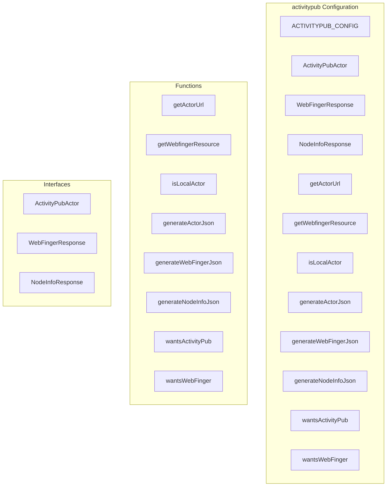

# activitypub Configuration

**File:** `src/config/activitypub.ts`

## Overview




## Exports

- **ACTIVITYPUB_CONFIG** - const export
- **ActivityPubActor** - interface export
- **WebFingerResponse** - interface export
- **NodeInfoResponse** - interface export
- **getActorUrl** - function export
- **getWebfingerResource** - function export
- **isLocalActor** - function export
- **generateActorJson** - function export
- **generateWebFingerJson** - function export
- **generateNodeInfoJson** - function export
- **wantsActivityPub** - function export
- **wantsWebFinger** - function export

## Functions

### `getActorUrl(username: string)`

No description available.

**Parameters:**
- `username: string`

**Returns:** `string`

```typescript
export function getActorUrl(username: string): string
```

### `getWebfingerResource(username: string)`

No description available.

**Parameters:**
- `username: string`

**Returns:** `string`

```typescript
export function getWebfingerResource(username: string): string
```

### `isLocalActor(actorUrl: string)`

No description available.

**Parameters:**
- `actorUrl: string`

**Returns:** `boolean`

```typescript
export function isLocalActor(actorUrl: string): boolean
```

### `generateActorJson(user: FederatedUser)`

No description available.

**Parameters:**
- `user: FederatedUser`

**Returns:** `ActivityPubActor`

```typescript
export function generateActorJson(user: FederatedUser): ActivityPubActor
```

### `generateWebFingerJson(username: string)`

No description available.

**Parameters:**
- `username: string`

**Returns:** `WebFingerResponse`

```typescript
export function generateWebFingerJson(username: string): WebFingerResponse
```

### `generateNodeInfoJson(stats?: {
  userCount?: number;
  postCount?: number;
  activeMonth?: number;
  activeHalfyear?: number;
})`

No description available.

**Parameters:**
- `stats?: {
  userCount?: number;
  postCount?: number;
  activeMonth?: number;
  activeHalfyear?: number;
}`

**Returns:** `NodeInfoResponse`

```typescript
export function generateNodeInfoJson(stats?: {
  userCount?: number;
  postCount?: number;
  activeMonth?: number;
  activeHalfyear?: number;
}): NodeInfoResponse
```

### `wantsActivityPub(acceptHeader: string)`

No description available.

**Parameters:**
- `acceptHeader: string`

**Returns:** `boolean`

```typescript
export function wantsActivityPub(acceptHeader: string): boolean
```

### `wantsWebFinger(acceptHeader: string)`

No description available.

**Parameters:**
- `acceptHeader: string`

**Returns:** `boolean`

```typescript
export function wantsWebFinger(acceptHeader: string): boolean
```


## Interfaces

### ActivityPubActor

No description available.

```typescript
interface ActivityPubActor {

  '@context': string | string[];
  id: string;
  type: 'Person' | 'Service' | 'Group';
  preferredUsername: string;
  name?: string;
  summary?: string;
  icon?: {
    type: 'Image';
    mediaType: string;
    url: string;
  };
  inbox: string;
  outbox: string;
  following: string;
  followers: string;
  featured?: string;
  publicKey: {
    id: string;
    owner: string;
    publicKeyPem: string;
  };
  endpoints?: {
    sharedInbox?: string;
  };
  url?: string;

}
```

### WebFingerResponse

No description available.

```typescript
interface WebFingerResponse {

  subject: string;
  links: Array<{
    rel: string;
    type?: string;
    href: string;
  }>;

}
```

### NodeInfoResponse

No description available.

```typescript
interface NodeInfoResponse {

  version: string;
  software: {
    name: string;
    version: string;
    repository?: string;
  };
  protocols: string[];
  services: {
    outbound: string[];
    inbound: string[];
  };
  usage: {
    users: {
      total: number;
      activeMonth: number;
      activeHalfyear: number;
    };
    localPosts: number;
    localComments: number;
  };
  openRegistrations: boolean;
  metadata: {
    nodeName: string;
    nodeDescription: string;
    maintainer?: {
      name: string;
      ema
  // ...
}
```


## Constants

### INSTANCE_DOMAIN

No description available.

```typescript
const INSTANCE_DOMAIN = import.meta.env.VITE_DOMAIN as string
```

### ACTIVITYPUB_CONFIG

No description available.

```typescript
export const ACTIVITYPUB_CONFIG = {
```


## Source Code Insights

**File Size:** 6194 characters
**Lines of Code:** 245
**Imports:** 1

## Usage Example

```typescript
import { ACTIVITYPUB_CONFIG, ActivityPubActor, WebFingerResponse, NodeInfoResponse, getActorUrl, getWebfingerResource, isLocalActor, generateActorJson, generateWebFingerJson, generateNodeInfoJson, wantsActivityPub, wantsWebFinger } from '@/config/activitypub'

// Example usage
getActorUrl()
```

---

*This documentation was automatically generated from the source code.*