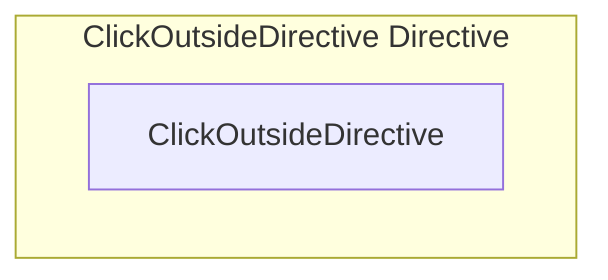

# ClickOutsideDirective Directive

**File:** `src/directives/ClickOutsideDirective.ts`

## Overview




## Exports

- **ClickOutsideDirective** - default export


## Source Code Insights

**File Size:** 667 characters
**Lines of Code:** 21
**Imports:** 1

## Usage Example

```typescript
import { ClickOutsideDirective } from '@/directives/ClickOutsideDirective'

// Example usage
// Use the exported functionality
```

---

*This documentation was automatically generated from the source code.*