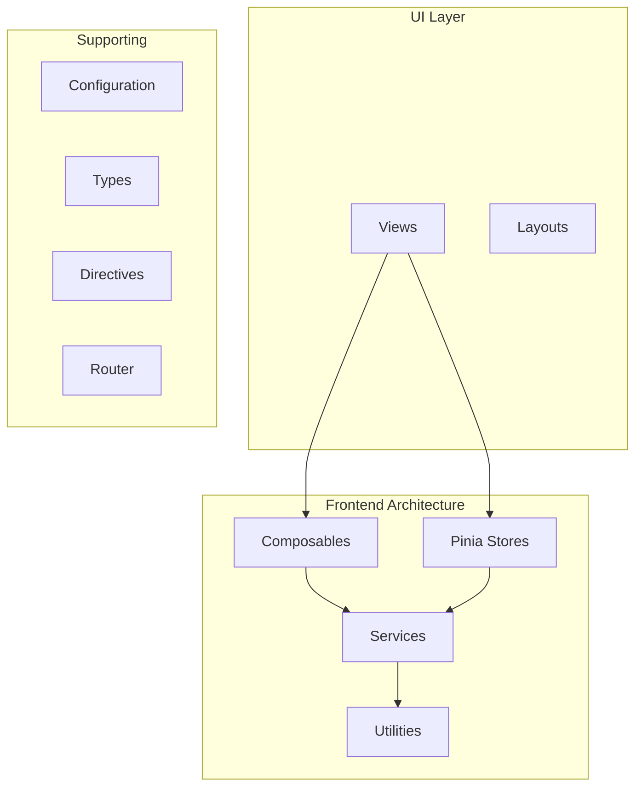

# API Reference

Welcome to the Harmony API documentation. This documentation is automatically generated from the source code.

## Overview

## Categories

### Services

70 files documented.

- [webrtcManager](/api/services/webrtcmanager)
- [usersService](/api/services/usersservice)
- [userDataService](/api/services/userdataservice)
- [unifiedWebRTC](/api/services/unifiedwebrtc)
- [unifiedEmojiService](/api/services/unifiedemojiservice)
- [spatialAudio](/api/services/spatialaudio)
- [serverMembershipService](/api/services/servermembershipservice)
- [permissionsService](/api/services/permissionsservice)
- [membershipService](/api/services/membershipservice)
- [livekitWebRTC](/api/services/livekitwebrtc)
- [inviteService](/api/services/inviteservice)
- [index](/api/services/index)
- [fileService](/api/services/fileservice)
- [emojiService](/api/services/emojiservice)
- [emojiPackService](/api/services/emojipackservice)
- [emojiIndexedDBCache](/api/services/emojiindexeddbcache)
- [activityPubService](/api/services/activitypubservice)
- [VoiceSettingsService](/api/services/voicesettingsservice)
- [ViewContextTracker](/api/services/viewcontexttracker)
- [TypingIndicatorService](/api/services/typingindicatorservice)
- [TrendingService](/api/services/trendingservice)
- [ThreadService](/api/services/threadservice)
- [StatusLifecycleDebugger](/api/services/statuslifecycledebugger)
- [StatePersistence](/api/services/statepersistence)
- [SessionHeartbeat](/api/services/sessionheartbeat)
- [ServiceWorkerManager](/api/services/serviceworkermanager)
- [SearchService](/api/services/searchservice)
- [RouteAwareInitialization](/api/services/routeawareinitialization)
- [RoleService](/api/services/roleservice)
- [RealtimeConnectionManager](/api/services/realtimeconnectionmanager)
- [ProfileService](/api/services/profileservice)
- [PostService](/api/services/postservice)
- [PWAManager](/api/services/pwamanager)
- [NotificationService](/api/services/notificationservice)
- [NotificationFormatter](/api/services/notificationformatter)
- [MessageService](/api/services/messageservice)
- [LoggingService](/api/services/loggingservice)
- [InteractionService](/api/services/interactionservice)
- [GlobalDMCallListener](/api/services/globaldmcalllistener)
- [GifService](/api/services/gifservice)
- [EasterEggService](/api/services/eastereggservice)
- [DMCallSignaling](/api/services/dmcallsignaling)
- [DMCallPermissions](/api/services/dmcallpermissions)
- [ConversationService](/api/services/conversationservice)
- [AuthContextService](/api/services/authcontextservice)
- [AudioThemeService](/api/services/audiothemeservice)
- [AppInitService](/api/services/appinitservice)
- [AdminService](/api/services/adminservice)
- [ActivityTracker](/api/services/activitytracker)
- [index](/api/services/federation/index)
- [FederationServerService](/api/services/federation/federationserverservice)
- [FederationDecisionService](/api/services/federation/federationdecisionservice)
- [FederationActivityService](/api/services/federation/federationactivityservice)
- [index](/api/services/encryption/index)
- [WebRTCEncryptionService](/api/services/encryption/webrtcencryptionservice)
- [SignalProtocolServiceBrowser](/api/services/encryption/signalprotocolservicebrowser)
- [SignalProtocolService](/api/services/encryption/signalprotocolservice)
- [SecureSessionKeyStore](/api/services/encryption/securesessionkeystore)
- [RecoveryKeyService](/api/services/encryption/recoverykeyservice)
- [MessageEncryptionService](/api/services/encryption/messageencryptionservice)
- [MegolmService](/api/services/encryption/megolmservice)
- [MegolmMessageEncryptionService](/api/services/encryption/megolmmessageencryptionservice)
- [MegolmKeyBackupService](/api/services/encryption/megolmkeybackupservice)
- [EncryptionKeyStoreBrowser](/api/services/encryption/encryptionkeystorebrowser)
- [EncryptionKeyStore](/api/services/encryption/encryptionkeystore)
- [index](/api/services/core/index)
- [CoreProfileService](/api/services/core/coreprofileservice)
- [CorePostService](/api/services/core/corepostservice)
- [CoreMessageService](/api/services/core/coremessageservice)
- [CoreInteractionService](/api/services/core/coreinteractionservice)

### Pinia Stores

18 files documented.

- [useTheme](/api/stores/usetheme)
- [useServerUsers](/api/stores/useserverusers)
- [useServerChannel](/api/stores/useserverchannel)
- [useReactions](/api/stores/usereactions)
- [usePublicServers](/api/stores/usepublicservers)
- [useProfile](/api/stores/useprofile)
- [useNotification](/api/stores/usenotification)
- [useInstanceSettings](/api/stores/useinstancesettings)
- [useEmojiCache](/api/stores/useemojicache)
- [useDM](/api/stores/usedm)
- [useChat](/api/stores/usechat)
- [useActivityPub](/api/stores/useactivitypub)
- [unifiedVoiceChannel](/api/stores/unifiedvoicechannel)
- [spatialAudio](/api/stores/spatialaudio)
- [server](/api/stores/server)
- [postReactions](/api/stores/postreactions)
- [drafts](/api/stores/drafts)
- [auth](/api/stores/auth)

### Vue Composables

37 files documented.

- [useVisualTheme](/api/composables/usevisualtheme)
- [useViewContext](/api/composables/useviewcontext)
- [useUserState](/api/composables/useuserstate)
- [useUserData](/api/composables/useuserdata)
- [useUnreadCounts](/api/composables/useunreadcounts)
- [useTypingIndicator](/api/composables/usetypingindicator)
- [useServerPermissions](/api/composables/useserverpermissions)
- [usePushToTalk](/api/composables/usepushtotalk)
- [usePushNotifications](/api/composables/usepushnotifications)
- [useProfilePresence](/api/composables/useprofilepresence)
- [usePostReactions](/api/composables/usepostreactions)
- [usePostInteractions](/api/composables/usepostinteractions)
- [usePopupPositioning](/api/composables/usepopuppositioning)
- [useMobileGestures](/api/composables/usemobilegestures)
- [useMessageSearch](/api/composables/usemessagesearch)
- [useMessageReactions](/api/composables/usemessagereactions)
- [useLocalMessageSearch](/api/composables/uselocalmessagesearch)
- [useLoadingState](/api/composables/useloadingstate)
- [useLayoutState](/api/composables/uselayoutstate)
- [useKonamiCode](/api/composables/usekonamicode)
- [useKeybinds](/api/composables/usekeybinds)
- [useHapticSettings](/api/composables/usehapticsettings)
- [useFrequentEmojis](/api/composables/usefrequentemojis)
- [useFloatingVideo](/api/composables/usefloatingvideo)
- [useEmojiLoader](/api/composables/useemojiloader)
- [useDebounce](/api/composables/usedebounce)
- [useContentRenderer](/api/composables/usecontentrenderer)
- [useComposerState](/api/composables/usecomposerstate)
- [useComposerActions](/api/composables/usecomposeractions)
- [useCommonUI](/api/composables/usecommonui)
- [useCleanUserStatus](/api/composables/usecleanuserstatus)
- [useChannelPermissions](/api/composables/usechannelpermissions)
- [useAutoSuggest](/api/composables/useautosuggest)
- [useAudioThemeCommon](/api/composables/useaudiothemecommon)
- [useApplicationState](/api/composables/useapplicationstate)
- [useAdaptiveGrid](/api/composables/useadaptivegrid)
- [useActivityPubUserSearch](/api/composables/useactivitypubusersearch)

### Types & Interfaces

1 files documented.

- [viewTypes](/api/types/viewtypes)

### Utilities

29 files documented.

- [userScopedStorage](/api/utils/userscopedstorage)
- [urlTrackerStripper](/api/utils/urltrackerstripper)
- [unifiedContentProcessing](/api/utils/unifiedcontentprocessing)
- [syntaxHighlighter](/api/utils/syntaxhighlighter)
- [settingsUtils](/api/utils/settingsutils)
- [serverUtils](/api/utils/serverutils)
- [requestDeduplicator](/api/utils/requestdeduplicator)
- [reactionCacheManager](/api/utils/reactioncachemanager)
- [notFoundUtils](/api/utils/notfoundutils)
- [messageEmbedUtils](/api/utils/messageembedutils)
- [messageDecryption](/api/utils/messagedecryption)
- [messageContentUtils](/api/utils/messagecontentutils)
- [mentionUtils](/api/utils/mentionutils)
- [mentionMigration](/api/utils/mentionmigration)
- [markdownRenderer](/api/utils/markdownrenderer)
- [markdownParser](/api/utils/markdownparser)
- [hapticFeedback](/api/utils/hapticfeedback)
- [groupIconUtils](/api/utils/groupiconutils)
- [getFromUser](/api/utils/getfromuser)
- [fileUpload](/api/utils/fileupload)
- [emojiUtils](/api/utils/emojiutils)
- [emojiConstants](/api/utils/emojiconstants)
- [embedDetection](/api/utils/embeddetection)
- [debug](/api/utils/debug)
- [colorUtils](/api/utils/colorutils)
- [botUtils](/api/utils/botutils)
- [bannerUtils](/api/utils/bannerutils)
- [backgroundUtils](/api/utils/backgroundutils)
- [avatarUtils](/api/utils/avatarutils)

### Configuration

1 files documented.

- [activitypub](/api/config/activitypub)

### Directives

1 files documented.

- [ClickOutsideDirective](/api/directives/clickoutsidedirective)

### Layouts

4 files documented.

- [SocialLayout](/api/layouts/sociallayout)
- [ChatLayout](/api/layouts/chatlayout)
- [BaseLayout](/api/layouts/baselayout)
- [AuthLayout](/api/layouts/authlayout)

### Router

1 files documented.

- [index](/api/router/index)

### Views

21 files documented.

- [UserSettings](/api/views/usersettings)
- [UserProfileView](/api/views/userprofileview)
- [TimelineView](/api/views/timelineview)
- [ThreadFullView](/api/views/threadfullview)
- [ServerSettings](/api/views/serversettings)
- [ResetPasswordView](/api/views/resetpasswordview)
- [RegisterView](/api/views/registerview)
- [PostView](/api/views/postview)
- [NotificationsView](/api/views/notificationsview)
- [NotFoundView](/api/views/notfoundview)
- [NewProfile](/api/views/newprofile)
- [LoginView](/api/views/loginview)
- [ListsView](/api/views/listsview)
- [HashtagView](/api/views/hashtagview)
- [FollowersView](/api/views/followersview)
- [ExploreView](/api/views/exploreview)
- [DMView](/api/views/dmview)
- [ChatView](/api/views/chatview)
- [BookmarksView](/api/views/bookmarksview)
- [AuthCallbackView](/api/views/authcallbackview)
- [AdminPanel](/api/views/adminpanel)

---

*Last generated: 2026-03-06T08:55:50.147Z*
