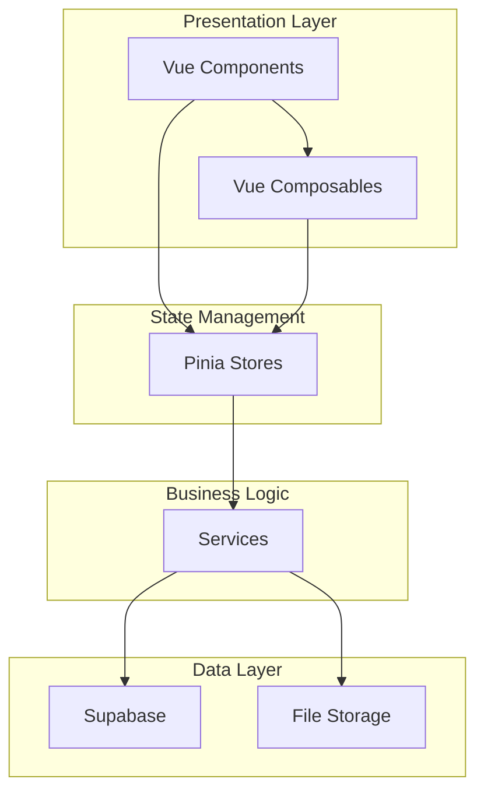

# API Reference

Welcome to the Harmony API documentation. This section provides comprehensive documentation for all services, stores, composables, and types used in the Harmony application.

## Overview

Harmony's API is organized into several key areas:

- **[Services](/api/services/auth)** - Business logic and external integrations
- **[Pinia Stores](/api/stores/auth)** - State management with reactive data
- **[Vue Composables](/api/composables/layout)** - Reusable composition functions
- **[TypeScript Types](/api/types/core)** - Type definitions and interfaces

## Architecture

The API follows a layered architecture:


```mermaid
graph TB
    subgraph "Presentation Layer"
        COMPONENTS[Vue Components]
        COMPOSABLES[Vue Composables]
    end
    
    subgraph "State Management"
        STORES[Pinia Stores]
    end
    
    subgraph "Business Logic"
        SERVICES[Services]
    end
    
    subgraph "Data Layer"
        SUPABASE[Supabase]
        STORAGE[File Storage]
    end
    
    COMPONENTS --> COMPOSABLES
    COMPONENTS --> STORES
    COMPOSABLES --> STORES
    STORES --> SERVICES
    SERVICES --> SUPABASE
    SERVICES --> STORAGE
```

## Key Services

### Core Services
- **[Authentication Service](/api/services/auth)** - User authentication and session management
- **[Chat Service](/api/services/chat)** - Real-time messaging functionality
- **[ActivityPub Service](/api/services/activitypub)** - Federation and social features
- **[User Data Service](/api/services/userdata)** - User profile and data management

### Specialized Services
- **[Admin Service](/api/services/admin)** - Administrative functions
- **[File Service](/api/services/file)** - File upload and storage
- **[Emoji Service](/api/services/emoji)** - Custom emoji management
- **[Voice Service](/api/services/voice)** - WebRTC voice/video calling

## Store Architecture

Harmony uses Pinia for state management with these key stores:

### Primary Stores
- **[Auth Store](/api/stores/auth)** - Authentication state
- **[Chat Store](/api/stores/chat)** - Chat messages and channels
- **[ActivityPub Store](/api/stores/activitypub)** - Social timeline and federation
- **[Server Channel Store](/api/stores/serverchannel)** - Server and channel management

### Supporting Stores
- **[DM Store](/api/stores/dm)** - Direct message conversations
- **[Notification Store](/api/stores/notification)** - User notifications
- **[Theme Store](/api/stores/theme)** - UI theme and preferences

## Type System

Harmony is fully typed with TypeScript. Key type categories:

- **[Core Types](/api/types/core)** - Basic interfaces and enums
- **[Chat Types](/api/types/chat)** - Message, channel, and server types
- **[ActivityPub Types](/api/types/activitypub)** - Federation and social types
- **[User Types](/api/types/user)** - Profile and authentication types

## Usage Patterns

### Service Usage
```typescript
import { authService } from '@/services/authService'

// Use service methods
const user = await authService.getCurrentUser()
```

### Store Usage
```typescript
import { useAuthStore } from '@/stores/auth'

const authStore = useAuthStore()
const isLoggedIn = authStore.isLoggedIn
```

### Composable Usage
```typescript
import { useUserData } from '@/composables/useUserData'

const { getCurrentUser, updateProfile } = useUserData()
```

## Error Handling

All API methods include comprehensive error handling:

```typescript
try {
  const result = await service.method()
  // Handle success
} catch (error) {
  console.error('Operation failed:', error)
  // Handle error
}
```

## Real-time Features

Many APIs include real-time subscriptions:

```typescript
// Subscribe to real-time updates
const subscription = store.subscribeToUpdates()

// Clean up subscription
onUnmounted(() => {
  subscription?.unsubscribe()
})
```

## Performance Considerations

- **Caching**: Services implement intelligent caching
- **Pagination**: Large data sets use cursor-based pagination
- **Debouncing**: Search and input operations are debounced
- **Lazy Loading**: Components and data load on demand

## Next Steps

- Explore the [Service Documentation](/api/services/auth)
- Learn about [Store Management](/api/stores/auth)
- Check out [Component APIs](/components/)
- View [System Flow Diagrams](/flows/)

---

*This documentation is auto-generated from TypeScript code and kept in sync with the latest changes.*
