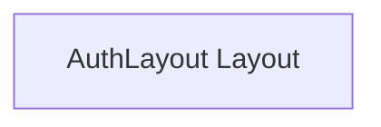

# AuthLayout Layout

**File:** `src/layouts/AuthLayout.vue`

## Overview




## Vue Component

This is a Vue component file.


## Source Code Insights

**File Size:** 755 characters
**Lines of Code:** 44
**Imports:** 0

## Usage Example

```typescript
import { AuthLayout } from '@/layouts/AuthLayout'

// Example usage
// Use the exported functionality
```

---

*This documentation was automatically generated from the source code.*