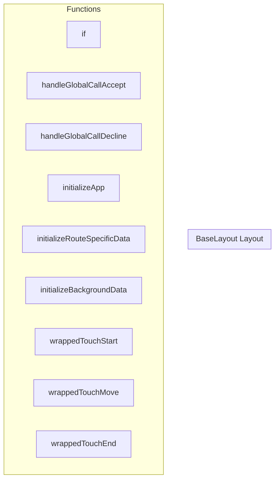

# BaseLayout Layout

**File:** `src/layouts/BaseLayout.vue`

## Overview




## Functions

### `if(typeof useUserData !== 'function')`

No description available.

**Parameters:**
- `typeof useUserData !== 'function'`

**Returns:** `void`

```typescript
function
    if (typeof useUserData !== 'function')
```

### `handleGlobalCallAccept(acceptWithVideo: boolean)`

No description available.

**Parameters:**
- `acceptWithVideo: boolean`

**Returns:** `Unknown`

```typescript
const handleGlobalCallAccept = async (acceptWithVideo: boolean) =>
```

### `handleGlobalCallDecline()`

No description available.

**Parameters:**
None

**Returns:** `Unknown`

```typescript
const handleGlobalCallDecline = async () =>
```

### `initializeApp()`

No description available.

**Parameters:**
None

**Returns:** `Unknown`

```typescript
const initializeApp = async () =>
```

### `initializeRouteSpecificData(userId: string, strategy: any, userData: any)`

No description available.

**Parameters:**
- `userId: string`
- `strategy: any`
- `userData: any`

**Returns:** `Unknown`

```typescript
const initializeRouteSpecificData = async (userId: string, strategy: any, userData: any) =>
```

### `initializeBackgroundData(userId: string, strategy: any)`

No description available.

**Parameters:**
- `userId: string`
- `strategy: any`

**Returns:** `Unknown`

```typescript
const initializeBackgroundData = async (userId: string, strategy: any) =>
```

### `wrappedTouchStart(event: TouchEvent)`

No description available.

**Parameters:**
- `event: TouchEvent`

**Returns:** `Unknown`

```typescript
const wrappedTouchStart = (event: TouchEvent) =>
```

### `wrappedTouchMove(event: TouchEvent)`

No description available.

**Parameters:**
- `event: TouchEvent`

**Returns:** `Unknown`

```typescript
const wrappedTouchMove = (event: TouchEvent) =>
```

### `wrappedTouchEnd(event: TouchEvent)`

No description available.

**Parameters:**
- `event: TouchEvent`

**Returns:** `Unknown`

```typescript
const wrappedTouchEnd = (event: TouchEvent) =>
```


## Constants

### PRESENCE_REFRESH_DEBOUNCE_MS

No description available.

```typescript
const PRESENCE_REFRESH_DEBOUNCE_MS = 500
```


## Vue Component

This is a Vue component file.


## Source Code Insights

**File Size:** 34762 characters
**Lines of Code:** 1015
**Imports:** 18

## Usage Example

```typescript
import { BaseLayout } from '@/layouts/BaseLayout'

// Example usage
if()
```

---

*This documentation was automatically generated from the source code.*