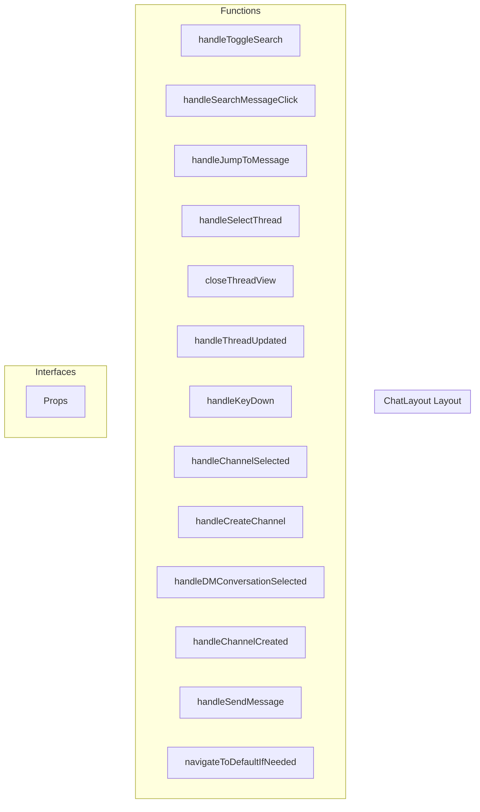

# ChatLayout Layout

**File:** `src/layouts/ChatLayout.vue`

## Overview




## Functions

### `handleToggleSearch()`

No description available.

**Parameters:**
None

**Returns:** `Unknown`

```typescript
const handleToggleSearch = () =>
```

### `handleSearchMessageClick(message: any, searchQuery?: string)`

No description available.

**Parameters:**
- `message: any`
- `searchQuery?: string`

**Returns:** `Unknown`

```typescript
const handleSearchMessageClick = (message: any, searchQuery?: string) =>
```

### `handleJumpToMessage(messageId: string)`

No description available.

**Parameters:**
- `messageId: string`

**Returns:** `Unknown`

```typescript
const handleJumpToMessage = (messageId: string) =>
```

### `handleSelectThread(thread: any)`

No description available.

**Parameters:**
- `thread: any`

**Returns:** `Unknown`

```typescript
const handleSelectThread = (thread: any) =>
```

### `closeThreadView()`

No description available.

**Parameters:**
None

**Returns:** `Unknown`

```typescript
const closeThreadView = () =>
```

### `handleThreadUpdated(thread: any)`

No description available.

**Parameters:**
- `thread: any`

**Returns:** `Unknown`

```typescript
const handleThreadUpdated = (thread: any) =>
```

### `handleKeyDown(event: KeyboardEvent)`

No description available.

**Parameters:**
- `event: KeyboardEvent`

**Returns:** `Unknown`

```typescript
const handleKeyDown = (event: KeyboardEvent) =>
```

### `handleChannelSelected(channelId: string)`

No description available.

**Parameters:**
- `channelId: string`

**Returns:** `Unknown`

```typescript
const handleChannelSelected = (channelId: string) =>
```

### `handleCreateChannel(categoryId: string)`

No description available.

**Parameters:**
- `categoryId: string`

**Returns:** `Unknown`

```typescript
const handleCreateChannel = (categoryId: string) =>
```

### `handleDMConversationSelected(conversationId: string)`

No description available.

**Parameters:**
- `conversationId: string`

**Returns:** `Unknown`

```typescript
const handleDMConversationSelected = (conversationId: string) =>
```

### `handleChannelCreated()`

No description available.

**Parameters:**
None

**Returns:** `Unknown`

```typescript
const handleChannelCreated = () =>
```

### `handleSendMessage(content: any, replyTo?: string)`

No description available.

**Parameters:**
- `content: any`
- `replyTo?: string`

**Returns:** `Unknown`

```typescript
const handleSendMessage = async (content: any, replyTo?: string) =>
```

### `navigateToDefaultIfNeeded()`

No description available.

**Parameters:**
None

**Returns:** `Unknown`

```typescript
const navigateToDefaultIfNeeded = async () =>
```


## Interfaces

### Props

No description available.

```typescript
interface Props {

  leftSidebarOpen: boolean
  rightSidebarOpen: boolean
  isMobile: boolean
  voicePanelOpen: boolean
  isDM?: boolean
  serverId?: string
  channelId?: string
  conversationId?: string
  viewType?: string
  currentView?: string
  // Drag state props from BaseLayout
  isDragging?: boolean
  dragDirection?: 'left' | 'right' | null
  leftSidebarDragOffset?: number
  rightSidebarDragOffset?: number

}
```


## Vue Component

This is a Vue component file.


## Source Code Insights

**File Size:** 18685 characters
**Lines of Code:** 657
**Imports:** 19

## Usage Example

```typescript
import { ChatLayout } from '@/layouts/ChatLayout'

// Example usage
handleToggleSearch()
```

---

*This documentation was automatically generated from the source code.*