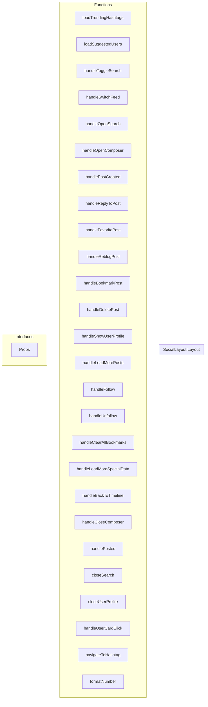

# SocialLayout Layout

**File:** `src/layouts/SocialLayout.vue`

## Overview




## Functions

### `loadTrendingHashtags()`

No description available.

**Parameters:**
None

**Returns:** `Unknown`

```typescript
const loadTrendingHashtags = async () =>
```

### `loadSuggestedUsers()`

No description available.

**Parameters:**
None

**Returns:** `Unknown`

```typescript
const loadSuggestedUsers = async () =>
```

### `handleToggleSearch()`

No description available.

**Parameters:**
None

**Returns:** `Unknown`

```typescript
const handleToggleSearch = () =>
```

### `handleSwitchFeed(feed: string)`

No description available.

**Parameters:**
- `feed: string`

**Returns:** `Unknown`

```typescript
const handleSwitchFeed = async (feed: string) =>
```

### `handleOpenSearch()`

No description available.

**Parameters:**
None

**Returns:** `Unknown`

```typescript
const handleOpenSearch = () =>
```

### `handleOpenComposer()`

No description available.

**Parameters:**
None

**Returns:** `Unknown`

```typescript
const handleOpenComposer = () =>
```

### `handlePostCreated()`

No description available.

**Parameters:**
None

**Returns:** `Unknown`

```typescript
const handlePostCreated = async () =>
```

### `handleReplyToPost(post: TimelinePost)`

No description available.

**Parameters:**
- `post: TimelinePost`

**Returns:** `Unknown`

```typescript
const handleReplyToPost = (post: TimelinePost) =>
```

### `handleFavoritePost(post: TimelinePost)`

No description available.

**Parameters:**
- `post: TimelinePost`

**Returns:** `Unknown`

```typescript
const handleFavoritePost = async (post: TimelinePost) =>
```

### `handleReblogPost(post: TimelinePost)`

No description available.

**Parameters:**
- `post: TimelinePost`

**Returns:** `Unknown`

```typescript
const handleReblogPost = async (post: TimelinePost) =>
```

### `handleBookmarkPost(post: TimelinePost)`

No description available.

**Parameters:**
- `post: TimelinePost`

**Returns:** `Unknown`

```typescript
const handleBookmarkPost = async (post: TimelinePost) =>
```

### `handleDeletePost(post: TimelinePost)`

No description available.

**Parameters:**
- `post: TimelinePost`

**Returns:** `Unknown`

```typescript
const handleDeletePost = async (post: TimelinePost) =>
```

### `handleShowUserProfile(user: FederatedUser)`

No description available.

**Parameters:**
- `user: FederatedUser`

**Returns:** `Unknown`

```typescript
const handleShowUserProfile = (user: FederatedUser) =>
```

### `handleLoadMorePosts()`

No description available.

**Parameters:**
None

**Returns:** `Unknown`

```typescript
const handleLoadMorePosts = async () =>
```

### `handleFollow(user: FederatedUser | string)`

No description available.

**Parameters:**
- `user: FederatedUser | string`

**Returns:** `Unknown`

```typescript
const handleFollow = async (user: FederatedUser | string) =>
```

### `handleUnfollow(user: FederatedUser | string)`

No description available.

**Parameters:**
- `user: FederatedUser | string`

**Returns:** `Unknown`

```typescript
const handleUnfollow = async (user: FederatedUser | string) =>
```

### `handleClearAllBookmarks()`

No description available.

**Parameters:**
None

**Returns:** `Unknown`

```typescript
const handleClearAllBookmarks = async () =>
```

### `handleLoadMoreSpecialData()`

No description available.

**Parameters:**
None

**Returns:** `Unknown`

```typescript
const handleLoadMoreSpecialData = async () =>
```

### `handleBackToTimeline()`

No description available.

**Parameters:**
None

**Returns:** `Unknown`

```typescript
const handleBackToTimeline = () =>
```

### `handleCloseComposer()`

No description available.

**Parameters:**
None

**Returns:** `Unknown`

```typescript
const handleCloseComposer = () =>
```

### `handlePosted(post: any)`

No description available.

**Parameters:**
- `post: any`

**Returns:** `Unknown`

```typescript
const handlePosted = (post: any) =>
```

### `closeSearch()`

No description available.

**Parameters:**
None

**Returns:** `Unknown`

```typescript
const closeSearch = () =>
```

### `closeUserProfile()`

No description available.

**Parameters:**
None

**Returns:** `Unknown`

```typescript
const closeUserProfile = () =>
```

### `handleUserCardClick(user: FederatedUser)`

No description available.

**Parameters:**
- `user: FederatedUser`

**Returns:** `Unknown`

```typescript
const handleUserCardClick = (user: FederatedUser) =>
```

### `navigateToHashtag(tag: string)`

No description available.

**Parameters:**
- `tag: string`

**Returns:** `Unknown`

```typescript
const navigateToHashtag = (tag: string) =>
```

### `formatNumber(num: number)`

No description available.

**Parameters:**
- `num: number`

**Returns:** `string`

```typescript
const formatNumber = (num: number): string =>
```


## Interfaces

### Props

No description available.

```typescript
interface Props {

  leftSidebarOpen: boolean
  rightSidebarOpen: boolean
  isMobile: boolean
  voicePanelOpen: boolean
  currentView?: string // Optional - extracted from route if not provided
  viewType?: string // Optional - extracted from route if not provided
  posts?: TimelinePost[]
  isLoadingFeed?: boolean
  hasMorePosts?: boolean
  profileUser?: FederatedUser | null
  profileHandle?: string
  specialViewData?: TimelinePost[]
  hasMoreSpecialData?: boolean
  postId?: string
  followingCount?: number
  fol
  // ...
}
```


## Vue Component

This is a Vue component file.


## Source Code Insights

**File Size:** 25286 characters
**Lines of Code:** 858
**Imports:** 15

## Usage Example

```typescript
import { SocialLayout } from '@/layouts/SocialLayout'

// Example usage
loadTrendingHashtags()
```

---

*This documentation was automatically generated from the source code.*