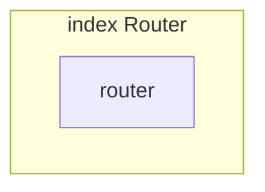

# index Router

**File:** `src/router/index.ts`

## Overview




## Exports

- **router** - default export


## Constants

### PROFILE_EXEMPT_ROUTES

No description available.

```typescript
const PROFILE_EXEMPT_ROUTES = new Set([
```


## Source Code Insights

**File Size:** 11799 characters
**Lines of Code:** 403
**Imports:** 5

## Usage Example

```typescript
import { router } from '@/router/index'

// Example usage
// Use the exported functionality
```

---

*This documentation was automatically generated from the source code.*