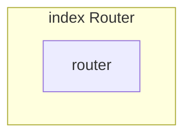

# index Router

**File:** `src/router/index.ts`

## Overview


```mermaid
graph TB
    subgraph "index Router"
        ROUTER[router]
    end
```


## Exports

- **router** - default export


## Source Code Insights

**File Size:** 10977 characters
**Lines of Code:** 375
**Imports:** 6

## Usage Example

```typescript
import { router } from '@/router/index'

// Example usage
// Use the exported functionality
```

---

*This documentation was automatically generated from the source code.*