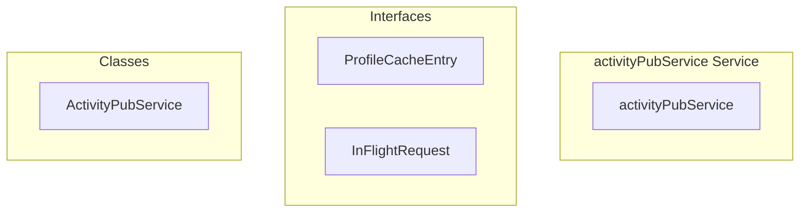

# activityPubService Service

**File:** `src/services/activityPubService.ts`

## Overview




## Exports

- **ActivityPubService** - class export
- **activityPubService** - const export


## Classes

### ActivityPubService

No description available.

**Methods:**
- `constructor`
- `getInstance`
- `getCachedProfile`
- `cacheProfile`
- `clearProfileCache`
- `getTimeline`
- `getPublicTimeline`
- `getEnhancedPublicTimeline`
- `catch`
- `getFederatedTimeline`
- `getLocalTimeline`
- `getPostWithContext`
- `getPost`
- `getConversationThread`
- `getConversationContext`
- `getConversationThreadLegacy`
- `getPostReplies`
- `getTrendingHashtags`
- `getTrendingPosts`
- `getSuggestedUsers`
- `getDiscoverableInstances`
- `getPostsByHashtag`
- `getExploreContent`
- `searchContent`
- `switch`
- `searchPosts`
- `getInstanceStats`
- `getInstanceActivity`
- `updateTrendingScores`
- `getUserPosts`
- `deletePost`
- `followUser`
- `unfollowUser`
- `getFollowers`
- `getFollowing`
- `isFollowing`
- `toggleFavorite`
- `favoritePost`
- `unfavoritePost`
- `toggleReblog`
- `reblogPost`
- `createQuoteReblog`
- `unreblogPost`
- `toggleBookmark`
- `bookmarkPost`
- `unbookmarkPost`
- `searchUsers`
- `getUserByHandle`
- `_fetchUserByHandle`
- `resolveUserByHandle`
- `fetchRemoteActor`
- `getUserById`
- `getUserTimeline`
- `getUserHandle`
- `searchFederatedUsers`
- `getCurrentUserProfileId`
- `getCurrentAuthUser`
- `getCurrentAuthUserId`
- `formatUserHandle`
- `parseUserHandle`
- `generateActorUrl`
- `generatePostUrl`
- `getPostInteractionState`
- `updatePost`
- `acceptFollowRequest`
- `rejectFollowRequest`
- `undoActivity`
- `joinVoiceChannel`
- `leaveVoiceChannel`
- `updateVoiceState`
- `joinFederatedServer`
- `leaveFederatedServer`
- `createActivity`
- `getUserActivityPubId`
- `postToActivityPubObject`
- `getPostAudience`
- `formatPostContent`
- `contentToHtml`
- `transformDatabasePostToTimelinePost`
- `loadPostWithAuthor`

**Properties:**
- `instance`
- `currentDomain`
- `instanceUrl`
- `OPTIMIZATION`
- `profileCache`
- `inFlightRequests`
- `PROFILE_CACHE_TTL`
- `minutes`
- `string`
- `entry`
- `null`
- `now`
- `profile`
- `timestamp`
- `MANAGEMENT`
- `NOTE`
- `instead`
- `posts`
- `timelineType`
- `options`
- `OPTIMIZED`
- `userId`
- `limit`
- `query`
- `author`
- `is_local`
- `ascending`
- `error`
- `professional`
- `TimelineOptions`
- `max_id`
- `interactions`
- `is_suspended`
- `my_interactions`
- `users`
- `is_bookmarked`
- `is_favorited`
- `is_reblogged`
- `loaded`
- `states`
- `statistics`
- `localCount`
- `federatedCount`
- `timeline`
- `about`
- `user`
- `p_user_id`
- `p_limit`
- `p_max_id`
- `filtering`
- `p_timeline_type`
- `DEBUG`
- `WARNING`
- `federatedPosts`
- `id`
- `domain`
- `methods`
- `scenarios`
- `postId`
- `context`
- `maxDepth`
- `includeInteractions`
- `p_context_type`
- `p_highlight_reply`
- `p_include_interactions`
- `p_max_depth`
- `p_post_id`
- `mainPost`
- `ancestors`
- `descendants`
- `threadInfo`
- `totalPosts`
- `participantCount`
- `depth`
- `rootPostId`
- `lastActivity`
- `highlightedPost`
- `contextType`
- `method`
- `result`
- `compatibility`
- `post`
- `in_conversation_id`
- `in_user_id`
- `root_post`
- `reply_count`
- `participant_count`
- `last_updated`
- `thread`
- `reply_context`
- `pagination`
- `data`
- `format`
- `replies`
- `METHODS`
- `hashtags`
- `number`
- `timeframe`
- `includeLocal`
- `includeFederated`
- `follow`
- `discovery`
- `filter`
- `search`
- `hashtag`
- `cursor`
- `hasMore`
- `content`
- `contentType`
- `timeRange`
- `language`
- `instances`
- `fediverse`
- `type`
- `default`
- `supabase`
- `profileError`
- `profileIds`
- `profiles`
- `nextCursor`
- `activity`
- `info`
- `is_deleted`
- `deleted_at`
- `triggers`
- `ap_id`
- `follower_id`
- `following_id`
- `status`
- `metadata`
- `follower`
- `following`
- `Follow`
- `followers`
- `updated_at`
- `only`
- `handle`
- `false`
- `INTERACTIONS`
- `favorited`
- `interaction`
- `gracefully`
- `existingError`
- `favorite`
- `user_id`
- `post_id`
- `interaction_type`
- `PostInteraction`
- `federation`
- `reblog`
- `reblogged`
- `reblogPost`
- `ID`
- `profileId`
- `actualPostId`
- `created`
- `postError`
- `originalPost`
- `actualOriginalId`
- `Fallback`
- `author_id`
- `visibility`
- `is_federated`
- `conversation_id`
- `conversation_root_id`
- `created_at`
- `favorites_count`
- `reblogs_count`
- `replies_count`
- `media_attachments`
- `content_warning`
- `is_sensitive`
- `url`
- `reblog_author`
- `ap_type`
- `reblog_of`
- `original_author`
- `comment`
- `userContent`
- `contentWarning`
- `isSensitive`
- `quote`
- `parsedContent`
- `quotePost`
- `in_reply_to`
- `is_quote`
- `bookmarked`
- `bookmark`
- `DISCOVERY`
- `p_query`
- `hasData`
- `dataLength`
- `hasError`
- `err`
- `locally`
- `forceRefresh`
- `cleanHandle`
- `cacheKey`
- `isRemote`
- `cachedProfile`
- `refresh`
- `inFlight`
- `request`
- `promise`
- `fetchPromise`
- `tracking`
- `username`
- `lookup`
- `exist`
- `federation_metadata`
- `bio`
- `display_name`
- `FederatedUser`
- `remoteUser`
- `object`
- `present`
- `parts`
- `avatar_url`
- `banner_url`
- `verified`
- `followers_count`
- `following_count`
- `posts_count`
- `federated_id`
- `_key`
- `inbox_url`
- `outbox_url`
- `followers_url`
- `following_url`
- `featured_url`
- `last_synced_at`
- `fetch`
- `remotely`
- `actor`
- `exists`
- `document`
- `actorResponse`
- `headers`
- `actorUrl`
- `pathParts`
- `p_username`
- `p_display_name`
- `p_domain`
- `p_avatar_url`
- `p_banner_url`
- `p_bio`
- `p_federated_id`
- `p_inbox_url`
- `p_outbox_url`
- `p_followers_url`
- `p_following_url`
- `p_public_key`
- `follows`
- `acceptedFollowingIds`
- `pendingFollowingIds`
- `allFollowingIds`
- `ordering`
- `currentUser`
- `AuthContextService`
- `consistently`
- `URL`
- `INTEGRATION`
- `updates`
- `onPostCreate`
- `onPostUpdate`
- `onPostDelete`
- `channel`
- `event`
- `onInteractionCreate`
- `onInteractionDelete`
- `onFollowCreate`
- `onFollowUpdate`
- `onFollowDelete`
- `state`
- `true`
- `HANDLING`
- `ownership`
- `updateData`
- `database`
- `actor_id`
- `target_id`
- `target_type`
- `activity_data`
- `published`
- `to`
- `cc`
- `updatedPost`
- `accepted_at`
- `channelId`
- `muted`
- `deafened`
- `video_enabled`
- `name`
- `server`
- `voiceState`
- `screen_sharing`
- `speaking`
- `inviteCode`
- `invite`
- `code`
- `HELPER`
- `retry_count`
- `production`
- `Helper`
- `attributedTo`
- `updated`
- `sensitive`
- `summary`
- `attachment`
- `inReplyTo`
- `utility`
- `batch`
- `processedContent`
- `parsed`
- `text`
- `information`


## Interfaces

### ProfileCacheEntry

No description available.

```typescript
interface ProfileCacheEntry {

  profile: FederatedUser;
  timestamp: number;

}
```

### InFlightRequest

No description available.

```typescript
interface InFlightRequest {

  promise: Promise<FederatedUser | null>;

}
```


## Source Code Insights

**File Size:** 88859 characters
**Lines of Code:** 2846
**Imports:** 4

## Usage Example

```typescript
import { ActivityPubService, activityPubService } from '@/services/activityPubService'

// Example usage
// Use the exported functionality
```

---

*This documentation was automatically generated from the source code.*