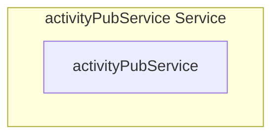

# activityPubService Service

**File:** `src/services/activityPubService.ts`

## Overview


```mermaid
graph TB
    subgraph "activityPubService Service"
        ACTIVITYPUBSERVICE[ActivityPubService]
        ACTIVITYPUBSERVICE[activityPubService]
    end
    
    
    
    
```

## Exports

- **ActivityPubService** - No description
- **activityPubService** - No description


## Classes

### ActivityPubService

No description available.

**Methods:**
- `constructor`

**Properties:**
- `instance`
- `currentDomain`
- `instanceUrl`
- `currentDomain`
- `instanceUrl`
- `https`


## Source Code Insights

**File Size:** 64275 characters
**Lines of Code:** 2152
**Imports:** 3

## Usage Example

```typescript
import { ActivityPubService, activityPubService } from '@/services/activityPubService.ts'

// Example usage
// Use the exported functionality
```

---

*This documentation was automatically generated from the source code.*