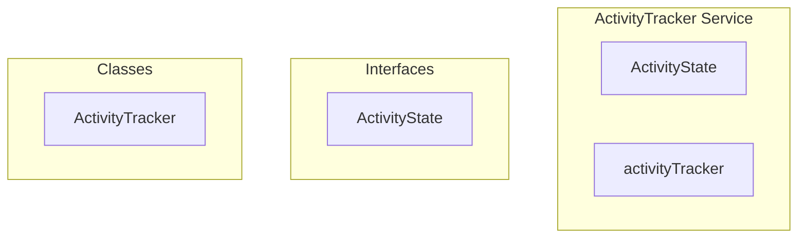

# ActivityTracker Service

**File:** `src/services/ActivityTracker.ts`

## Overview




## Exports

- **ActivityState** - interface export
- **activityTracker** - const export


## Classes

### ActivityTracker

No description available.

**Methods:**
- `constructor`
- `startTracking`
- `stopTracking`
- `onActivity`
- `checkActivityStatus`
- `resetStatusTracking`
- `isInactive`
- `getTimeSinceLastActivity`
- `getActivityState`

**Properties:**
- `lastActivity`
- `activityCheckTimer`
- `isTracking`
- `AWAY_THRESHOLD`
- `OFFLINE_THRESHOLD`
- `CHECK_INTERVAL`
- `tracking`
- `activityEvents`
- `boundActivityHandler`
- `activity`
- `true`
- `passive`
- `checks`
- `false`
- `listeners`
- `timer`
- `null`
- `event`
- `now`
- `wasInactive`
- `resumed`
- `detail`
- `changed`
- `inactiveTime`
- `isAway`
- `isOffline`
- `events`
- `status`
- `reason`
- `wasAway`
- `wasOffline`
- `inactive`
- `state`
- `isIdle`
- `wasManuallySet`
- `manualStatus`


## Interfaces

### ActivityState

No description available.

```typescript
interface ActivityState {

  lastActivity: number
  isIdle: boolean
  isAway: boolean
  wasManuallySet: boolean
  manualStatus: UserStatus | null

}
```


## Source Code Insights

**File Size:** 4638 characters
**Lines of Code:** 174
**Imports:** 2

## Usage Example

```typescript
import { ActivityState, activityTracker } from '@/services/ActivityTracker'

// Example usage
// Use the exported functionality
```

---

*This documentation was automatically generated from the source code.*