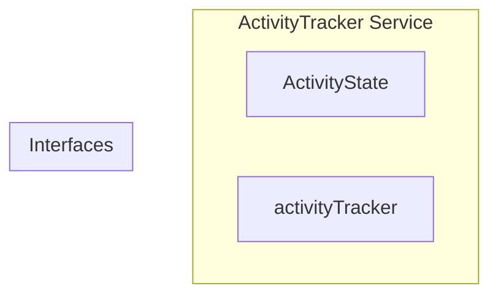

# ActivityTracker Service

**File:** `src/services/ActivityTracker.ts`

## Overview


```mermaid
graph TB
    subgraph "ActivityTracker Service"
        ACTIVITYSTATE[ActivityState]
        ACTIVITYTRACKER[activityTracker]
    end
    
    
    
    subgraph "Interfaces"
        ACTIVITYSTATE[ActivityState]
    end
```

## Exports

- **ActivityState** - No description
- **activityTracker** - No description


## Classes

### ActivityTracker

No description available.

**Methods:**
- `now`

**Properties:**
- `lastActivity`
- `number`
- `activityCheckTimer`
- `null`
- `isTracking`
- `boolean`
- `AWAY_THRESHOLD`
- `OFFLINE_THRESHOLD`
- `CHECK_INTERVAL`
- `activityEvents`
- `boundActivityHandler`
- `boundActivityHandler`


## Interfaces

### ActivityState

No description available.

```typescript
export interface ActivityState {
  lastActivity: number
  isIdle: boolean
  isAway: boolean
  wasManuallySet: boolean
  manualStatus: UserStatus | null
}
```


## Source Code Insights

**File Size:** 4610 characters
**Lines of Code:** 173
**Imports:** 1

## Usage Example

```typescript
import { ActivityState, activityTracker } from '@/services/ActivityTracker.ts'

// Example usage
// Use the exported functionality
```

---

*This documentation was automatically generated from the source code.*