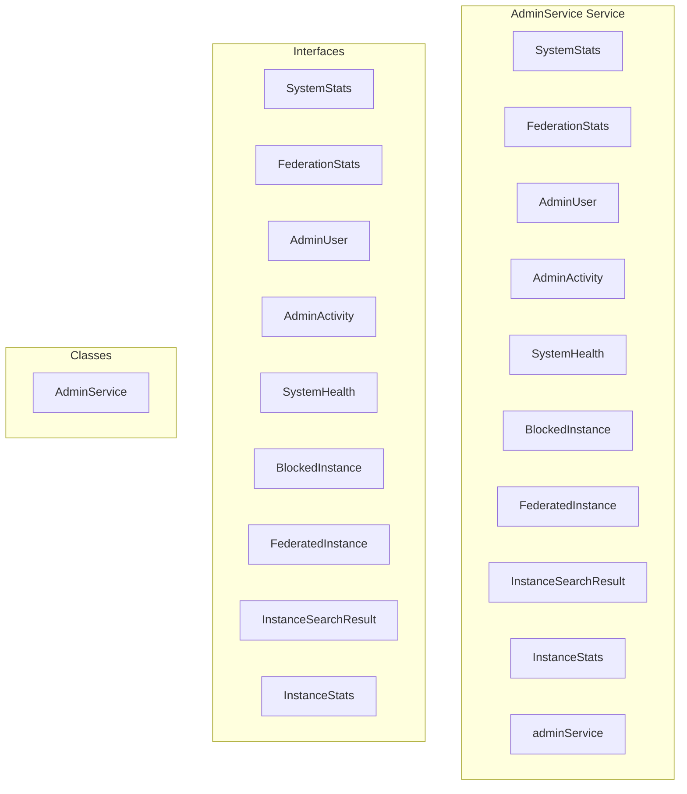

# AdminService Service

**File:** `src/services/AdminService.ts`

## Overview




## Exports

- **SystemStats** - interface export
- **FederationStats** - interface export
- **AdminUser** - interface export
- **AdminActivity** - interface export
- **SystemHealth** - interface export
- **BlockedInstance** - interface export
- **FederatedInstance** - interface export
- **InstanceSearchResult** - interface export
- **InstanceStats** - interface export
- **adminService** - const export


## Classes

### AdminService

No description available.

**Methods:**
- `getSystemStats`
- `catch`
- `getFederationStats`
- `getSystemHealth`
- `getUsers`
- `getRecentActivity`
- `moderateUser`
- `moderateInstance`
- `switch`
- `getBlockedInstances`
- `getInstanceConfig`
- `settings`
- `updateWebRTCSettings`
- `updateFederationSettings`
- `setInstanceConfig`
- `setInstanceConfigs`
- `checkAdminPermissions`
- `checkModeratorPermissions`
- `checkAdminOrModPermissions`
- `setModeratorStatus`
- `exportLogs`
- `updateInstanceTrust`
- `updateInstanceBlock`
- `deleteInstance`
- `addInstanceFromDomain`
- `getFederatedInstances`
- `getInstanceStats`
- `addFederatedInstance`
- `updateFederatedInstance`
- `deleteFederatedInstance`
- `searchActivityPubInstances`
- `discoverInstance`
- `probeNodeinfo`
- `probeMastodonAPI`
- `probeActivityPubActor`
- `getPopularInstances`
- `fetch`
- `getInstancesBySoftware`
- `nodes`
- `getDiscoveredInstances`
- `refreshInstanceInfo`
- `getUserServers`
- `getKeyConsistencyReport`
- `triggerMaintenanceTask`
- `runKeyGenerationSweep`
- `runOrphanedKeyCleanup`

**Properties:**
- `statistics`
- `queries`
- `today`
- `newPostsResult`
- `count`
- `total_users`
- `total_servers`
- `active_servers`
- `total_posts`
- `federated_instances`
- `uptime`
- `newUsersToday`
- `postsToday`
- `stats`
- `error`
- `endpointHealthResult`
- `metrics`
- `endpoints`
- `totalEndpoints`
- `deadEndpoints`
- `healthyEndpoints`
- `endpointsWithFailures`
- `totalFailures`
- `totalSuccesses`
- `totalAttempts`
- `successRate`
- `pending_deliveries`
- `successful_deliveries`
- `failed_deliveries`
- `active_instances`
- `endpoint_health`
- `total_endpoints`
- `dead_endpoints`
- `healthy_endpoints`
- `endpoints_with_failures`
- `total_failures`
- `total_successes`
- `success_rate`
- `calculation`
- `federationStats`
- `time`
- `start`
- `dbResponseTime`
- `database`
- `responseTime`
- `connections`
- `federation`
- `pending`
- `status`
- `storage`
- `memory`
- `health`
- `information`
- `number`
- `supabase`
- `federated_id`
- `ascending`
- `counts`
- `usersWithCounts`
- `serverCount`
- `ap_actor_id`
- `postCount`
- `handle`
- `users`
- `activity`
- `events`
- `table`
- `mockActivity`
- `id`
- `admin_id`
- `admin_username`
- `action_type`
- `target_type`
- `target_id`
- `details`
- `metadata`
- `ip_address`
- `user_agent`
- `created_at`
- `DEFINER`
- `userId`
- `action`
- `reason`
- `adminId`
- `RLS`
- `internally`
- `rpcAction`
- `rpcReason`
- `prefix`
- `p_admin_id`
- `p_target_user_id`
- `p_action`
- `p_reason`
- `failed`
- `user`
- `domain`
- `blocked`
- `is_blocked`
- `onConflict`
- `break`
- `default`
- `instance`
- `instances`
- `blocked_at`
- `blocked_by`
- `configuration`
- `webrtcSettings`
- `mode`
- `livekitUrl`
- `allowFederatedVoice`
- `maxStageListeners`
- `exists`
- `it`
- `data`
- `defaults`
- `instanceName`
- `instanceDescription`
- `registrationOpen`
- `requiresApproval`
- `oauthProviders`
- `termsUrl`
- `privacyUrl`
- `parsed`
- `value`
- `values`
- `succeeds`
- `present`
- `cases`
- `quotes`
- `chat`
- `maxServerSize`
- `maxMessageLength`
- `allowFileUploads`
- `enableVoiceChannels`
- `maxPostLength`
- `retryAttempts`
- `enableOutbound`
- `enableInbound`
- `webrtc`
- `name`
- `description`
- `config`
- `null`
- `settings`
- `webrtc_mode`
- `livekit_url`
- `allow_federated_voice`
- `max_stage_listeners`
- `updated_at`
- `false`
- `true`
- `federationEnabled`
- `inboundEnabled`
- `outboundEnabled`
- `autoAcceptFollows`
- `p_user_id`
- `p_federation_enabled`
- `p_inbound_enabled`
- `p_outbound_enabled`
- `p_auto_accept_follows`
- `pair`
- `permissions`
- `key`
- `format`
- `automatically`
- `JSONB`
- `jsonbValue`
- `p_key`
- `p_value`
- `p_description`
- `updated`
- `configs`
- `admin`
- `moderator`
- `isModerator`
- `is_moderator`
- `headers`
- `csvContent`
- `type`
- `logs`
- `trusted`
- `is_trusted`
- `trust_updated_by`
- `trust_updated_at`
- `trust`
- `blocked_reason`
- `unblocked_reason`
- `unblocked_by`
- `unblocked_at`
- `info`
- `instanceInfo`
- `software`
- `version`
- `admin_contact`
- `user_count`
- `status_count`
- `last_seen_at`
- `added_by`
- `added_at`
- `api_available`
- `federation_enabled`
- `filtering`
- `limit`
- `offset`
- `filter`
- `search`
- `total`
- `query`
- `filters`
- `pagination`
- `total_instances`
- `blocked_instances`
- `trusted_instances`
- `recently_discovered`
- `manually`
- `options`
- `forceAdd`
- `cleanDomain`
- `instanceData`
- `connection_count`
- `discovery_method`
- `existing`
- `instanceId`
- `updates`
- `logging`
- `probing`
- `directly`
- `result`
- `at`
- `nodeinfoResult`
- `fallback`
- `mastodonResult`
- `resort`
- `actorResult`
- `location`
- `wellKnownResponse`
- `signal`
- `wellKnown`
- `URL`
- `nodeinfoUrl`
- `nodeinfo`
- `nodeinfoResponse`
- `v1`
- `response`
- `continue`
- `actor`
- `webfingerUrl`
- `compatible`
- `removed`
- `method`
- `body`
- `softwarename`
- `active_users_monthly`
- `local_posts`
- `sorted`
- `b`
- `variables`
- `interaction_count`
- `with`
- `interactions`
- `instanceCounts`
- `discovered`
- `fetchError`
- `updatedInfo`
- `last_refresh`
- `of`
- `icon_url`
- `member_count`
- `owner_id`
- `is_owner`
- `joined_at`
- `owner`
- `server`
- `serversWithCounts`
- `servers`
- `MAINTENANCE`
- `pairs`
- `users_missing_keys`
- `users_with_inconsistent_keys`
- `inconsistent_users`
- `user_id`
- `username`
- `has_public_key`
- `has_private_key`
- `endpoint`
- `consistency`
- `report`
- `backend`
- `run`
- `task`
- `success`
- `job_id`
- `message`
- `errorData`
- `maintenance`
- `triggered`
- `states`


## Interfaces

### SystemStats

No description available.

```typescript
interface SystemStats {

  total_users: number;
  total_servers: number;
  active_servers: number;
  total_posts: number;
  federated_instances: number;
  uptime?: number;
  newUsersToday?: number;
  postsToday?: number;

}
```

### FederationStats

No description available.

```typescript
interface FederationStats {

  pending_deliveries: number;
  successful_deliveries: number;
  failed_deliveries: number;
  active_instances: number;
  endpoint_health: {
    total_endpoints: number;
    dead_endpoints: number;
    healthy_endpoints: number;
    endpoints_with_failures: number;
    total_failures: number;
    total_successes: number;
    success_rate: number;
  };

}
```

### AdminUser

No description available.

```typescript
interface AdminUser {

  id: string;
  username: string;
  display_name?: string;
  avatar_url?: string;
  created_at: string;
  updated_at?: string;
  domain?: string;
  is_local?: boolean; // Indicates if the user is local or remote
  is_admin: boolean;
  is_moderator: boolean;
  is_suspended: boolean;
  suspended_at?: string;
  suspension_reason?: string;
  federated_id?: string;
  ap_actor_id?: string;
  postCount: number;
  serverCount: number;
  handle: string;

}
```

### AdminActivity

No description available.

```typescript
interface AdminActivity {

  id: string;
  admin_id: string;
  admin_username: string;
  action_type: string;
  target_type: string;
  target_id?: string;
  details: string;
  metadata?: any;
  ip_address?: string;
  user_agent?: string;
  created_at: string;

}
```

### SystemHealth

No description available.

```typescript
interface SystemHealth {

  database: {
    responseTime: number;
    connections: number;
  };
  federation: {
    pending: number;
    status: 'healthy' | 'warning' | 'error';
  };
  storage: {
    used: number;
    total: string;
  };
  memory: {
    used: number;
    total: string;
  };

}
```

### BlockedInstance

No description available.

```typescript
interface BlockedInstance {

  domain: string;
  reason: string;
  blocked_at?: string;
  blocked_by?: string;

}
```

### FederatedInstance

No description available.

```typescript
interface FederatedInstance {

  id: string;
  domain: string;
  software?: string;
  version?: string;
  description?: string;
  admin_contact?: string;
  is_blocked: boolean;
  is_trusted: boolean;
  last_seen_at: string;
  user_count: number;
  status_count: number;
  connection_count: number;
  metadata: any;
  created_at: string;
  updated_at: string;

}
```

### InstanceSearchResult

No description available.

```typescript
interface InstanceSearchResult {

  domain: string;
  software?: string;
  version?: string;
  description?: string;
  user_count?: number;
  status_count?: number;
  admin_contact?: string;
  api_available: boolean;
  federation_enabled: boolean;

}
```

### InstanceStats

No description available.

```typescript
interface InstanceStats {

  total_instances: number;
  blocked_instances: number;
  trusted_instances: number;
  active_instances: number;
  recently_discovered: number;

}
```


## Source Code Insights

**File Size:** 53995 characters
**Lines of Code:** 1759
**Imports:** 2

## Usage Example

```typescript
import { SystemStats, FederationStats, AdminUser, AdminActivity, SystemHealth, BlockedInstance, FederatedInstance, InstanceSearchResult, InstanceStats, adminService } from '@/services/AdminService'

// Example usage
// Use the exported functionality
```

---

*This documentation was automatically generated from the source code.*