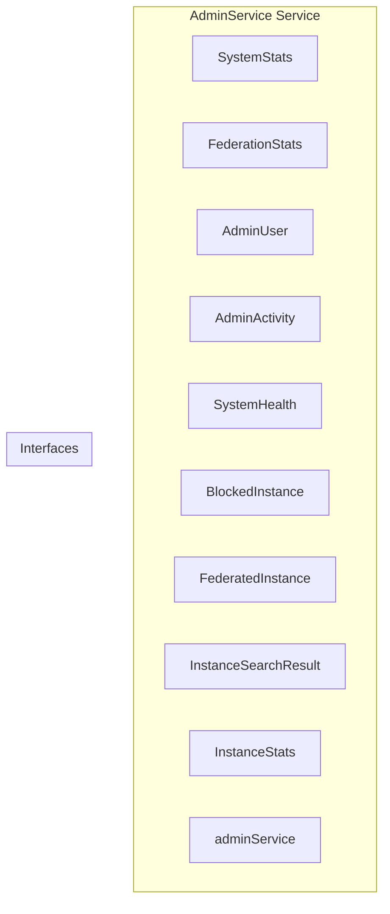

# AdminService Service

**File:** `src/services/AdminService.ts`

## Overview


```mermaid
graph TB
    subgraph "AdminService Service"
        SYSTEMSTATS[SystemStats]
        FEDERATIONSTATS[FederationStats]
        ADMINUSER[AdminUser]
        ADMINACTIVITY[AdminActivity]
        SYSTEMHEALTH[SystemHealth]
        BLOCKEDINSTANCE[BlockedInstance]
        FEDERATEDINSTANCE[FederatedInstance]
        INSTANCESEARCHRESULT[InstanceSearchResult]
        INSTANCESTATS[InstanceStats]
        ADMINSERVICE[adminService]
    end
    
    
    
    subgraph "Interfaces"
        SYSTEMSTATS[SystemStats]
        FEDERATIONSTATS[FederationStats]
        ADMINUSER[AdminUser]
        ADMINACTIVITY[AdminActivity]
        SYSTEMHEALTH[SystemHealth]
        BLOCKEDINSTANCE[BlockedInstance]
        FEDERATEDINSTANCE[FederatedInstance]
        INSTANCESEARCHRESULT[InstanceSearchResult]
        INSTANCESTATS[InstanceStats]
    end
```

## Exports

- **SystemStats** - No description
- **FederationStats** - No description
- **AdminUser** - No description
- **AdminActivity** - No description
- **SystemHealth** - No description
- **BlockedInstance** - No description
- **FederatedInstance** - No description
- **InstanceSearchResult** - No description
- **InstanceStats** - No description
- **adminService** - No description


## Classes

### AdminService

No description available.

**Methods:**
- `getSystemStats`
- `Date`

**Properties:**
- `today`
- `count`
- `head`


## Interfaces

### SystemStats

No description available.

```typescript
export interface SystemStats {
  total_users: number;
  total_servers: number;
  active_servers: number;
  total_posts: number;
  federated_instances: number;
  uptime?: number;
  newUsersToday?: number;
  postsToday?: number;
}
```

### FederationStats

No description available.

```typescript
export interface FederationStats {
  pending_deliveries: number;
  successful_deliveries: number;
  failed_deliveries: number;
  active_instances: number;
}
```

### AdminUser

No description available.

```typescript
export interface AdminUser {
  id: string;
  username: string;
  display_name?: string;
  avatar_url?: string;
  created_at: string;
  updated_at?: string;
  domain?: string;
  is_local?: boolean; // Indicates if the user is local or remote
  is_admin: boolean;
  is_suspended: boolean;
  suspended_at?: string;
  suspension_reason?: string;
  federated_id?: string;
  ap_actor_id?: string;
  postCount: number;
  serverCount: number;
  handle: string;
}
```

### AdminActivity

No description available.

```typescript
export interface AdminActivity {
  id: string;
  admin_id: string;
  admin_username: string;
  action_type: string;
  target_type: string;
  target_id?: string;
  details: string;
  metadata?: any;
  ip_address?: string;
  user_agent?: string;
  created_at: string;
}
```

### SystemHealth

No description available.

```typescript
export interface SystemHealth {
  database: {
    responseTime: number;
    connections: number;
  }
```

### BlockedInstance

No description available.

```typescript
export interface BlockedInstance {
  domain: string;
  reason: string;
  blocked_at?: string;
  blocked_by?: string;
}
```

### FederatedInstance

No description available.

```typescript
export interface FederatedInstance {
  id: string;
  domain: string;
  software?: string;
  version?: string;
  description?: string;
  admin_contact?: string;
  is_blocked: boolean;
  is_trusted: boolean;
  last_seen_at: string;
  user_count: number;
  status_count: number;
  connection_count: number;
  metadata: any;
  created_at: string;
  updated_at: string;
}
```

### InstanceSearchResult

No description available.

```typescript
export interface InstanceSearchResult {
  domain: string;
  software?: string;
  version?: string;
  description?: string;
  user_count?: number;
  status_count?: number;
  admin_contact?: string;
  api_available: boolean;
  federation_enabled: boolean;
}
```

### InstanceStats

No description available.

```typescript
export interface InstanceStats {
  total_instances: number;
  blocked_instances: number;
  trusted_instances: number;
  active_instances: number;
  recently_discovered: number;
}
```


## Source Code Insights

**File Size:** 33076 characters
**Lines of Code:** 1136
**Imports:** 1

## Usage Example

```typescript
import { SystemStats, FederationStats, AdminUser, AdminActivity, SystemHealth, BlockedInstance, FederatedInstance, InstanceSearchResult, InstanceStats, adminService } from '@/services/AdminService.ts'

// Example usage
// Use the exported functionality
```

---

*This documentation was automatically generated from the source code.*