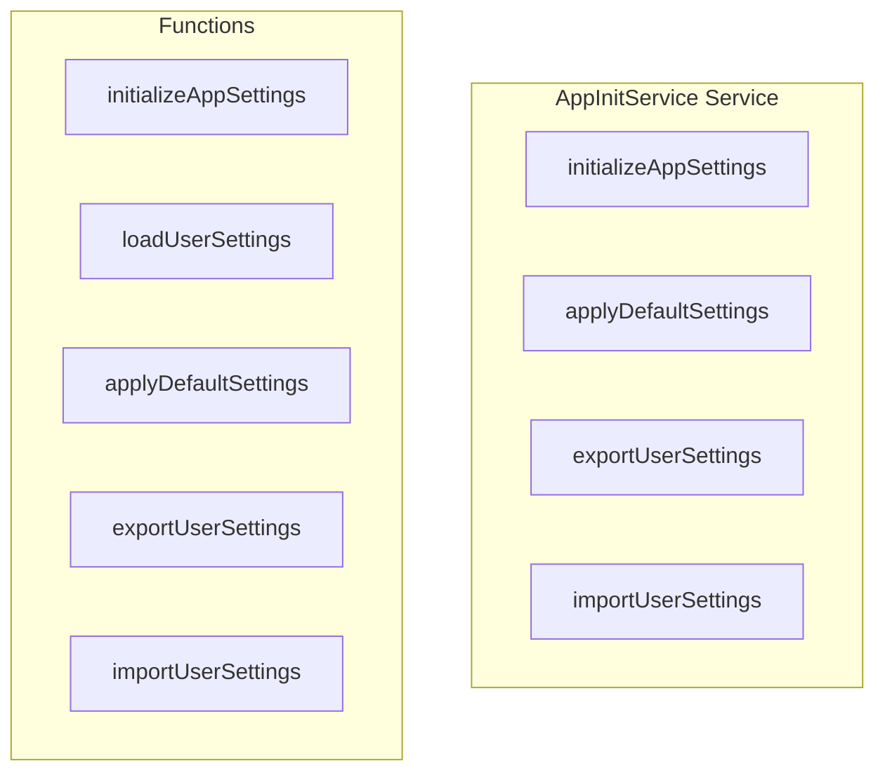

# AppInitService Service

**File:** `src/services/AppInitService.ts`

## Overview




## Exports

- **initializeAppSettings** - function export
- **applyDefaultSettings** - function export
- **exportUserSettings** - function export
- **importUserSettings** - function export

## Functions

### `initializeAppSettings()`

No description available.

**Parameters:**
None

**Returns:** `void`

```typescript
/**
 * App Initialization Service
 * 
 * Handles initialization of all app-wide settings and features on startup
 * OPTIMIZED: Uses profile store to avoid redundant database queries
 */

import { useVisualTheme } from '@/composables/useVisualTheme'
import { setLocale } from '@/i18n'
import { useAuthStore } from '@/stores/auth'
import { useProfileStore } from '@/stores/useProfile'
import { useInstanceSettingsStore } from '@/stores/useInstanceSettings'
import { debug } from '@/utils/debug'

/**
 * Initialize all app settings
 */
export async function initializeAppSettings()
```

### `loadUserSettings()`

No description available.

**Parameters:**
None

**Returns:** `void`

```typescript
/**
 * Load user-specific settings from profile store
 * OPTIMIZED: Uses cached profile data instead of separate queries
 */
async function loadUserSettings()
```

### `applyDefaultSettings()`

No description available.

**Parameters:**
None

**Returns:** `void`

```typescript
/**
 * Apply default settings for new users or fallback
 */
export async function applyDefaultSettings()
```

### `exportUserSettings()`

No description available.

**Parameters:**
None

**Returns:** `void`

```typescript
/**
 * Export user settings for backup
 */
export async function exportUserSettings()
```

### `importUserSettings(settings: any)`

No description available.

**Parameters:**
- `settings: any`

**Returns:** `void`

```typescript
/**
 * Import user settings from backup
 */
export async function importUserSettings(settings: any)
```


## Source Code Insights

**File Size:** 3096 characters
**Lines of Code:** 119
**Imports:** 6

## Usage Example

```typescript
import { initializeAppSettings, applyDefaultSettings, exportUserSettings, importUserSettings } from '@/services/AppInitService'

// Example usage
initializeAppSettings()
```

---

*This documentation was automatically generated from the source code.*