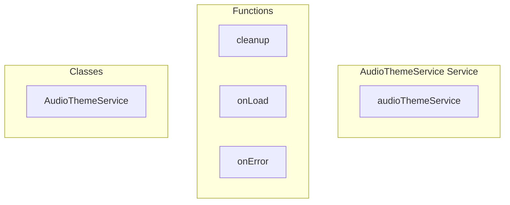

# AudioThemeService Service

**File:** `src/services/AudioThemeService.ts`

## Overview




## Exports

- **AudioThemeService** - class export
- **audioThemeService** - const export

## Functions

### `cleanup()`

No description available.

**Parameters:**
None

**Returns:** `Unknown`

```typescript
const cleanup = () =>
```

### `onLoad()`

No description available.

**Parameters:**
None

**Returns:** `Unknown`

```typescript
const onLoad = () =>
```

### `onError()`

No description available.

**Parameters:**
None

**Returns:** `Unknown`

```typescript
const onError = () =>
```


## Classes

### AudioThemeService

No description available.

**Methods:**
- `constructor`
- `getInstance`
- `initializeBuiltInThemes`
- `registerTheme`
- `getThemes`
- `getCurrentTheme`
- `getTheme`
- `setTheme`
- `catch`
- `playAudio`
- `performAudioPlayback`
- `getAudioWithFallback`
- `getOrCreateAudio`
- `preloadAudio`
- `preloadTheme`
- `addToCache`
- `clearCacheForTheme`
- `loadSettings`
- `saveSettings`
- `getVolume`
- `setVolume`
- `getSettings`
- `testAudio`
- `getCacheInfo`
- `clearCache`
- `emit`
- `destroy`

**Properties:**
- `instance`
- `state`
- `audioCache`
- `audioQueue`
- `settings`
- `selectedTheme`
- `volume`
- `lastUpdated`
- `optimizations`
- `lastPlayTime`
- `RATE_LIMIT_MS`
- `MAX_CACHE_SIZE`
- `PRELOAD_TIMEOUT`
- `registry`
- `themes`
- `loadedThemes`
- `Events`
- `eventListeners`
- `MANAGEMENT`
- `id`
- `name`
- `description`
- `author`
- `version`
- `isBuiltIn`
- `preview`
- `sounds`
- `Notifications`
- `mention`
- `dm`
- `reaction`
- `reply`
- `server_invite`
- `friend_request`
- `server_update`
- `emoji_added`
- `voice_channel_activity`
- `actions`
- `voice_connect`
- `voice_disconnect`
- `call_incoming`
- `call_outgoing`
- `call_ended`
- `mic_on`
- `mic_off`
- `deafen_on`
- `deafen_off`
- `camera_on`
- `camera_off`
- `screenshare_on`
- `screenshare_off`
- `ui_click`
- `ui_hover`
- `ui_success`
- `ui_error`
- `ui_notification`
- `melodic`
- `tones`
- `refined`
- `Note`
- `theme`
- `null`
- `ID`
- `SWITCHING`
- `swapping`
- `false`
- `previousTheme`
- `themeId`
- `memory`
- `from`
- `true`
- `error`
- `PLAYBACK`
- `fallback`
- `action`
- `now`
- `lastPlay`
- `playback`
- `queueKey`
- `playPromise`
- `chain`
- `audio`
- `0`
- `audioClone`
- `soundPath`
- `loading`
- `1`
- `currentTheme`
- `2`
- `defaultTheme`
- `caching`
- `PRELOADING`
- `timeout`
- `timeoutId`
- `cleanup`
- `onLoad`
- `onError`
- `once`
- `path`
- `soundPaths`
- `preloadPromises`
- `sound`
- `failures`
- `management`
- `size`
- `firstKey`
- `localStorage`
- `stored`
- `validation`
- `DEBUGGING`
- `testing`
- `debugging`
- `paths`
- `maxSize`
- `cache`
- `SYSTEM`
- `listener`
- `listeners`
- `index`
- `event`
- `CLEANUP`
- `resources`


## Source Code Insights

**File Size:** 19544 characters
**Lines of Code:** 613
**Imports:** 3

## Usage Example

```typescript
import { AudioThemeService, audioThemeService } from '@/services/AudioThemeService'

// Example usage
cleanup()
```

---

*This documentation was automatically generated from the source code.*