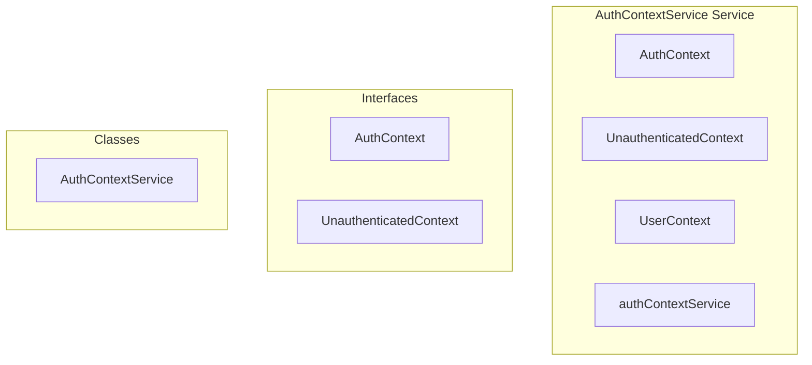

# AuthContextService Service

**File:** `src/services/AuthContextService.ts`

## Overview




## Exports

- **AuthContext** - interface export
- **UnauthenticatedContext** - interface export
- **UserContext** - type export
- **AuthContextService** - class export
- **authContextService** - const export


## Classes

### AuthContextService

No description available.

**Methods:**
- `getInstance`
- `getCurrentContext`
- `catch`
- `getCurrentProfileId`
- `getCurrentAuthUser`
- `isAuthenticated`
- `clearCache`
- `initializeAuthListener`
- `createUnauthenticatedContext`
- `waitForLoading`

**Properties:**
- `instance`
- `cachedContext`
- `isLoading`
- `queries`
- `available`
- `requests`
- `true`
- `data`
- `ID`
- `profile`
- `exists`
- `authUser`
- `profileId`
- `isAuthenticated`
- `resolved`
- `context`
- `false`
- `authenticated`
- `user`
- `throwing`
- `null`
- `cache`
- `changes`
- `state`
- `in`
- `newUserId`
- `cachedUserId`
- `etc`
- `is`
- `methods`


## Interfaces

### AuthContext

No description available.

```typescript
interface AuthContext {

  authUser: User
  profileId: string
  isAuthenticated: true

}
```

### UnauthenticatedContext

No description available.

```typescript
interface UnauthenticatedContext {

  authUser: null
  profileId: null
  isAuthenticated: false

}
```


## Source Code Insights

**File Size:** 6388 characters
**Lines of Code:** 222
**Imports:** 3

## Usage Example

```typescript
import { AuthContext, UnauthenticatedContext, UserContext, AuthContextService, authContextService } from '@/services/AuthContextService'

// Example usage
// Use the exported functionality
```

---

*This documentation was automatically generated from the source code.*