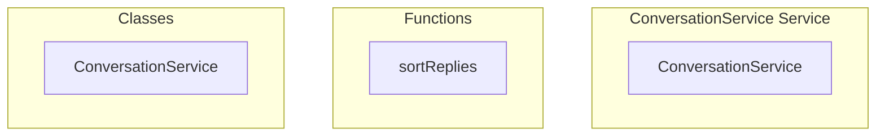

# ConversationService Service

**File:** `src/services/ConversationService.ts`

## Overview




## Exports

- **ConversationService** - class export

## Functions

### `sortReplies(post: ActivityPubPost & { replies?: ActivityPubPost[] })`

No description available.

**Parameters:**
- `post: ActivityPubPost & { replies?: ActivityPubPost[] }`

**Returns:** `Unknown`

```typescript
const sortReplies = (post: ActivityPubPost & { replies?: ActivityPubPost[] }) =>
```


## Classes

### ConversationService

No description available.

**Methods:**
- `findConversationRoot`
- `catch`
- `getConversationThread`
- `getConversationContext`
- `buildThreadHierarchy`
- `createNavigationContext`
- `getConversationNavigationData`
- `getRouteContext`

**Properties:**
- `operation`
- `lookups`
- `post`
- `post_id`
- `root`
- `postId`
- `rootId`
- `retrieval`
- `thread`
- `conversation_root_id`
- `in_conversation_root_id`
- `error`
- `posts`
- `id`
- `root_post`
- `reply_count`
- `created_at`
- `index`
- `context`
- `null`
- `display`
- `postMap`
- `rootPosts`
- `pass`
- `replies`
- `postWithReplies`
- `parent`
- `date`
- `sortReplies`
- `b`
- `highlighting`
- `conversationRootId`
- `clickedPostId`
- `highlightPostId`
- `timestamp`
- `data`
- `routing`
- `options`
- `highlightPost`
- `scrollToPost`
- `success`
- `route`
- `name`
- `params`
- `query`
- `highlight`
- `from`
- `t`
- `fallbackRoute`
- `ID`
- `parameters`
- `scrolling`
- `fromPostId`


## Source Code Insights

**File Size:** 7931 characters
**Lines of Code:** 259
**Imports:** 3

## Usage Example

```typescript
import { ConversationService } from '@/services/ConversationService'

// Example usage
sortReplies()
```

---

*This documentation was automatically generated from the source code.*