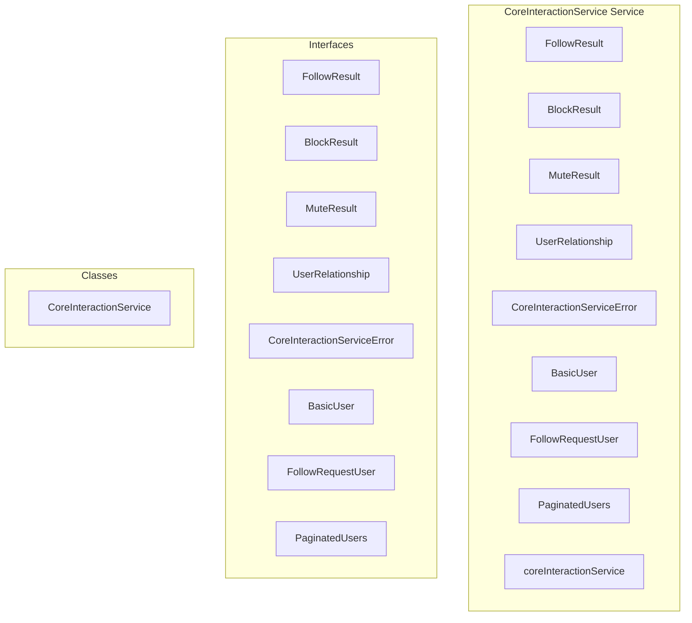

# core/CoreInteractionService Service

**File:** `src/services/core/CoreInteractionService.ts`

## Overview




## Exports

- **FollowResult** - interface export
- **BlockResult** - interface export
- **MuteResult** - interface export
- **UserRelationship** - interface export
- **CoreInteractionServiceError** - interface export
- **BasicUser** - interface export
- **FollowRequestUser** - interface export
- **PaginatedUsers** - interface export
- **CoreInteractionService** - class export
- **coreInteractionService** - const export


## Classes

### CoreInteractionService

No description available.

**Methods:**
- `getInstance`
- `toggleFollow`
- `catch`
- `acceptFollowRequest`
- `rejectFollowRequest`
- `toggleBlock`
- `toggleMute`
- `getUserRelationships`
- `getFollowRequests`
- `getFollowers`
- `getFollowing`
- `getCurrentUserProfileId`
- `createError`

**Properties:**
- `instance`
- `constants`
- `MAX_RELATIONSHIP_BATCH_SIZE`
- `MAX_PAGINATION_LIMIT`
- `service`
- `profileId`
- `validation`
- `prevention`
- `Core`
- `status`
- `data`
- `following`
- `pending`
- `verification`
- `supabase`
- `Security`
- `settings`
- `check`
- `failed`
- `requiresApproval`
- `insertion`
- `follower_id`
- `following_id`
- `created_at`
- `violations`
- `error`
- `blocked`
- `blocker_id`
- `blocked_user_id`
- `muted`
- `muter_id`
- `muted_user_id`
- `mute_type`
- `processing`
- `empty`
- `limits`
- `IDs`
- `sanitizedUserIds`
- `relationships`
- `false`
- `followedBy`
- `followRequestPending`
- `handling`
- `blocks`
- `mutes`
- `true`
- `UI`
- `pagination`
- `number`
- `requests`
- `hasMore`
- `nextCursor`
- `secureLimit`
- `query`
- `domain`
- `ascending`
- `more`
- `results`
- `actualRequests`
- `transformedRequests`
- `id`
- `username`
- `display_name`
- `avatar_url`
- `is_local`
- `requested_at`
- `undefined`
- `limit`
- `actualFollowers`
- `users`
- `actualFollowing`
- `METHODS`
- `ID`
- `lookups`
- `message`
- `secureDetails`
- `details`


## Interfaces

### FollowResult

No description available.

```typescript
interface FollowResult {

  following: boolean
  pending?: boolean // For follow requests

}
```

### BlockResult

No description available.

```typescript
interface BlockResult {

  blocked: boolean

}
```

### MuteResult

No description available.

```typescript
interface MuteResult {

  muted: boolean

}
```

### UserRelationship

No description available.

```typescript
interface UserRelationship {

  following: boolean
  followedBy: boolean
  followRequestPending: boolean
  blocked: boolean
  muted: boolean

}
```

### CoreInteractionServiceError

No description available.

```typescript
interface CoreInteractionServiceError {

  code: string
  message: string
  details?: any

}
```

### BasicUser

No description available.

```typescript
interface BasicUser {

  id: string
  username: string
  display_name: string
  avatar_url?: string
  is_local: boolean
  domain?: string

}
```

### FollowRequestUser

No description available.

```typescript
interface FollowRequestUser {

  requested_at: string

}
```

### PaginatedUsers

No description available.

```typescript
interface PaginatedUsers {

  users: BasicUser[]
  hasMore: boolean
  nextCursor?: string

}
```


## Source Code Insights

**File Size:** 26209 characters
**Lines of Code:** 787
**Imports:** 3

## Usage Example

```typescript
import { FollowResult, BlockResult, MuteResult, UserRelationship, CoreInteractionServiceError, BasicUser, FollowRequestUser, PaginatedUsers, CoreInteractionService, coreInteractionService } from '@/services/core/CoreInteractionService'

// Example usage
// Use the exported functionality
```

---

*This documentation was automatically generated from the source code.*