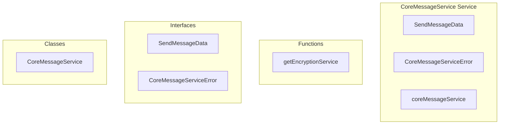

# core/CoreMessageService Service

**File:** `src/services/core/CoreMessageService.ts`

## Overview


```mermaid
graph TB
    subgraph "CoreMessageService Service"
        SENDMESSAGEDATA[SendMessageData]
        COREMESSAGESERVICEERROR[CoreMessageServiceError]
        COREMESSAGESERVICE[CoreMessageService]
        COREMESSAGESERVICE[coreMessageService]
    end
    
    subgraph "Functions"
        FN_GETENCRYPTIONSERVICE[getEncryptionService]
    end
    
    subgraph "Interfaces"
        INT_SENDMESSAGEDATA[SendMessageData]
        INT_COREMESSAGESERVICEERROR[CoreMessageServiceError]
    end
    
    subgraph "Classes"
        CLS_COREMESSAGESERVICE[CoreMessageService]
    end
```


## Exports

- **SendMessageData** - interface export
- **CoreMessageServiceError** - interface export
- **CoreMessageService** - class export
- **coreMessageService** - const export

## Functions

### `getEncryptionService()`

No description available.

**Parameters:**
None

**Returns:** `void`

```typescript
async function getEncryptionService()
```


## Classes

### CoreMessageService

No description available.

**Methods:**
- `getInstance`
- `sendChannelMessage`
- `Channel`
- `catch`
- `sendDMMessage`
- `Conversation`
- `editMessage`
- `deleteMessage`
- `toggleReaction`
- `getMessageReactions`
- `getBatchMessageReactions`
- `populateReactionsStoreCache`
- `loadChannelMessages`
- `loadConversationMessages`
- `loadMessage`
- `getCurrentUserProfileId`
- `createError`

**Properties:**
- `instance`
- `serverId`
- `channelId`
- `content`
- `replyTo`
- `currentUser`
- `first`
- `finalContent`
- `encrypted`
- `encryptionMetadata`
- `policy`
- `data`
- `encryptionMode`
- `mode`
- `disabled`
- `encrypt`
- `encryptionService`
- `hasRecoveryKey`
- `isUnlocked`
- `check`
- `with`
- `recipientIds`
- `encryptedData`
- `failed`
- `plaintext`
- `messageData`
- `user_id`
- `channel_id`
- `reply_to`
- `encryption_metadata`
- `metadata`
- `database`
- `FAILED`
- `successfully`
- `message`
- `error`
- `Note`
- `conversationId`
- `conversation`
- `enabled`
- `conversationEncryptionEnabled`
- `setting`
- `unlocked`
- `participants`
- `conversation_id`
- `newContent`
- `roomId`
- `members`
- `channel`
- `Megolm`
- `supabase`
- `is_deleted`
- `lookup`
- `messageId`
- `emojiId`
- `added`
- `hadRaceCondition`
- `profileId`
- `Core`
- `exists`
- `message_id`
- `reaction`
- `emoji_id`
- `condition`
- `SIMPLIFIED`
- `transformedReactions`
- `emoji`
- `id`
- `name`
- `url`
- `count`
- `reactions`
- `message_id_of_reactions`
- `PERFORMANCE`
- `message_ids`
- `groupedReactions`
- `arrays`
- `INTEGRATION`
- `FIX`
- `together`
- `dependencies`
- `reactionsStore`
- `cache`
- `functionality`
- `NOTE`
- `options`
- `limit`
- `before`
- `after`
- `signal`
- `query`
- `ascending`
- `messages`
- `messageList`
- `orderedMessages`
- `OPTIMIZATION`
- `messageIds`
- `reactionsByMessage`
- `seamlessly`
- `decryptedMessages`
- `null`
- `ID`
- `lookups`


## Interfaces

### SendMessageData

No description available.

```typescript
interface SendMessageData {

  content: MessagePart[]
  reply_to?: string
  // For server messages
  channel_id?: string
  // For DMs  
  conversation_id?: string

}
```

### CoreMessageServiceError

No description available.

```typescript
interface CoreMessageServiceError {

  code: string
  message: string
  details?: any

}
```


## Source Code Insights

**File Size:** 30926 characters
**Lines of Code:** 850
**Imports:** 5

## Usage Example

```typescript
import { SendMessageData, CoreMessageServiceError, CoreMessageService, coreMessageService } from '@/services/core/CoreMessageService'

// Example usage
getEncryptionService()
```

---

*This documentation was automatically generated from the source code.*