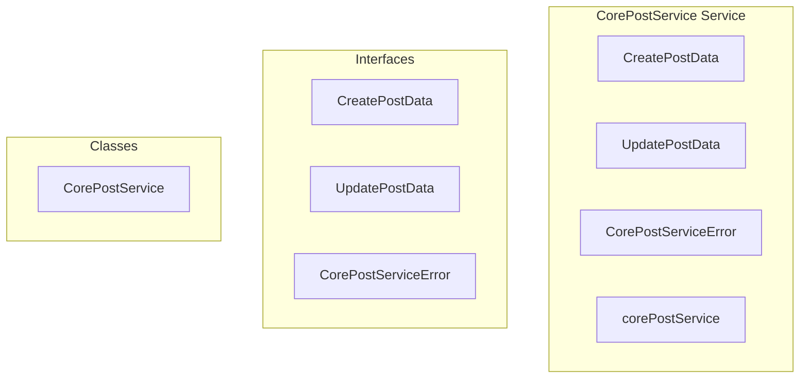

# core/CorePostService Service

**File:** `src/services/core/CorePostService.ts`

## Overview




## Exports

- **CreatePostData** - interface export
- **UpdatePostData** - interface export
- **CorePostServiceError** - interface export
- **CorePostService** - class export
- **corePostService** - const export


## Classes

### CorePostService

No description available.

**Methods:**
- `getInstance`
- `createPost`
- `catch`
- `updatePost`
- `deletePost`
- `toggleLike`
- `toggleShare`
- `toggleBookmark`
- `toggleReaction`
- `getPostReactions`
- `getBatchPostReactions`
- `loadTimelinePosts`
- `loadPost`
- `getCurrentUserProfileId`
- `formatTimelinePost`
- `createError`

**Properties:**
- `instance`
- `Core`
- `OPTIMIZED`
- `authUser`
- `profileId`
- `validation`
- `MessagePart`
- `postData`
- `author_id`
- `content`
- `visibility`
- `content_warning`
- `in_reply_to`
- `media_attachments`
- `is_sensitive`
- `language`
- `is_local`
- `is_federated`
- `metadata`
- `connection`
- `data`
- `author`
- `error`
- `lookup`
- `updates`
- `ownership`
- `updateData`
- `supabase`
- `is_deleted`
- `liked`
- `newCount`
- `post_id`
- `user_id`
- `interaction_type`
- `like`
- `count`
- `shared`
- `share`
- `bookmarked`
- `bookmark`
- `post`
- `postId`
- `emojiId`
- `added`
- `hadRaceCondition`
- `exists`
- `emoji_id`
- `reaction`
- `condition`
- `p_post_id`
- `PERFORMANCE`
- `post_ids`
- `groupedReactions`
- `arrays`
- `emoji`
- `id`
- `name`
- `url`
- `users`
- `timeline`
- `options`
- `limit`
- `before`
- `after`
- `signal`
- `query`
- `ascending`
- `postList`
- `OPTIMIZATION`
- `postIds`
- `reactionsByPost`
- `null`
- `created_at`
- `updated_at`
- `reply_context`
- `favorites_count`
- `reblogs_count`
- `replies_count`
- `is_favorited`
- `is_reblogged`
- `is_bookmarked`
- `reblog`
- `reblog_author`
- `message`


## Interfaces

### CreatePostData

No description available.

```typescript
interface CreatePostData {

  content: MessagePart[]
  visibility: 'public' | 'unlisted' | 'followers' | 'direct'
  content_warning?: string
  in_reply_to?: string
  media_attachments?: any[]
  is_sensitive?: boolean
  language?: string

}
```

### UpdatePostData

No description available.

```typescript
interface UpdatePostData {

  content?: MessagePart[]
  content_warning?: string
  is_sensitive?: boolean
  media_attachments?: any[]

}
```

### CorePostServiceError

No description available.

```typescript
interface CorePostServiceError {

  code: string
  message: string
  details?: any

}
```


## Source Code Insights

**File Size:** 22317 characters
**Lines of Code:** 730
**Imports:** 4

## Usage Example

```typescript
import { CreatePostData, UpdatePostData, CorePostServiceError, CorePostService, corePostService } from '@/services/core/CorePostService'

// Example usage
// Use the exported functionality
```

---

*This documentation was automatically generated from the source code.*