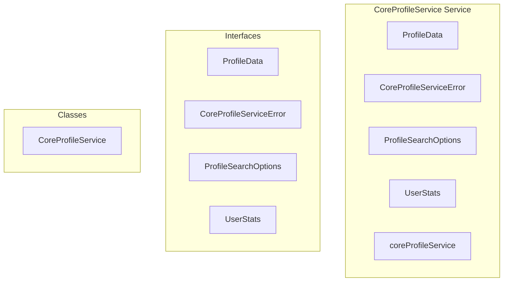

# core/CoreProfileService Service

**File:** `src/services/core/CoreProfileService.ts`

## Overview




## Exports

- **ProfileData** - interface export
- **CoreProfileServiceError** - interface export
- **ProfileSearchOptions** - interface export
- **UserStats** - interface export
- **CoreProfileService** - class export
- **coreProfileService** - const export


## Classes

### CoreProfileService

No description available.

**Methods:**
- `getInstance`
- `loadProfile`
- `catch`
- `loadProfileByAuthUserId`
- `searchProfiles`
- `updateProfile`
- `createProfile`
- `getUserStats`
- `sanitizeProfileData`
- `sanitizeProfileCreationData`
- `sanitizeSearchQuery`
- `sanitizeProfileForPublicView`
- `validateProfileData`
- `validateProfileCreationData`
- `createError`

**Properties:**
- `instance`
- `constants`
- `MAX_SEARCH_LIMIT`
- `MAX_USERNAME_LENGTH`
- `MAX_DISPLAY_NAME_LENGTH`
- `MAX_BIO_LENGTH`
- `validation`
- `Core`
- `data`
- `is_verified`
- `null`
- `sanitizedProfile`
- `error`
- `profile`
- `query`
- `options`
- `limit`
- `injection`
- `sanitizedQuery`
- `secureLimit`
- `queryBuilder`
- `is_private`
- `filtering`
- `filteredProfiles`
- `profileId`
- `authUser`
- `sanitization`
- `sanitizedData`
- `verification`
- `security`
- `violations`
- `creation`
- `auth_user_id`
- `is_local`
- `securely`
- `aggregation`
- `following_count`
- `stats`
- `posts_count`
- `followers_count`
- `profile_views`
- `METHODS`
- `username`
- `display_name`
- `avatar_url`
- `banner_url`
- `bio`
- `color`
- `domain`
- `characters`
- `viewing`
- `Profile`
- `message`
- `Security`
- `secureDetails`
- `details`


## Interfaces

### ProfileData

No description available.

```typescript
interface ProfileData {

  username?: string
  display_name?: string
  avatar_url?: string
  banner_url?: string
  bio?: string
  color?: string

}
```

### CoreProfileServiceError

No description available.

```typescript
interface CoreProfileServiceError {

  code: string
  message: string
  details?: any

}
```

### ProfileSearchOptions

No description available.

```typescript
interface ProfileSearchOptions {

  limit?: number
  includePrivate?: boolean
  signal?: AbortSignal

}
```

### UserStats

No description available.

```typescript
interface UserStats {

  posts_count: number
  followers_count: number
  following_count: number
  profile_views: number

}
```


## Source Code Insights

**File Size:** 14346 characters
**Lines of Code:** 459
**Imports:** 4

## Usage Example

```typescript
import { ProfileData, CoreProfileServiceError, ProfileSearchOptions, UserStats, CoreProfileService, coreProfileService } from '@/services/core/CoreProfileService'

// Example usage
// Use the exported functionality
```

---

*This documentation was automatically generated from the source code.*