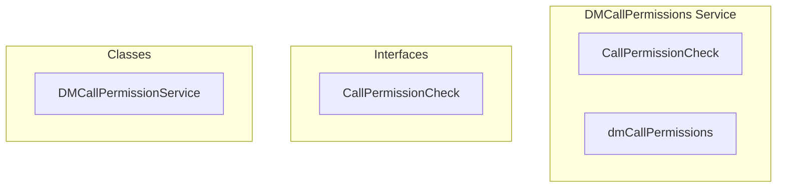

# DMCallPermissions Service

**File:** `src/services/DMCallPermissions.ts`

## Overview




## Exports

- **CallPermissionCheck** - interface export
- **dmCallPermissions** - const export


## Classes

### DMCallPermissionService

No description available.

**Methods:**
- `canReceiveCall`
- `catch`
- `isUserBlocked`
- `status`
- `isUserInDND`
- `isUserBusy`
- `isConversationMuted`
- `areCallNotificationsEnabled`
- `getDeclineReasonMessage`
- `switch`

**Properties:**
- `table`
- `callerId`
- `receiverId`
- `conversationId`
- `permissions`
- `receiver`
- `isBlocked`
- `result`
- `allowed`
- `reason`
- `message`
- `hasBlockedReceiver`
- `mode`
- `isDND`
- `isBusy`
- `conversation`
- `isMuted`
- `preferences`
- `notificationsEnabled`
- `passed`
- `B`
- `blockedUserId`
- `supabase`
- `results`
- `false`
- `status`
- `blocked`
- `userData`
- `database`
- `call`
- `channel`
- `calls`
- `user`
- `enabled`
- `found`
- `true`
- `on`
- `error`
- `caller`
- `default`


## Interfaces

### CallPermissionCheck

No description available.

```typescript
interface CallPermissionCheck {

  allowed: boolean
  reason?: 'blocked' | 'busy' | 'dnd' | 'muted' | 'notifications_disabled'
  message?: string

}
```


## Source Code Insights

**File Size:** 7585 characters
**Lines of Code:** 258
**Imports:** 4

## Usage Example

```typescript
import { CallPermissionCheck, dmCallPermissions } from '@/services/DMCallPermissions'

// Example usage
// Use the exported functionality
```

---

*This documentation was automatically generated from the source code.*