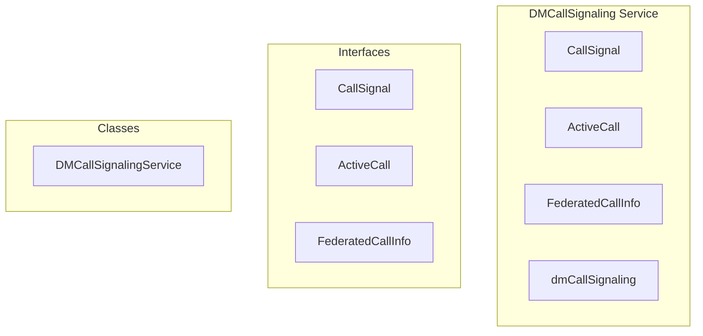

# DMCallSignaling Service

**File:** `src/services/DMCallSignaling.ts`

## Overview




## Exports

- **CallSignal** - interface export
- **ActiveCall** - interface export
- **FederatedCallInfo** - interface export
- **dmCallSignaling** - const export


## Classes

### DMCallSignalingService

No description available.

**Methods:**
- `sendSignal`
- `initiateCall`
- `sendSignalToUser`
- `handleCallTimeout`
- `acceptCall`
- `declineCall`
- `endCall`
- `joinCall`
- `leaveCall`
- `getActiveCall`
- `hasActiveCall`
- `getCallParticipants`
- `initiateFederatedCall`
- `catch`
- `acceptFederatedCall`
- `declineFederatedCall`
- `endFederatedCall`
- `handleFederatedCallTimeout`
- `isFederatedCall`
- `cleanup`

**Properties:**
- `channels`
- `activeCalls`
- `listeners`
- `CALL_TIMEOUT_MS`
- `conversation`
- `onSignal`
- `channelName`
- `listener`
- `exist`
- `channel`
- `event`
- `signal`
- `type`
- `from`
- `callType`
- `status`
- `payload`
- `timeout`
- `conversationId`
- `callerId`
- `receiverIds`
- `timestamp`
- `timer`
- `timeoutTimer`
- `call`
- `channelId`
- `participants`
- `startedAt`
- `tempChannel`
- `user`
- `reason`
- `userId`
- `answered`
- `undefined`
- `caller`
- `exists`
- `calls`
- `METHODS`
- `Realtime`
- `callerFederatedId`
- `calleeFederatedId`
- `to`
- `backend`
- `configResponse`
- `config`
- `null`
- `roomName`
- `room`
- `data`
- `tokenResponse`
- `method`
- `headers`
- `body`
- `roomType`
- `ActivityPub`
- `inviteResponse`
- `livekitUrl`
- `callInfo`
- `callerInstanceUrl`
- `isFederated`
- `token`
- `wsUrl`
- `instance`
- `info`
- `otherParticipantFederatedId`
- `ringing`
- `onIncomingCall`
- `callId`
- `callerName`
- `callerAvatar`
- `accepted`
- `state`
- `rejected`
- `ended`
- `federated`
- `false`
- `timers`


## Interfaces

### CallSignal

No description available.

```typescript
interface CallSignal {

  type: 'initiate' | 'accept' | 'decline' | 'end' | 'join' | 'leave' | 'busy' | 'timeout'
  callerId: string
  callType: 'voice' | 'video'
  timestamp: number
  conversationId: string
  reason?: 'timeout' | 'busy' | 'blocked' | 'dnd' // Decline/busy reasons
  // Federated call fields
  isFederated?: boolean
  callerFederatedId?: string
  livekitUrl?: string
  roomName?: string

}
```

### ActiveCall

No description available.

```typescript
interface ActiveCall {

  conversationId: string
  channelId: string // dm-{conversationId}
  callType: 'voice' | 'video'
  callerId: string
  participants: string[] // user IDs currently in call
  startedAt: Date
  timeoutTimer?: number // Timer ID for call timeout
  // Federated call fields
  isFederated?: boolean
  callerFederatedId?: string
  calleeFederatedId?: string
  livekitUrl?: string
  roomName?: string

}
```

### FederatedCallInfo

No description available.

```typescript
interface FederatedCallInfo {

  callerFederatedId: string
  calleeFederatedId: string
  callerInstanceUrl: string
  livekitUrl: string
  roomName: string

}
```


## Source Code Insights

**File Size:** 21483 characters
**Lines of Code:** 766
**Imports:** 3

## Usage Example

```typescript
import { CallSignal, ActiveCall, FederatedCallInfo, dmCallSignaling } from '@/services/DMCallSignaling'

// Example usage
// Use the exported functionality
```

---

*This documentation was automatically generated from the source code.*