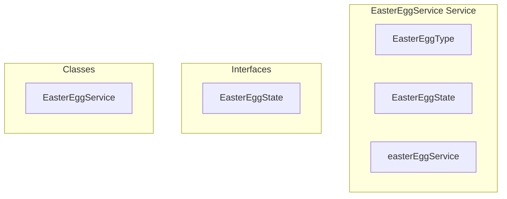

# EasterEggService Service

**File:** `src/services/EasterEggService.ts`

## Overview




## Exports

- **EasterEggType** - type export
- **EasterEggState** - interface export
- **easterEggService** - const export


## Classes

### EasterEggService

No description available.

**Methods:**
- `initialize`
- `activate`
- `deactivate`
- `getState`
- `isActive`
- `getActiveType`
- `notifyListeners`
- `cleanup`

**Properties:**
- `state`
- `isActive`
- `type`
- `activatedBy`
- `activatedAt`
- `listeners`
- `channel`
- `channelName`
- `userId`
- `config`
- `broadcast`
- `event`
- `activation`
- `again`
- `egg`
- `active`
- `Activated`
- `participants`
- `payload`
- `boolean`
- `changes`
- `Cleanup`
- `null`
- `leaks`
- `broadcasting`


## Interfaces

### EasterEggState

No description available.

```typescript
interface EasterEggState {

  isActive: boolean
  type: EasterEggType | null
  activatedBy: string | null
  activatedAt: number | null

}
```


## Source Code Insights

**File Size:** 4304 characters
**Lines of Code:** 187
**Imports:** 2

## Usage Example

```typescript
import { EasterEggType, EasterEggState, easterEggService } from '@/services/EasterEggService'

// Example usage
// Use the exported functionality
```

---

*This documentation was automatically generated from the source code.*