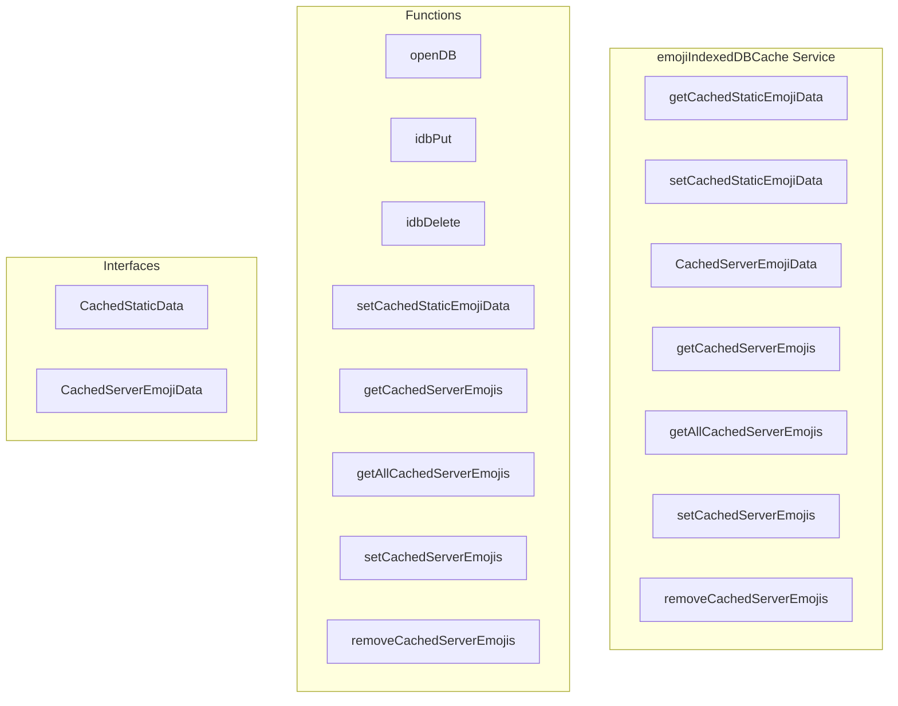

# emojiIndexedDBCache Service

**File:** `src/services/emojiIndexedDBCache.ts`

## Overview




## Exports

- **getCachedStaticEmojiData** - function export
- **setCachedStaticEmojiData** - function export
- **CachedServerEmojiData** - interface export
- **getCachedServerEmojis** - function export
- **getAllCachedServerEmojis** - function export
- **setCachedServerEmojis** - function export
- **removeCachedServerEmojis** - function export

## Functions

### `openDB()`

No description available.

**Parameters:**
None

**Returns:** `Promise&lt;IDBDatabase&gt;`

```typescript
function openDB(): Promise<IDBDatabase>
```

### `idbPut(storeName: string, value: unknown)`

No description available.

**Parameters:**
- `storeName: string`
- `value: unknown`

**Returns:** `Promise&lt;void&gt;`

```typescript
async function idbPut(storeName: string, value: unknown): Promise<void>
```

### `idbDelete(storeName: string, key: IDBValidKey)`

No description available.

**Parameters:**
- `storeName: string`
- `key: IDBValidKey`

**Returns:** `Promise&lt;void&gt;`

```typescript
async function idbDelete(storeName: string, key: IDBValidKey): Promise<void>
```

### `setCachedStaticEmojiData(key: string, data: unknown, version: string)`

No description available.

**Parameters:**
- `key: string`
- `data: unknown`
- `version: string`

**Returns:** `Promise&lt;void&gt;`

```typescript
export async function setCachedStaticEmojiData(
  key: string,
  data: unknown,
  version: string,
): Promise<void>
```

### `getCachedServerEmojis(serverId: string)`

No description available.

**Parameters:**
- `serverId: string`

**Returns:** `Promise&lt;CachedServerEmojiData | undefined&gt;`

```typescript
export async function getCachedServerEmojis(
  serverId: string,
): Promise<CachedServerEmojiData | undefined>
```

### `getAllCachedServerEmojis()`

No description available.

**Parameters:**
None

**Returns:** `Promise&lt;CachedServerEmojiData[]&gt;`

```typescript
export async function getAllCachedServerEmojis(): Promise<CachedServerEmojiData[]>
```

### `setCachedServerEmojis(data: CachedServerEmojiData)`

No description available.

**Parameters:**
- `data: CachedServerEmojiData`

**Returns:** `Promise&lt;void&gt;`

```typescript
export async function setCachedServerEmojis(
  data: CachedServerEmojiData,
): Promise<void>
```

### `removeCachedServerEmojis(serverId: string)`

No description available.

**Parameters:**
- `serverId: string`

**Returns:** `Promise&lt;void&gt;`

```typescript
export async function removeCachedServerEmojis(serverId: string): Promise<void>
```


## Interfaces

### CachedStaticData

No description available.

```typescript
interface CachedStaticData {

  key: string
  data: unknown
  version: string
  cachedAt: number

}
```

### CachedServerEmojiData

No description available.

```typescript
interface CachedServerEmojiData {

  serverId: string
  serverName: string
  serverIcon?: string
  allowCrossServer: boolean
  emojis: unknown[]
  lastFetched: number

}
```


## Constants

### DB_NAME

No description available.

```typescript
const DB_NAME = 'harmony_emoji_cache'
```

### DB_VERSION

No description available.

```typescript
const DB_VERSION = 1
```

### STORES

No description available.

```typescript
const STORES = {
```

### SERVER_EMOJI_MAX_AGE

No description available.

```typescript
const SERVER_EMOJI_MAX_AGE = 60 * 60 * 1000 // 1 hour persistent cache
```


## Source Code Insights

**File Size:** 6355 characters
**Lines of Code:** 218
**Imports:** 1

## Usage Example

```typescript
import { getCachedStaticEmojiData, setCachedStaticEmojiData, CachedServerEmojiData, getCachedServerEmojis, getAllCachedServerEmojis, setCachedServerEmojis, removeCachedServerEmojis } from '@/services/emojiIndexedDBCache'

// Example usage
openDB()
```

---

*This documentation was automatically generated from the source code.*