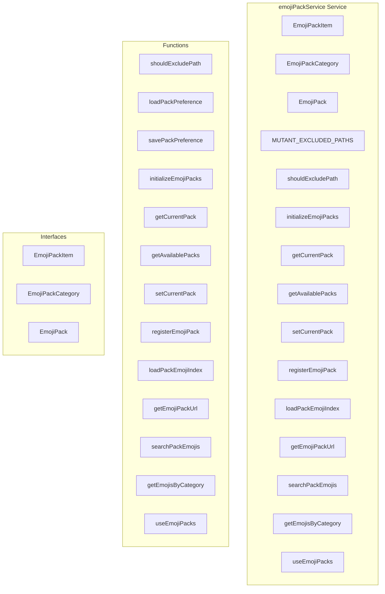

# emojiPackService Service

**File:** `src/services/emojiPackService.ts`

## Overview




## Exports

- **EmojiPackItem** - interface export
- **EmojiPackCategory** - interface export
- **EmojiPack** - interface export
- **MUTANT_EXCLUDED_PATHS** - const export
- **shouldExcludePath** - function export
- **initializeEmojiPacks** - function export
- **getCurrentPack** - function export
- **getAvailablePacks** - function export
- **setCurrentPack** - function export
- **registerEmojiPack** - function export
- **loadPackEmojiIndex** - function export
- **getEmojiPackUrl** - function export
- **searchPackEmojis** - function export
- **getEmojisByCategory** - function export
- **useEmojiPacks** - function export

## Functions

### `shouldExcludePath(path: string)`

No description available.

**Parameters:**
- `path: string`

**Returns:** `boolean`

```typescript
/**
 * Emoji Pack Service
 * 
 * Manages swappable emoji packs:
 * - Twemoji (default) - Twitter's open source emojis
 * - Mutant Standard - Expressive custom emoji set
 * - Native Unicode - System default emojis
 * 
 * Allows users to switch between different emoji styles.
 */

import { ref, computed } from 'vue'
import { debug } from '@/utils/debug'
import { 
  EMOJI_CATEGORIES, 
  TWEMOJI_BASE_URL, 
  MUTANT_BASE_URL,
  DEFAULT_EMOJI_PACK,
  type EmojiPack as EmojiPackType
} from '@/utils/emojiConstants'

export interface EmojiPackItem {
  id: string              // Unique identifier (filename without extension)
  name: string            // Display name (emoji shortcode)
  category: string        // Category name
  subcategory?: string    // Subcategory name
  path: string            // Path to the SVG file
  keywords?: string[]     // Search keywords
}

export interface EmojiPackCategory {
  id: string
  name: string
  icon: string            // Category icon (emoji or SVG path)
  order?: number
  subcategories?: string[]
}

export interface EmojiPack {
  id: string
  name: string
  description: string
  basePath: string
  format: 'svg' | 'png' | 'webp'
  categories: EmojiPackCategory[]
  emojis: EmojiPackItem[]
  isBuiltIn: boolean      // True for native Unicode
}

const STORAGE_KEY = 'harmony-emoji-pack'
const DEFAULT_PACK_ID: EmojiPackType = DEFAULT_EMOJI_PACK

// Available emoji packs
const availablePacks = ref<Map<string, EmojiPack>>(new Map())
const currentPackId = ref<string>(DEFAULT_PACK_ID)
const isInitialized = ref(false)

// Twemoji pack definition (NEW DEFAULT)
const twemojiPack: EmojiPack = {
  id: 'twemoji',
  name: 'Twemoji',
  description: 'Twitter\'s open source emoji set',
  basePath: TWEMOJI_BASE_URL,
  format: 'svg',
  categories: EMOJI_CATEGORIES.map(cat => ({
    id: cat.id,
    name: cat.name,
    icon: cat.icon,
    order: cat.order
  })),
  emojis: [], // Loaded from unicode-emoji-data.json
  isBuiltIn: false
}

// Native Unicode emoji pack (built-in)
const nativeUnicodePack: EmojiPack = {
  id: 'native',
  name: 'System',
  description: 'System default Unicode emojis',
  basePath: '',
  format: 'svg',
  categories: EMOJI_CATEGORIES.map(cat => ({
    id: cat.id,
    name: cat.name,
    icon: cat.icon,
    order: cat.order
  })),
  emojis: [], // Native emojis are handled differently (rendered as text)
  isBuiltIn: true
}

// Mutant Standard emoji pack definition
const mutantStandardPack: EmojiPack = {
  id: 'mutant',
  name: 'Mutant Standard',
  description: 'Expressive and unique emoji set',
  basePath: MUTANT_BASE_URL,
  format: 'svg',
  categories: [
    { id: 'expressions', name: 'Expressions', icon: '😀', order: 0, subcategories: ['smileys', 'body_parts', 'semi_body'] },
    { id: 'food_drink_herbs', name: 'Food & Drink', icon: '🍕', order: 1, subcategories: ['food', 'drink', 'fruit_veg', 'alcohol_herbs'] },
    { id: 'activities_clothing', name: 'Activities', icon: '🏀', order: 2, subcategories: ['sports', 'clothing', 'performing_arts', 'roles'] },
    { id: 'nature_effects', name: 'Nature', icon: '🌿', order: 3, subcategories: ['plants', 'weather', 'earth', 'effects', 'moon'] },
    { id: 'objects', name: 'Objects', icon: '🔧', order: 4, subcategories: ['tech', 'household', 'office_stationery', 'games', 'party'] },
    { id: 'symbols', name: 'Symbols', icon: '❤️', order: 5, subcategories: ['hearts', 'arrows', 'shapes', 'misc'] },
    { id: 'travel_places', name: 'Travel', icon: '✈️', order: 6, subcategories: ['air', 'road', 'trains', 'buildings', 'scenes'] },
    { id: 'people_animals', name: 'Creatures', icon: '🐱', order: 7, subcategories: ['creatures', 'aspects'] },
    { id: 'extra', name: 'Extra', icon: '✨', order: 8, subcategories: ['cyber', 'occult_magic', 'weapons', 'symbols'] },
  ],
  emojis: [], // Will be populated by the index generator
  isBuiltIn: false
}

/**
 * Directories/patterns to exclude from Mutant Standard (per user request)
 */
export const MUTANT_EXCLUDED_PATHS = [
  'gender_sexuality_relationships', // Exclude trans/furry flags and symbols
  'expressions/hands/paw',          // Exclude furry hand variants
  'expressions/hands/hoof',         // Exclude furry hand variants
  'expressions/hands/clw',          // Exclude furry claw variants
]

/**
 * Check if a path should be excluded from the emoji pack
 */
export function shouldExcludePath(path: string): boolean
```

### `loadPackPreference()`

No description available.

**Parameters:**
None

**Returns:** `void`

```typescript
/**
 * Load emoji pack preference from localStorage
 */
function loadPackPreference(): void
```

### `savePackPreference()`

No description available.

**Parameters:**
None

**Returns:** `void`

```typescript
/**
 * Save emoji pack preference to localStorage
 */
function savePackPreference(): void
```

### `initializeEmojiPacks()`

No description available.

**Parameters:**
None

**Returns:** `void`

```typescript
/**
 * Initialize the emoji pack service
 */
export function initializeEmojiPacks(): void
```

### `getCurrentPack()`

No description available.

**Parameters:**
None

**Returns:** `EmojiPack`

```typescript
/**
 * Get the current emoji pack
 */
export function getCurrentPack(): EmojiPack
```

### `getAvailablePacks()`

No description available.

**Parameters:**
None

**Returns:** `EmojiPack[]`

```typescript
/**
 * Get all available emoji packs
 */
export function getAvailablePacks(): EmojiPack[]
```

### `setCurrentPack(packId: string)`

No description available.

**Parameters:**
- `packId: string`

**Returns:** `boolean`

```typescript
/**
 * Set the current emoji pack
 */
export function setCurrentPack(packId: string): boolean
```

### `registerEmojiPack(pack: EmojiPack)`

No description available.

**Parameters:**
- `pack: EmojiPack`

**Returns:** `void`

```typescript
/**
 * Register a custom emoji pack
 */
export function registerEmojiPack(pack: EmojiPack): void
```

### `loadPackEmojiIndex(packId: string)`

No description available.

**Parameters:**
- `packId: string`

**Returns:** `Promise&lt;EmojiPackItem[]&gt;`

```typescript
/**
 * Load emoji index for a pack (fetches the pre-generated JSON)
 */
export async function loadPackEmojiIndex(packId: string): Promise<EmojiPackItem[]>
```

### `getEmojiPackUrl(emoji: EmojiPackItem, pack?: EmojiPack)`

No description available.

**Parameters:**
- `emoji: EmojiPackItem`
- `pack?: EmojiPack`

**Returns:** `string`

```typescript
/**
 * Get emoji URL for a pack item
 */
export function getEmojiPackUrl(emoji: EmojiPackItem, pack?: EmojiPack): string
```

### `searchPackEmojis(query: string)`

No description available.

**Parameters:**
- `query: string`

**Returns:** `EmojiPackItem[]`

```typescript
/**
 * Search emojis across the current pack
 */
export function searchPackEmojis(query: string): EmojiPackItem[]
```

### `getEmojisByCategory(categoryId: string)`

No description available.

**Parameters:**
- `categoryId: string`

**Returns:** `EmojiPackItem[]`

```typescript
/**
 * Get emojis by category
 */
export function getEmojisByCategory(categoryId: string): EmojiPackItem[]
```

### `useEmojiPacks()`

No description available.

**Parameters:**
None

**Returns:** `void`

```typescript
/**
 * Composable for emoji packs
 */
export function useEmojiPacks()
```


## Interfaces

### EmojiPackItem

No description available.

```typescript
interface EmojiPackItem {

  id: string              // Unique identifier (filename without extension)
  name: string            // Display name (emoji shortcode)
  category: string        // Category name
  subcategory?: string    // Subcategory name
  path: string            // Path to the SVG file
  keywords?: string[]     // Search keywords

}
```

### EmojiPackCategory

No description available.

```typescript
interface EmojiPackCategory {

  id: string
  name: string
  icon: string            // Category icon (emoji or SVG path)
  order?: number
  subcategories?: string[]

}
```

### EmojiPack

No description available.

```typescript
interface EmojiPack {

  id: string
  name: string
  description: string
  basePath: string
  format: 'svg' | 'png' | 'webp'
  categories: EmojiPackCategory[]
  emojis: EmojiPackItem[]
  isBuiltIn: boolean      // True for native Unicode

}
```


## Constants

### STORAGE_KEY

No description available.

```typescript
const STORAGE_KEY = 'harmony-emoji-pack'
```

### DEFAULT_PACK_ID

No description available.

```typescript
const DEFAULT_PACK_ID: EmojiPackType = DEFAULT_EMOJI_PACK
```

### MUTANT_EXCLUDED_PATHS

No description available.

```typescript
export const MUTANT_EXCLUDED_PATHS = [
```


## Source Code Insights

**File Size:** 9089 characters
**Lines of Code:** 314
**Imports:** 3

## Usage Example

```typescript
import { EmojiPackItem, EmojiPackCategory, EmojiPack, MUTANT_EXCLUDED_PATHS, shouldExcludePath, initializeEmojiPacks, getCurrentPack, getAvailablePacks, setCurrentPack, registerEmojiPack, loadPackEmojiIndex, getEmojiPackUrl, searchPackEmojis, getEmojisByCategory, useEmojiPacks } from '@/services/emojiPackService'

// Example usage
shouldExcludePath()
```

---

*This documentation was automatically generated from the source code.*