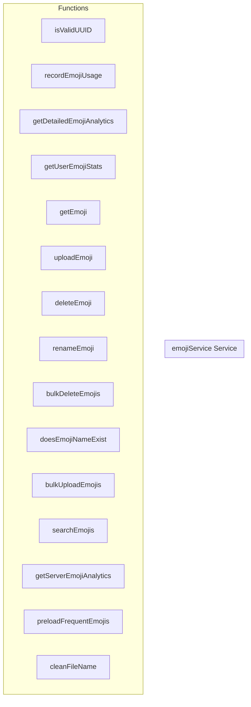

# emojiService Service

**File:** `src/services/emojiService.ts`

## Overview




## Functions

### `isValidUUID(str: string)`

No description available.

**Parameters:**
- `str: string`

**Returns:** `boolean`

```typescript
function isValidUUID(str: string): boolean
```

### `recordEmojiUsage(emojiId: string, userId: string, serverId: string, contextType: 'message' | 'reaction', contextId?: string)`

No description available.

**Parameters:**
- `emojiId: string`
- `userId: string`
- `serverId: string`
- `contextType: 'message' | 'reaction'`
- `contextId?: string`

**Returns:** `Promise&lt;void&gt;`

```typescript
async function recordEmojiUsage(
    emojiId: string, 
    userId: string, 
    serverId: string, 
    contextType: 'message' | 'reaction', 
    contextId?: string
): Promise<void>
```

### `getDetailedEmojiAnalytics(serverId: string, userId?: string, limit = 10)`

No description available.

**Parameters:**
- `serverId: string`
- `userId?: string`
- `limit = 10`

**Returns:** `void`

```typescript
async function getDetailedEmojiAnalytics(serverId: string, userId?: string, limit = 10)
```

### `getUserEmojiStats(userId: string, serverId?: string, limit = 20)`

No description available.

**Parameters:**
- `userId: string`
- `serverId?: string`
- `limit = 20`

**Returns:** `void`

```typescript
async function getUserEmojiStats(userId: string, serverId?: string, limit = 20)
```

### `getEmoji(emojiId: string, trackUsage?: {
    userId: string;
    serverId: string;
    contextType: 'message' | 'reaction';
    contextId?: string;
})`

No description available.

**Parameters:**
- `emojiId: string`
- `trackUsage?: {
    userId: string;
    serverId: string;
    contextType: 'message' | 'reaction';
    contextId?: string;
}`

**Returns:** `Promise&lt;Emoji | null&gt;`

```typescript
async function getEmoji(emojiId: string, trackUsage?: {
    userId: string;
    serverId: string;
    contextType: 'message' | 'reaction';
    contextId?: string;
}): Promise<Emoji | null>
```

### `uploadEmoji(serverId: string, userId: string, file: File)`

No description available.

**Parameters:**
- `serverId: string`
- `userId: string`
- `file: File`

**Returns:** `Promise&lt;Emoji | null&gt;`

```typescript
async function uploadEmoji(serverId: string, userId: string, file: File): Promise<Emoji | null>
```

### `deleteEmoji(emojiId: string)`

No description available.

**Parameters:**
- `emojiId: string`

**Returns:** `Promise&lt;boolean&gt;`

```typescript
async function deleteEmoji(emojiId: string): Promise<boolean>
```

### `renameEmoji(emojiId: string, newName: string, serverId: string)`

No description available.

**Parameters:**
- `emojiId: string`
- `newName: string`
- `serverId: string`

**Returns:** `Promise&lt;boolean&gt;`

```typescript
async function renameEmoji(emojiId: string, newName: string, serverId: string): Promise<boolean>
```

### `bulkDeleteEmojis(emojiIds: string[])`

No description available.

**Parameters:**
- `emojiIds: string[]`

**Returns:** `Promise&lt;`

```typescript
async function bulkDeleteEmojis(emojiIds: string[]): Promise<
```

### `doesEmojiNameExist(serverId: string, name: string)`

No description available.

**Parameters:**
- `serverId: string`
- `name: string`

**Returns:** `Promise&lt;boolean&gt;`

```typescript
async function doesEmojiNameExist(serverId: string, name: string): Promise<boolean>
```

### `bulkUploadEmojis(serverId: string, userId: string, files: File[])`

No description available.

**Parameters:**
- `serverId: string`
- `userId: string`
- `files: File[]`

**Returns:** `Promise&lt;(Emoji | null)[]&gt;`

```typescript
async function bulkUploadEmojis(serverId: string, userId: string, files: File[]): Promise<(Emoji | null)[]>
```

### `searchEmojis(query: string, options: {
    serverId?: string;
    limit?: number;
    includeServerName?: boolean;
} = {})`

No description available.

**Parameters:**
- `query: string`
- `options: {
    serverId?: string;
    limit?: number;
    includeServerName?: boolean;
} = {}`

**Returns:** `Promise&lt;any[]&gt;`

```typescript
async function searchEmojis(query: string, options: {
    serverId?: string;
    limit?: number;
    includeServerName?: boolean;
} = {}): Promise<any[]>
```

### `getServerEmojiAnalytics(serverId: string)`

No description available.

**Parameters:**
- `serverId: string`

**Returns:** `void`

```typescript
async function getServerEmojiAnalytics(serverId: string)
```

### `preloadFrequentEmojis(serverIds: string[] = [])`

No description available.

**Parameters:**
- `serverIds: string[] = []`

**Returns:** `void`

```typescript
async function preloadFrequentEmojis(serverIds: string[] = [])
```

### `cleanFileName(originalName: string)`

No description available.

**Parameters:**
- `originalName: string`

**Returns:** `Unknown`

```typescript
const cleanFileName = (originalName: string) =>
```


## Source Code Insights

**File Size:** 17863 characters
**Lines of Code:** 555
**Imports:** 5

## Usage Example

```typescript
import { emojiService } from '@/services/emojiService'

// Example usage
isValidUUID()
```

---

*This documentation was automatically generated from the source code.*