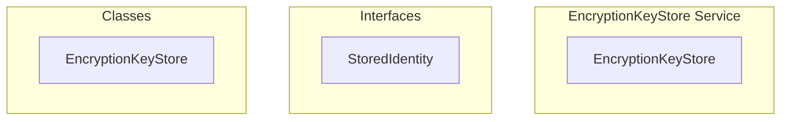

# encryption/EncryptionKeyStore Service

**File:** `src/services/encryption/EncryptionKeyStore.ts`

## Overview




## Exports

- **EncryptionKeyStore** - class export


## Classes

### EncryptionKeyStore

No description available.

**Methods:**
- `constructor`
- `initialize`
- `setEncryptionKey`
- `catch`
- `tryRestoreSessionKey`
- `clearSessionKey`
- `hasEncryptionKeyLoaded`
- `getIdentityKeyPair`
- `getLocalRegistrationId`
- `isTrustedIdentity`
- `saveIdentity`
- `loadPreKey`
- `storePreKey`
- `removePreKey`
- `loadSession`
- `storeSession`
- `loadSignedPreKey`
- `storeSignedPreKey`
- `removeSignedPreKey`
- `saveIdentityKeyPair`
- `encrypt`
- `decrypt`
- `putInStore`
- `deleteFromStore`
- `clearAllData`
- `exportBackup`
- `importBackup`
- `encryptWithPassword`
- `decryptWithPassword`
- `getAllFromStore`
- `clearAllStores`
- `hasStoredKeys`
- `close`
- `arrayBufferToBase64`
- `base64ToArrayBuffer`

**Properties:**
- `db`
- `userId`
- `encryptionKey`
- `identityKeyPair`
- `registrationId`
- `INITIALIZATION`
- `request`
- `exist`
- `keyPath`
- `sessionStore`
- `data`
- `encoder`
- `passwordData`
- `password`
- `keyMaterial`
- `name`
- `salt`
- `iterations`
- `hash`
- `it`
- `session`
- `exported`
- `keyArray`
- `keyBase64`
- `key`
- `sessionStorage`
- `false`
- `ArrayBuffer`
- `keyString`
- `i`
- `true`
- `null`
- `loaded`
- `IndexedDB`
- `IMPLEMENTATION`
- `stored`
- `undefined`
- `decrypted`
- `parsed`
- `pubKey`
- `privKey`
- `identifier`
- `identityKey`
- `direction`
- `identities`
- `verification`
- `encodedAddress`
- `Key`
- `nonblockingApproval`
- `address`
- `value`
- `timestamp`
- `loadPreKey`
- `debugging`
- `allPrekeys`
- `keyPair`
- `serialized`
- `encrypted`
- `id`
- `SessionRecordType`
- `record`
- `loadSignedPreKey`
- `allSignedPrekeys`
- `HELPERS`
- `dataBytes`
- `iv`
- `combined`
- `decoder`
- `transaction`
- `store`
- `storeNames`
- `METHODS`
- `backup`
- `saved`
- `stores`
- `version`
- `identity`
- `prekeys`
- `sessions`
- `metadata`
- `backupJson`
- `backupPassword`
- `combinedArray`
- `keys`
- `bytes`
- `binary`


## Interfaces

### StoredIdentity

No description available.

```typescript
interface StoredIdentity {

  keyPair: string // Base64 encoded encrypted data
  registrationId: number
  timestamp: number

}
```


## Constants

### DB_NAME

No description available.

```typescript
const DB_NAME = 'harmony_e2ee_keystore'
```

### DB_VERSION

No description available.

```typescript
const DB_VERSION = 1
```

### STORES

No description available.

```typescript
const STORES = {
```


## Source Code Insights

**File Size:** 23350 characters
**Lines of Code:** 788
**Imports:** 2

## Usage Example

```typescript
import { EncryptionKeyStore } from '@/services/encryption/EncryptionKeyStore'

// Example usage
// Use the exported functionality
```

---

*This documentation was automatically generated from the source code.*