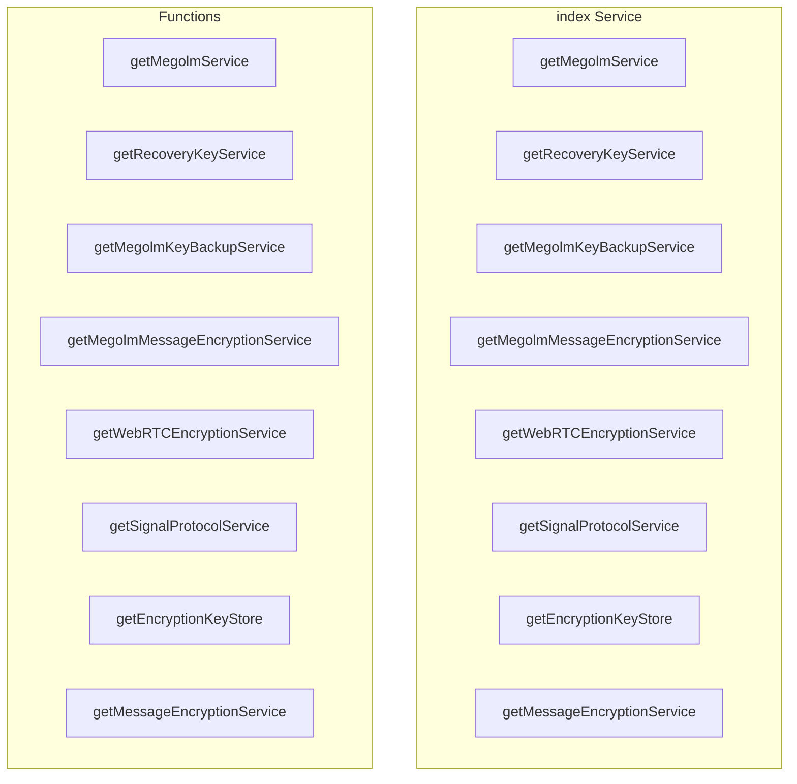

# encryption/index Service

**File:** `src/services/encryption/index.ts`

## Overview




## Exports

- **getMegolmService** - const export
- **getRecoveryKeyService** - const export
- **getMegolmKeyBackupService** - const export
- **getMegolmMessageEncryptionService** - const export
- **getWebRTCEncryptionService** - const export
- **getSignalProtocolService** - const export
- **getEncryptionKeyStore** - const export
- **getMessageEncryptionService** - const export

## Functions

### `getMegolmService()`

No description available.

**Parameters:**
None

**Returns:** `Unknown`

```typescript
export const getMegolmService = () =>
```

### `getRecoveryKeyService()`

No description available.

**Parameters:**
None

**Returns:** `Unknown`

```typescript
export const getRecoveryKeyService = () =>
```

### `getMegolmKeyBackupService()`

No description available.

**Parameters:**
None

**Returns:** `Unknown`

```typescript
export const getMegolmKeyBackupService = () =>
```

### `getMegolmMessageEncryptionService()`

No description available.

**Parameters:**
None

**Returns:** `Unknown`

```typescript
export const getMegolmMessageEncryptionService = () =>
```

### `getWebRTCEncryptionService()`

No description available.

**Parameters:**
None

**Returns:** `Unknown`

```typescript
export const getWebRTCEncryptionService = () =>
```

### `getSignalProtocolService()`

No description available.

**Parameters:**
None

**Returns:** `Unknown`

```typescript
export const getSignalProtocolService = () =>
```

### `getEncryptionKeyStore()`

No description available.

**Parameters:**
None

**Returns:** `Unknown`

```typescript
export const getEncryptionKeyStore = () =>
```

### `getMessageEncryptionService()`

No description available.

**Parameters:**
None

**Returns:** `Unknown`

```typescript
export const getMessageEncryptionService = () =>
```


## Source Code Insights

**File Size:** 3607 characters
**Lines of Code:** 94
**Imports:** 0

## Usage Example

```typescript
import { getMegolmService, getRecoveryKeyService, getMegolmKeyBackupService, getMegolmMessageEncryptionService, getWebRTCEncryptionService, getSignalProtocolService, getEncryptionKeyStore, getMessageEncryptionService } from '@/services/encryption/index'

// Example usage
getMegolmService()
```

---

*This documentation was automatically generated from the source code.*