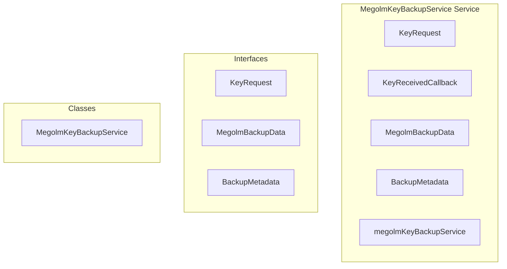

# encryption/MegolmKeyBackupService Service

**File:** `src/services/encryption/MegolmKeyBackupService.ts`

## Overview




## Exports

- **KeyRequest** - interface export
- **KeyReceivedCallback** - type export
- **MegolmBackupData** - interface export
- **BackupMetadata** - interface export
- **MegolmKeyBackupService** - class export
- **megolmKeyBackupService** - const export


## Classes

### MegolmKeyBackupService

No description available.

**Methods:**
- `constructor`
- `getInstance`
- `initialize`
- `setupRealtimeSubscriptions`
- `handleIncomingKeyRequest`
- `catch`
- `handleFulfilledRequest`
- `encryptSessionKeyForUser`
- `decryptSessionKeyForMe`
- `onKeyReceived`
- `cleanup`
- `createBackup`
- `restoreFromBackup`
- `hasBackup`
- `getBackupMetadata`
- `deleteBackup`
- `setAutoBackup`
- `triggerAutoBackup`
- `createKeyRequest`
- `getMyPendingRequests`
- `getRequestsToMe`
- `processPendingRequestsToMe`
- `cancelKeyRequest`
- `checkKeyRequestStatus`
- `getPendingKeyRequests`
- `fulfillKeyRequest`
- `calculateHash`
- `exportToFile`
- `importFromFile`

**Properties:**
- `instance`
- `userId`
- `autoBackupEnabled`
- `subscriptions`
- `incomingRequestsChannel`
- `fulfilledRequestsChannel`
- `received`
- `keyReceivedCallbacks`
- `pendingRequests`
- `INITIALIZATION`
- `requests`
- `flow`
- `have`
- `supabase`
- `event`
- `schema`
- `table`
- `filter`
- `decryption`
- `request`
- `user`
- `key`
- `session`
- `encryption`
- `data`
- `requester`
- `encryptedKey`
- `_key`
- `status`
- `encrypted_key`
- `fulfilled_at`
- `sessionKey`
- `firstKnownIndex`
- `callback`
- `recipientPublicKey`
- `encoder`
- `derivedKey`
- `name`
- `iv`
- `encrypted`
- `ciphertext`
- `combined`
- `us`
- `decrypt`
- `decrypted`
- `null`
- `OPERATIONS`
- `server`
- `MegolmService`
- `sessions`
- `backupData`
- `version`
- `timestamp`
- `backupJson`
- `encryptedBackup`
- `check`
- `hash`
- `database`
- `user_id`
- `encrypted_data`
- `session_count`
- `backup_hash`
- `last_updated`
- `onConflict`
- `backup`
- `outboundCount`
- `inboundCount`
- `integrity`
- `recovery`
- `false`
- `BackupMetadata`
- `changes`
- `enabled`
- `failed`
- `operations`
- `sender`
- `ID`
- `needed`
- `sessionId`
- `existingRequestId`
- `requestId`
- `id`
- `requester_user_id`
- `sender_user_id`
- `room_id`
- `session_id`
- `created_at`
- `made`
- `ascending`
- `me`
- `offline`
- `fulfilledCount`
- `pending`
- `break`
- `fulfilled`
- `instead`
- `encryptedForRecipient`
- `METHODS`
- `dataBytes`
- `hashArray`
- `storage`
- `exportData`
- `type`
- `json`
- `file`
- `Decrypt`
- `importData`


## Interfaces

### KeyRequest

No description available.

```typescript
interface KeyRequest {

  id: string
  requester_user_id: string
  sender_user_id: string
  room_id: string
  session_id: string
  status: 'pending' | 'fulfilled' | 'expired' | 'cancelled'
  encrypted_key?: string
  created_at: string
  fulfilled_at?: string

}
```

### MegolmBackupData

No description available.

```typescript
interface MegolmBackupData {

  version: number
  userId: string
  timestamp: number
  sessions: {
    outbound: MegolmOutboundSession[]
    inbound: MegolmInboundSession[]
  }

}
```

### BackupMetadata

No description available.

```typescript
interface BackupMetadata {

  id: string
  user_id: string
  version: number
  session_count: number
  last_updated: string
  backup_hash: string

}
```


## Source Code Insights

**File Size:** 24565 characters
**Lines of Code:** 849
**Imports:** 5

## Usage Example

```typescript
import { KeyRequest, KeyReceivedCallback, MegolmBackupData, BackupMetadata, MegolmKeyBackupService, megolmKeyBackupService } from '@/services/encryption/MegolmKeyBackupService'

// Example usage
// Use the exported functionality
```

---

*This documentation was automatically generated from the source code.*