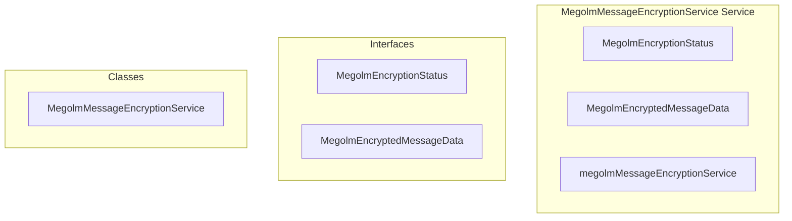

# encryption/MegolmMessageEncryptionService Service

**File:** `src/services/encryption/MegolmMessageEncryptionService.ts`

## Overview




## Exports

- **MegolmEncryptionStatus** - interface export
- **MegolmEncryptedMessageData** - interface export
- **MegolmMessageEncryptionService** - class export
- **megolmMessageEncryptionService** - const export


## Classes

### MegolmMessageEncryptionService

No description available.

**Methods:**
- `constructor`
- `getInstance`
- `initialize`
- `catch`
- `tryAutoUnlock`
- `storeSessionKeys`
- `clearLegacyStorage`
- `lockEncryption`
- `initializeWithRecoveryKey`
- `setupNewEncryption`
- `completeSetupWithWords`
- `ensureIdentityKeyPair`
- `encryptMessage`
- `decryptMessage`
- `decryptMegolmMessage`
- `ensureSessionShared`
- `encryptSessionKeyForUser`
- `encryptPrivateKeyForStorage`
- `claimPendingSessionShares`
- `decryptSessionKeyForMe`
- `getEncryptionStatus`
- `isUnlocked`
- `hasRecoveryKey`
- `backupSessions`
- `getCurrentUserId`
- `isInitialized`
- `resetEncryption`
- `cleanup`

**Properties:**
- `instance`
- `currentUserId`
- `initialized`
- `INITIALIZATION`
- `user`
- `database`
- `data`
- `MegolmMessageEncryptionService`
- `authUserId`
- `ID`
- `realtime`
- `decryption`
- `detail`
- `true`
- `session`
- `false`
- `storedKeys`
- `key`
- `result`
- `fallback`
- `storedData`
- `words`
- `derivedKeys`
- `Migrate`
- `encryptionKey`
- `backupKey`
- `signingKey`
- `phrase`
- `mnemonic`
- `exists`
- `backup`
- `failed`
- `shares`
- `claimedCount`
- `fulfilledCount`
- `requests`
- `confirms`
- `service`
- `exchange`
- `code`
- `verificationCode`
- `p_user_id`
- `p_verification_code`
- `p_word_count`
- `isUnlocked`
- `hasRecoveryKey`
- `keyPair`
- `name`
- `base64`
- `KeyRaw`
- `KeyBase64`
- `DB`
- `encryptedPrivateKey`
- `supabase`
- `user_id`
- `identity_public_key`
- `identity_private_key_encrypted`
- `device_id`
- `is_active`
- `access`
- `DECRYPTION`
- `content`
- `roomId`
- `recipientIds`
- `plaintextContent`
- `encryptedMessage`
- `shared`
- `text`
- `encryptedContent`
- `type`
- `encrypted`
- `encryption_metadata`
- `algorithm`
- `session_id`
- `message_index`
- `sender_user_id`
- `timestamp`
- `message`
- `channel_id`
- `conversation_id`
- `fields`
- `encrypted_keys`
- `sender_key_id`
- `iv`
- `metadata`
- `context`
- `keys`
- `OPTIMIZED`
- `sessionId`
- `messageIndex`
- `senderId`
- `ciphertext`
- `object`
- `PATH`
- `decryptedJson`
- `decryptedContent`
- `server`
- `claimed`
- `sender`
- `error`
- `SHARING`
- `recipients`
- `usersNeedingSession`
- `sessionData`
- `BATCH`
- `keyMap`
- `usersWithKeys`
- `usersWithoutKeys`
- `PARALLEL`
- `sharePromises`
- `encryptedSessionKey`
- `Key`
- `share`
- `room_id`
- `recipient_user_id`
- `encrypted_session_key`
- `first_known_index`
- `onConflict`
- `results`
- `successCount`
- `sessionKey`
- `recipientPublicKey`
- `derivation`
- `similar`
- `encoder`
- `derivedKey`
- `combined`
- `storage`
- `0`
- `parallel`
- `p_share_id`
- `us`
- `decrypt`
- `decrypted`
- `decoder`
- `UTILITIES`
- `status`
- `enabled`
- `hasBackup`
- `needsSetup`
- `mode`
- `Note`
- `up`
- `exist`
- `hasKey`
- `sessions`
- `logout`
- `null`


## Interfaces

### MegolmEncryptionStatus

No description available.

```typescript
interface MegolmEncryptionStatus {

  enabled: boolean
  hasRecoveryKey: boolean
  hasBackup: boolean
  needsSetup: boolean
  mode: 'disabled' | 'optional' | 'required'

}
```

### MegolmEncryptedMessageData

No description available.

```typescript
interface MegolmEncryptedMessageData {

  encrypted: true
  content: MessagePart[] // Encrypted content (base64 ciphertext in text field)
  encryption_metadata: {
    algorithm: 'megolm_v1'
    session_id: string
    message_index: number
    sender_user_id: string
    timestamp: number
  }

}
```


## Source Code Insights

**File Size:** 31308 characters
**Lines of Code:** 981
**Imports:** 7

## Usage Example

```typescript
import { MegolmEncryptionStatus, MegolmEncryptedMessageData, MegolmMessageEncryptionService, megolmMessageEncryptionService } from '@/services/encryption/MegolmMessageEncryptionService'

// Example usage
// Use the exported functionality
```

---

*This documentation was automatically generated from the source code.*