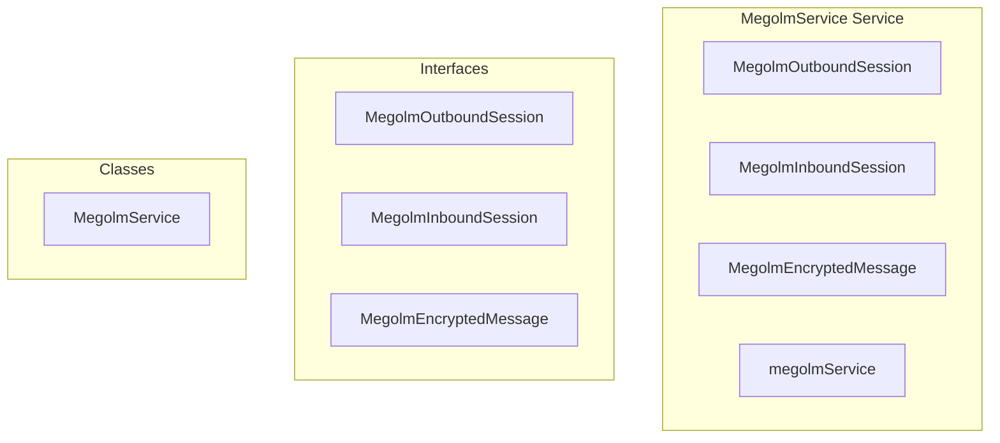

# encryption/MegolmService Service

**File:** `src/services/encryption/MegolmService.ts`

## Overview




## Exports

- **MegolmOutboundSession** - interface export
- **MegolmInboundSession** - interface export
- **MegolmEncryptedMessage** - interface export
- **MegolmService** - class export
- **megolmService** - const export


## Classes

### MegolmService

No description available.

**Methods:**
- `constructor`
- `getInstance`
- `initialize`
- `migrateOutboundToInbound`
- `openDatabase`
- `loadSessionsFromDB`
- `catch`
- `getOrCreateOutboundSession`
- `createOutboundSession`
- `shouldRotateSession`
- `incrementMessageIndex`
- `importInboundSession`
- `getInboundSession`
- `hasInboundSession`
- `findInboundSessionBySessionId`
- `getInboundSessionsForRoom`
- `encryptMessage`
- `decryptMessage`
- `deriveRatchetKey`
- `getSessionKeyForSharing`
- `markSessionSharedWith`
- `getUsersNeedingSession`
- `exportAllSessions`
- `importAllSessions`
- `saveOutboundSession`
- `saveInboundSession`
- `putInStore`
- `clearAllStores`
- `arrayBufferToBase64`
- `base64ToArrayBuffer`
- `isInitialized`
- `close`

**Properties:**
- `instance`
- `db`
- `userId`
- `encryptionKey`
- `initialized`
- `sessions`
- `outboundSessions`
- `inboundSessions`
- `INITIALIZATION`
- `MegolmService`
- `Migration`
- `copies`
- `true`
- `decrypt`
- `migratedCount`
- `key`
- `inbound`
- `sessionId`
- `roomId`
- `senderUserId`
- `sessionKey`
- `firstKnownIndex`
- `createdAt`
- `request`
- `outboundStore`
- `inboundStore`
- `keyPath`
- `decrypted`
- `session`
- `MANAGEMENT`
- `room`
- `IMPORTANT`
- `our`
- `sessionKeyBytes`
- `ID`
- `sessionIdBytes`
- `now`
- `messageIndex`
- `rotateAt`
- `sharedWith`
- `memory`
- `IndexedDB`
- `CRITICAL`
- `rotated`
- `encrypting`
- `decryption`
- `sender`
- `undefined`
- `DECRYPTION`
- `plaintext`
- `index`
- `ratchetKey`
- `message`
- `encoder`
- `plaintextBytes`
- `iv`
- `encryptedData`
- `name`
- `ciphertext`
- `combined`
- `result`
- `it`
- `old`
- `encryptedMessage`
- `inboundSession`
- `Fallback`
- `outboundSession`
- `lookups`
- `0`
- `roomSessions`
- `combinedArray`
- `Decrypt`
- `decryptedData`
- `decoder`
- `material`
- `keyMaterial`
- `info`
- `hash`
- `salt`
- `SHARING`
- `user`
- `null`
- `with`
- `allUserIds`
- `BACKUP`
- `backup`
- `storing`
- `outbound`
- `existing`
- `one`
- `MIGRATION`
- `fix`
- `inboundKey`
- `HELPERS`
- `encrypted`
- `sessionCopy`
- `field`
- `transaction`
- `store`
- `value`
- `METHODS`
- `bytes`
- `binary`
- `i`
- `false`


## Interfaces

### MegolmOutboundSession

No description available.

```typescript
interface MegolmOutboundSession {

  sessionId: string
  roomId: string // Can be channel_id or conversation_id
  sessionKey: string // Base64 encoded session key
  messageIndex: number // Current message index (ratchets forward)
  createdAt: number
  rotateAt: number // When to create a new session
  sharedWith: string[] // User IDs we've shared this session with

}
```

### MegolmInboundSession

No description available.

```typescript
interface MegolmInboundSession {

  sessionId: string
  roomId: string
  senderUserId: string
  sessionKey: string // Base64 encoded
  firstKnownIndex: number // First message index we can decrypt from
  createdAt: number

}
```

### MegolmEncryptedMessage

No description available.

```typescript
interface MegolmEncryptedMessage {

  sessionId: string
  messageIndex: number
  ciphertext: string // Base64 encoded

}
```


## Constants

### SESSION_ROTATION_MESSAGE_COUNT

No description available.

```typescript
const SESSION_ROTATION_MESSAGE_COUNT = 100 // Rotate after 100 messages
```

### SESSION_ROTATION_TIME_MS

No description available.

```typescript
const SESSION_ROTATION_TIME_MS = 7 * 24 * 60 * 60 * 1000 // Rotate after 7 days
```

### MEGOLM_DB_NAME

No description available.

```typescript
const MEGOLM_DB_NAME = 'harmony_megolm_sessions'
```

### MEGOLM_DB_VERSION

No description available.

```typescript
const MEGOLM_DB_VERSION = 1
```

### STORES

No description available.

```typescript
const STORES = {
```


## Source Code Insights

**File Size:** 28413 characters
**Lines of Code:** 833
**Imports:** 1

## Usage Example

```typescript
import { MegolmOutboundSession, MegolmInboundSession, MegolmEncryptedMessage, MegolmService, megolmService } from '@/services/encryption/MegolmService'

// Example usage
// Use the exported functionality
```

---

*This documentation was automatically generated from the source code.*