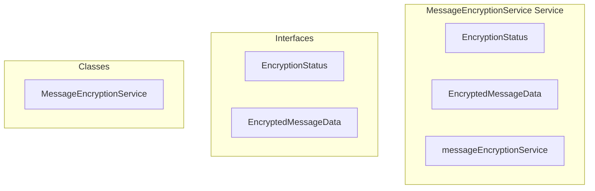

# encryption/MessageEncryptionService Service

**File:** `src/services/encryption/MessageEncryptionService.ts`

## Overview




## Exports

- **EncryptionStatus** - interface export
- **EncryptedMessageData** - interface export
- **MessageEncryptionService** - class export
- **messageEncryptionService** - const export


## Classes

### MessageEncryptionService

No description available.

**Methods:**
- `constructor`
- `getInstance`
- `initialize`
- `catch`
- `user`
- `getCurrentUserId`
- `hasEncryptionKeys`
- `setupEncryption`
- `generatePrekeys`
- `encryptMessage`
- `hasEncryptionKeyLoaded`
- `unlockEncryption`
- `needsUnlock`
- `decryptMessage`
- `encryptGroupMessage`
- `decryptGroupMessage`
- `establishSession`
- `checkServerEncryptionPolicy`
- `checkConversationEncryption`
- `enableConversationEncryption`
- `isEncryptedContent`
- `getEncryptionStatus`
- `rotatePrekeys`
- `arrayBufferToBase64`
- `base64ToArrayBuffer`
- `exportBackup`
- `importBackup`
- `hasStoredKeys`
- `resetEncryption`
- `cleanup`

**Properties:**
- `instance`
- `keyStore`
- `currentUserId`
- `initialized`
- `INITIALIZATION`
- `user`
- `key`
- `password`
- `auth_user_id`
- `data`
- `encryption`
- `found`
- `userId`
- `ID`
- `first`
- `restored`
- `provided`
- `Service`
- `true`
- `up`
- `false`
- `supabase`
- `p_user_id`
- `keys`
- `SETUP`
- `pair`
- `identityKeyPair`
- `registrationId`
- `database`
- `p_identity_public_key`
- `p_identity_private_key_encrypted`
- `p_device_id`
- `store`
- `storage`
- `keyPair`
- `pubKey`
- `privKey`
- `prekeys`
- `server`
- `conflicts`
- `failures`
- `signedPreKey`
- `Key`
- `1`
- `decryption`
- `id`
- `preKeys`
- `upsert`
- `IMPORTANT`
- `error`
- `user_id`
- `device_id`
- `prekey_id`
- `_key`
- `is_signed`
- `is_one_time`
- `signature`
- `onConflict`
- `prekey`
- `prekeyData`
- `50`
- `i`
- `batch`
- `content`
- `metadata`
- `recipientIds`
- `self`
- `hasOtherRecipients`
- `symmetricKey`
- `iv`
- `2`
- `plaintextContent`
- `encoder`
- `plaintextBuffer`
- `cryptoKey`
- `name`
- `encryptedBuffer`
- `encryptedBase64`
- `ivBase64`
- `3`
- `encryptedKeys`
- `symmetricKeyBase64`
- `case`
- `type`
- `continue`
- `recipientAddress`
- `hasSession`
- `session`
- `encryptedKey`
- `recipient`
- `others`
- `text`
- `encryptedContent`
- `encrypted`
- `encryption_metadata`
- `algorithm`
- `encrypted_for`
- `sender_key_id`
- `timestamp`
- `encrypted_keys`
- `IndexedDB`
- `identityKey`
- `loaded`
- `Protocol`
- `message`
- `senderId`
- `encryptedKeyData`
- `senderAddress`
- `address`
- `users`
- `errorMsg`
- `messages`
- `sessionError`
- `decryptedBuffer`
- `decoder`
- `decryptedJson`
- `decryptedContent`
- `failed`
- `groupId`
- `decryptMessage`
- `MANAGEMENT`
- `bundle`
- `library`
- `transformedBundle`
- `deviceId`
- `oneTimePreKey`
- `undefined`
- `CHECKING`
- `p_server_id`
- `policy`
- `enabled`
- `hasKeys`
- `needsSetup`
- `mode`
- `isEncrypted`
- `p_conversation_id`
- `encryptionEnabled`
- `conversation`
- `UTILITIES`
- `display`
- `available`
- `keyCount`
- `count`
- `rotated`
- `remaining`
- `METHODS`
- `bytes`
- `binary`
- `present`
- `normalizedBase64`
- `string`
- `RECOVERY`
- `file`
- `backup`
- `backupPassword`
- `ENCRYPTION`
- `fresh`
- `deleted`
- `null`
- `state`
- `CLEANUP`


## Interfaces

### EncryptionStatus

No description available.

```typescript
interface EncryptionStatus {

  enabled: boolean
  hasKeys: boolean
  needsSetup: boolean
  mode: 'disabled' | 'optional' | 'required' | 'required_local_only'

}
```

### EncryptedMessageData

No description available.

```typescript
interface EncryptedMessageData {

  encrypted: true
  content: MessagePart[] // Encrypted content (base64 ciphertext in text field)
  encryption_metadata: {
    algorithm: 'signal_protocol_v1_hybrid' // Hybrid: AES-GCM + Signal Protocol
    encrypted_for: string[] // User IDs this message is encrypted for
    sender_key_id: string
    timestamp: number
    encrypted_keys: Record<string, string> // Map of user_id -> encrypted symmetric key
    iv: string // Initialization vector for AES-GCM
  }

}
```


## Source Code Insights

**File Size:** 30311 characters
**Lines of Code:** 941
**Imports:** 5

## Usage Example

```typescript
import { EncryptionStatus, EncryptedMessageData, MessageEncryptionService, messageEncryptionService } from '@/services/encryption/MessageEncryptionService'

// Example usage
// Use the exported functionality
```

---

*This documentation was automatically generated from the source code.*