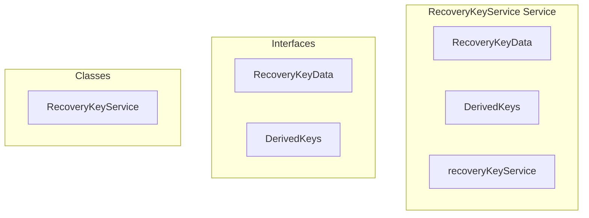

# encryption/RecoveryKeyService Service

**File:** `src/services/encryption/RecoveryKeyService.ts`

## Overview




## Exports

- **RecoveryKeyData** - interface export
- **DerivedKeys** - interface export
- **RecoveryKeyService** - class export
- **recoveryKeyService** - const export


## Classes

### RecoveryKeyService

No description available.

**Methods:**
- `constructor`
- `getInstance`
- `generateMnemonic`
- `validateMnemonic`
- `formatMnemonicForDisplay`
- `parseMnemonicInput`
- `deriveKeysFromMnemonic`
- `getEncryptionKey`
- `getBackupKey`
- `isLoaded`
- `setDerivedKeys`
- `clear`
- `encryptForBackup`
- `decryptFromBackup`
- `generateQRData`
- `parseQRData`
- `catch`
- `generateVerificationCode`
- `verifyRecoveryPhrase`
- `arrayBufferToBase64`
- `base64ToArrayBuffer`

**Properties:**
- `instance`
- `derivedKeys`
- `mnemonic`
- `GENERATION`
- `24`
- `entropy`
- `entropyBytes`
- `bits`
- `words`
- `bitString`
- `checksumBits`
- `fullBitString`
- `i`
- `wordCount`
- `index`
- `phrase`
- `false`
- `wordlist`
- `true`
- `groups`
- `input`
- `DERIVATION`
- `purposes`
- `seed`
- `mnemonicString`
- `encoder`
- `seedData`
- `PBKDF2`
- `keyMaterial`
- `name`
- `derivation`
- `salt`
- `masterBits`
- `iterations`
- `hash`
- `512`
- `key`
- `masterKey`
- `HKDF`
- `encryptionKey`
- `info`
- `backupKey`
- `signingKey`
- `null`
- `loaded`
- `keys`
- `memory`
- `ENCRYPTION`
- `dataBytes`
- `iv`
- `encrypted`
- `ciphertext`
- `combined`
- `combinedArray`
- `decrypted`
- `decoder`
- `SUPPORT`
- `structure`
- `data`
- `v`
- `m`
- `t`
- `decoded`
- `version`
- `VERIFICATION`
- `hashArray`
- `code`
- `expectedCode`
- `METHODS`
- `bytes`
- `binary`


## Interfaces

### RecoveryKeyData

No description available.

```typescript
interface RecoveryKeyData {

  mnemonic: string[] // 12 or 24 words
  version: number
  createdAt: number

}
```

### DerivedKeys

No description available.

```typescript
interface DerivedKeys {

  encryptionKey: CryptoKey // For encrypting local data
  backupKey: CryptoKey // For encrypting server backups
  signingKey: CryptoKey // For signing cross-device auth

}
```


## Constants

### WORDLIST

No description available.

```typescript
const WORDLIST = [
```


## Source Code Insights

**File Size:** 31576 characters
**Lines of Code:** 690
**Imports:** 1

## Usage Example

```typescript
import { RecoveryKeyData, DerivedKeys, RecoveryKeyService, recoveryKeyService } from '@/services/encryption/RecoveryKeyService'

// Example usage
// Use the exported functionality
```

---

*This documentation was automatically generated from the source code.*