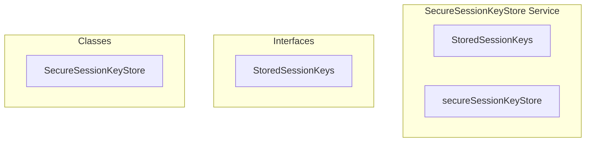

# encryption/SecureSessionKeyStore Service

**File:** `src/services/encryption/SecureSessionKeyStore.ts`

## Overview




## Exports

- **StoredSessionKeys** - interface export
- **secureSessionKeyStore** - const export


## Classes

### SecureSessionKeyStore

No description available.

**Methods:**
- `open`
- `store`
- `load`
- `clear`
- `clearAll`
- `ensureNonExtractable`
- `close`

**Properties:**
- `db`
- `request`
- `SecureSessionKeyStore`
- `keyPath`
- `keys`
- `safeKeys`
- `encryptionKey`
- `backupKey`
- `signingKey`
- `tx`
- `store`
- `storedAt`
- `result`
- `key`
- `raw`
- `null`


## Interfaces

### StoredSessionKeys

No description available.

```typescript
interface StoredSessionKeys {

  encryptionKey: CryptoKey
  backupKey: CryptoKey
  signingKey: CryptoKey

}
```


## Constants

### DB_NAME

No description available.

```typescript
const DB_NAME = 'harmony_session_keys'
```

### DB_VERSION

No description available.

```typescript
const DB_VERSION = 1
```

### STORE_NAME

No description available.

```typescript
const STORE_NAME = 'keys'
```


## Source Code Insights

**File Size:** 5233 characters
**Lines of Code:** 182
**Imports:** 1

## Usage Example

```typescript
import { StoredSessionKeys, secureSessionKeyStore } from '@/services/encryption/SecureSessionKeyStore'

// Example usage
// Use the exported functionality
```

---

*This documentation was automatically generated from the source code.*