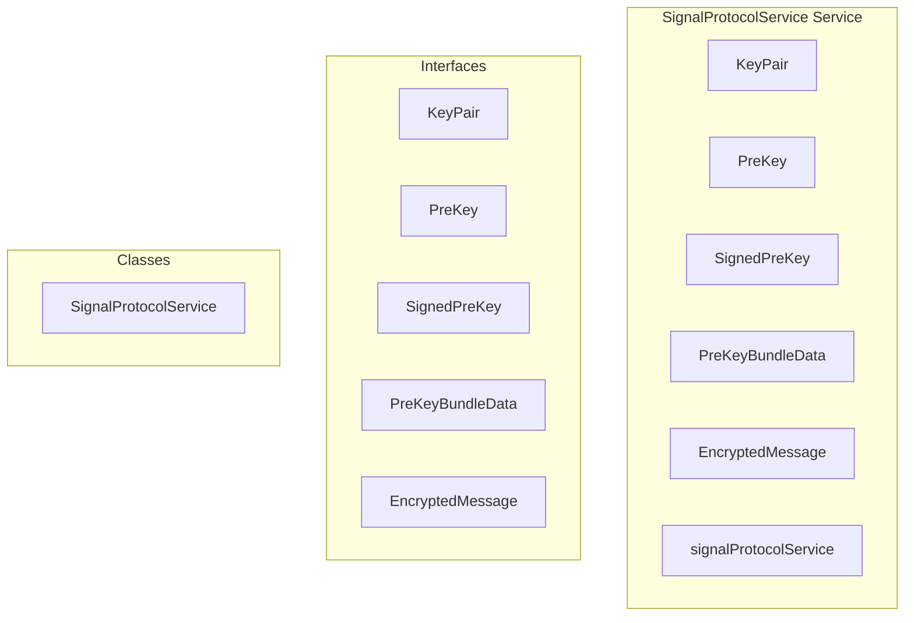

# encryption/SignalProtocolService Service

**File:** `src/services/encryption/SignalProtocolService.ts`

## Overview




## Exports

- **KeyPair** - interface export
- **PreKey** - interface export
- **SignedPreKey** - interface export
- **PreKeyBundleData** - interface export
- **EncryptedMessage** - interface export
- **SignalProtocolService** - class export
- **signalProtocolService** - const export


## Classes

### SignalProtocolService

No description available.

**Methods:**
- `constructor`
- `getInstance`
- `initialize`
- `isInitialized`
- `ensureInitialized`
- `generateIdentityKeyPair`
- `generateSignedPreKey`
- `generatePreKeys`
- `generateRegistrationId`
- `processPreKeyBundle`
- `createSessionFromPreKeyBundle`
- `key`
- `hasSession`
- `encryptMessage`
- `decryptMessage`
- `catch`
- `encodeToBase64`
- `decodeFromBase64`
- `stringToArrayBuffer`
- `arrayBufferToString`
- `binaryStringToArrayBuffer`
- `encryptGroupMessage`
- `decryptGroupMessage`

**Properties:**
- `instance`
- `keyStore`
- `initialized`
- `store`
- `true`
- `null`
- `GENERATION`
- `pair`
- `keyPair`
- `Key`
- `prekey`
- `identityKeyPair`
- `signedPreKeyId`
- `identityPrivateKey`
- `signedPreKey`
- `pubKey`
- `id`
- `signature`
- `timestamp`
- `prekeys`
- `count`
- `preKeys`
- `i`
- `preKey`
- `ID`
- `MANAGEMENT`
- `recipientAddress`
- `bundle`
- `address`
- `sessionBuilder`
- `library`
- `registrationId`
- `identityKey`
- `keyId`
- `undefined`
- `recipient`
- `sessionRecord`
- `DECRYPTION`
- `plaintext`
- `sessionCipher`
- `ciphertext`
- `bodyBuffer`
- `body`
- `type`
- `sender`
- `senderAddress`
- `encryptedMessage`
- `SignalProtocol`
- `messageBody`
- `error`
- `METHODS`
- `bytes`
- `binary`
- `data`
- `encoder`
- `decoder`
- `buffer`
- `0xff`
- `1`
- `message`
- `Note`
- `performance`
- `groupId`
- `senderId`
- `distribution`
- `encryptedBody`
- `placeholder`


## Interfaces

### KeyPair

No description available.

```typescript
interface KeyPair {

  publicKey: string // Base64 encoded
  privateKey: string // Base64 encoded

}
```

### PreKey

No description available.

```typescript
interface PreKey {

  id: number
  keyPair: KeyPair

}
```

### SignedPreKey

No description available.

```typescript
interface SignedPreKey {

  signature: string // Base64 encoded
  timestamp: number

}
```

### PreKeyBundleData

No description available.

```typescript
interface PreKeyBundleData {

  identityKey: string // Base64 encoded public key
  registrationId: number
  deviceId: number
  signedPreKey: {
    id: number
    publicKey: string
    signature: string
  }
  oneTimePreKey?: {
    id: number
    publicKey: string
  }

}
```

### EncryptedMessage

No description available.

```typescript
interface EncryptedMessage {

  type: 'prekey' | 'message'
  body: string // Base64 encoded ciphertext
  registrationId: number

}
```


## Source Code Insights

**File Size:** 12213 characters
**Lines of Code:** 401
**Imports:** 3

## Usage Example

```typescript
import { KeyPair, PreKey, SignedPreKey, PreKeyBundleData, EncryptedMessage, SignalProtocolService, signalProtocolService } from '@/services/encryption/SignalProtocolService'

// Example usage
// Use the exported functionality
```

---

*This documentation was automatically generated from the source code.*