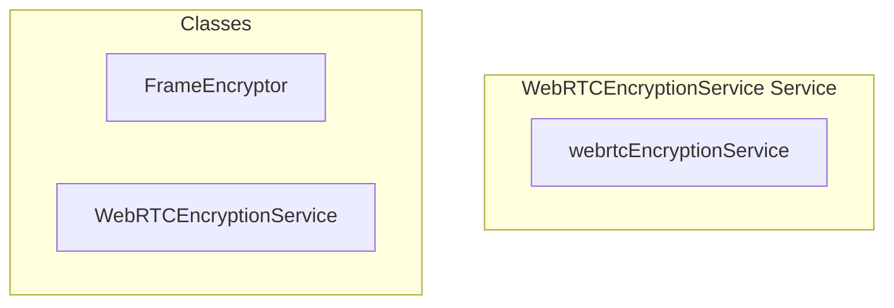

# encryption/WebRTCEncryptionService Service

**File:** `src/services/encryption/WebRTCEncryptionService.ts`

## Overview




## Exports

- **WebRTCEncryptionService** - class export
- **webrtcEncryptionService** - const export


## Classes

### FrameEncryptor

No description available.

**Methods:**
- `initialize`
- `encrypt`
- `catch`
- `decrypt`
- `reset`

**Properties:**
- `key`
- `counter`
- `encryption`
- `name`
- `0`
- `iv`
- `counterBytes`
- `data`
- `encrypted`
- `frame`
- `result`
- `failed`
- `decrypted`
- `fails`
- `encryptedFrame`

### WebRTCEncryptionService

No description available.

**Methods:**
- `constructor`
- `getInstance`
- `initialize`
- `initializeParticipant`
- `catch`
- `setupTemporaryKey`
- `deriveKeyMaterial`
- `encryptSender`
- `decryptReceiver`
- `setupPeerConnectionEncryption`
- `addParticipant`
- `removeParticipant`
- `isEnabled`
- `isSupported`
- `getStatus`
- `cleanup`
- `renegotiateKeys`

**Properties:**
- `instance`
- `encryptors`
- `decryptors`
- `enabled`
- `currentUserId`
- `INITIALIZATION`
- `call`
- `participantIds`
- `userId`
- `true`
- `Protocol`
- `participant`
- `one`
- `sessionAddress`
- `session`
- `hasSession`
- `messageEncryptionService`
- `key`
- `keyDerivationData`
- `encryptedKey`
- `signaling`
- `keyMaterial`
- `sending`
- `encryptor`
- `receiving`
- `decryptor`
- `string`
- `encoder`
- `dataBuffer`
- `baseKey`
- `name`
- `salt`
- `iterations`
- `hash`
- `256`
- `INTEGRATION`
- `receiverId`
- `supported`
- `streams`
- `encryption`
- `transformStream`
- `transform`
- `data`
- `frame`
- `encrypted`
- `error`
- `readable`
- `senderId`
- `decryption`
- `decrypted`
- `connection`
- `peerConnection`
- `remoteUserId`
- `ready`
- `senders`
- `receivers`
- `MANAGEMENT`
- `UTILITIES`
- `Streams`
- `prototype`
- `false`
- `status`
- `participantCount`
- `participants`
- `CLEANUP`
- `null`
- `keys`


## Source Code Insights

**File Size:** 14897 characters
**Lines of Code:** 515
**Imports:** 3

## Usage Example

```typescript
import { WebRTCEncryptionService, webrtcEncryptionService } from '@/services/encryption/WebRTCEncryptionService'

// Example usage
// Use the exported functionality
```

---

*This documentation was automatically generated from the source code.*