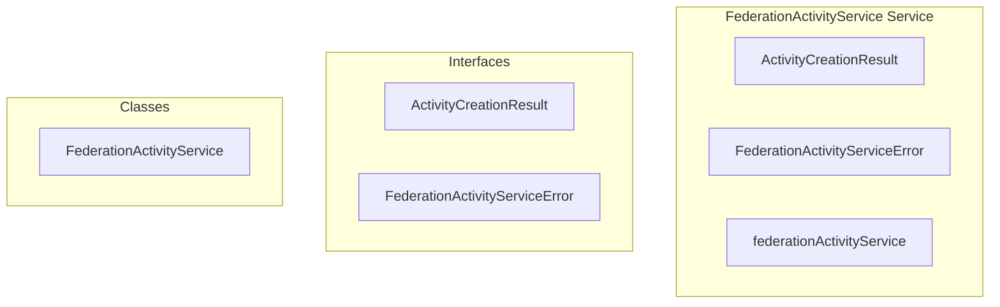

# federation/FederationActivityService Service

**File:** `src/services/federation/FederationActivityService.ts`

## Overview




## Exports

- **ActivityCreationResult** - interface export
- **FederationActivityServiceError** - interface export
- **FederationActivityService** - class export
- **federationActivityService** - const export


## Classes

### FederationActivityService

No description available.

**Methods:**
- `getInstance`
- `createMessageReactionActivity`
- `catch`
- `createPostReactionActivity`
- `createPostActivity`
- `switch`
- `createFollowActivity`
- `createProfileUpdateActivity`
- `buildReactionActivityData`
- `buildPostReactionActivityData`
- `buildPostActivityData`
- `buildFollowActivityData`
- `buildProfileUpdateActivityData`
- `getMessageData`
- `getPostData`
- `getEmojiData`
- `getActorData`
- `getInstanceDomain`
- `getAudienceForVisibility`
- `createError`

**Properties:**
- `instance`
- `messageId`
- `emojiId`
- `userId`
- `operation`
- `Federation`
- `data`
- `messageData`
- `emojiData`
- `actorData`
- `success`
- `type`
- `instanceDomain`
- `activityId`
- `activityType`
- `functions`
- `activityData`
- `actor`
- `supabase`
- `ap_id`
- `ap_type`
- `actor_id`
- `actor_ap_id`
- `object_id`
- `object_type`
- `activity_data`
- `status`
- `is_local`
- `created_at`
- `reactions`
- `postId`
- `postData`
- `table`
- `break`
- `default`
- `activity`
- `followerId`
- `targetUserId`
- `targetData`
- `target`
- `ID`
- `params`
- `id`
- `object`
- `published`
- `content`
- `tag`
- `name`
- `icon`
- `url`
- `support`
- `noteObject`
- `attributedTo`
- `to`
- `cc`
- `preferredUsername`
- `summary`
- `image`
- `inbox`
- `outbox`
- `Key`
- `owner`
- `KeyPem`
- `null`
- `fallback`
- `FIXED`
- `domain`
- `followers`
- `message`
- `secureDetails`
- `details`


## Interfaces

### ActivityCreationResult

No description available.

```typescript
interface ActivityCreationResult {

  success: boolean
  activityId?: string
  error?: string

}
```

### FederationActivityServiceError

No description available.

```typescript
interface FederationActivityServiceError {

  code: string
  message: string
  details?: any

}
```


## Source Code Insights

**File Size:** 21613 characters
**Lines of Code:** 692
**Imports:** 2

## Usage Example

```typescript
import { ActivityCreationResult, FederationActivityServiceError, FederationActivityService, federationActivityService } from '@/services/federation/FederationActivityService'

// Example usage
// Use the exported functionality
```

---

*This documentation was automatically generated from the source code.*