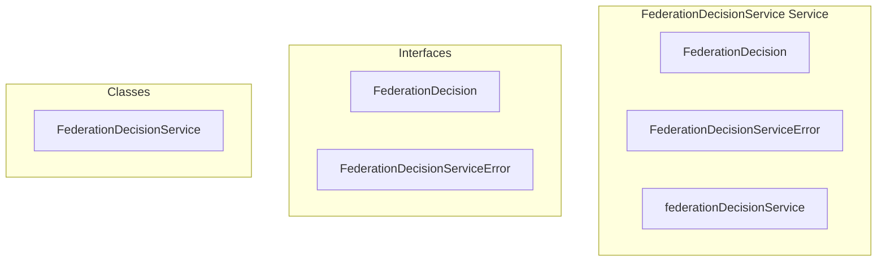

# federation/FederationDecisionService Service

**File:** `src/services/federation/FederationDecisionService.ts`

## Overview




## Exports

- **FederationDecision** - interface export
- **FederationDecisionServiceError** - interface export
- **FederationDecisionService** - class export
- **federationDecisionService** - const export


## Classes

### FederationDecisionService

No description available.

**Methods:**
- `getInstance`
- `shouldFederateReaction`
- `catch`
- `shouldFederatePostReaction`
- `shouldFederatePost`
- `shouldFederateFollow`
- `shouldFederateProfileUpdate`
- `checkUserFederationEnabled`
- `checkInstanceFederationEnabled`
- `getMessageType`
- `checkPostFederationEligible`
- `createError`

**Properties:**
- `instance`
- `userId`
- `Federation`
- `settings`
- `userDecision`
- `instanceDecision`
- `messageType`
- `shouldFederate`
- `reason`
- `federationType`
- `type`
- `federated`
- `eligibility`
- `postDecision`
- `pass`
- `DECISIONS`
- `operation`
- `data`
- `posts`
- `federate`
- `targetUserId`
- `followerDecision`
- `user`
- `supabase`
- `user_id`
- `level`
- `federationEnabled`
- `decisions`
- `DM`
- `Chat`
- `federation`
- `message`
- `secureDetails`
- `details`


## Interfaces

### FederationDecision

No description available.

```typescript
interface FederationDecision {

  shouldFederate: boolean
  reason: string
  federationType?: 'dm' | 'post' | 'follow' | 'reaction'

}
```

### FederationDecisionServiceError

No description available.

```typescript
interface FederationDecisionServiceError {

  code: string
  message: string
  details?: any

}
```


## Source Code Insights

**File Size:** 14532 characters
**Lines of Code:** 496
**Imports:** 2

## Usage Example

```typescript
import { FederationDecision, FederationDecisionServiceError, FederationDecisionService, federationDecisionService } from '@/services/federation/FederationDecisionService'

// Example usage
// Use the exported functionality
```

---

*This documentation was automatically generated from the source code.*