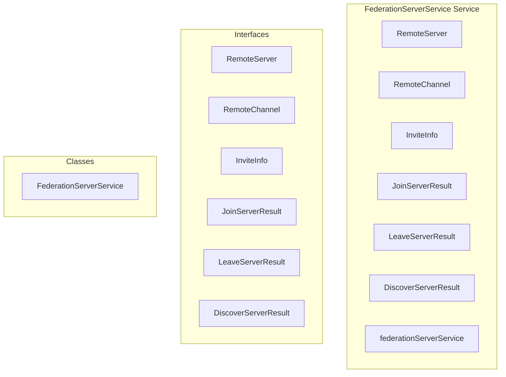

# federation/FederationServerService Service

**File:** `src/services/federation/FederationServerService.ts`

## Overview




## Exports

- **RemoteServer** - interface export
- **RemoteChannel** - interface export
- **InviteInfo** - interface export
- **JoinServerResult** - interface export
- **LeaveServerResult** - interface export
- **DiscoverServerResult** - interface export
- **FederationServerService** - class export
- **federationServerService** - const export


## Classes

### FederationServerService

No description available.

**Methods:**
- `constructor`
- `getInstance`
- `discoverServer`
- `catch`
- `resolveInviteLink`
- `joinServer`
- `leaveServer`
- `syncServer`
- `isRemoteServer`
- `parseServerHandle`

**Properties:**
- `instance`
- `SERVER`
- `link`
- `formats`
- `handle`
- `Discovering`
- `inviteMatch`
- `discovery`
- `params`
- `response`
- `method`
- `headers`
- `errorData`
- `success`
- `error`
- `data`
- `URL`
- `serverInstance`
- `server`
- `id`
- `name`
- `description`
- `icon`
- `memberCount`
- `channels`
- `inbox`
- `discoverable`
- `LINK`
- `issues`
- `domain`
- `code`
- `fullUrl`
- `invite`
- `body`
- `expiresAt`
- `maxUses`
- `uses`
- `createdBy`
- `to`
- `ID`
- `servers`
- `serverUrl`
- `userId`
- `inviteCode`
- `status`
- `serverId`
- `defaultChannelId`
- `HELPER`
- `check`
- `localDomain`
- `serverDomain`
- `false`
- `components`
- `Format`
- `url`
- `format`
- `match`


## Interfaces

### RemoteServer

No description available.

```typescript
interface RemoteServer {

  id: string
  name: string
  description: string
  icon?: string
  memberCount: number
  channels: RemoteChannel[]
  inbox: string
  discoverable: boolean
  instance: string

}
```

### RemoteChannel

No description available.

```typescript
interface RemoteChannel {

  id: string
  name: string
  type: 'text' | 'voice'

}
```

### InviteInfo

No description available.

```typescript
interface InviteInfo {

  code: string
  server: RemoteServer
  expiresAt?: string
  maxUses?: number
  uses?: number
  createdBy?: {
    username: string
    displayName?: string
    avatar?: string
  }

}
```

### JoinServerResult

No description available.

```typescript
interface JoinServerResult {

  success: boolean
  serverId?: string
  defaultChannelId?: string
  status?: 'pending' | 'accepted' | 'rejected'
  error?: string

}
```

### LeaveServerResult

No description available.

```typescript
interface LeaveServerResult {

  success: boolean
  error?: string

}
```

### DiscoverServerResult

No description available.

```typescript
interface DiscoverServerResult {

  success: boolean
  server?: RemoteServer
  invite?: InviteInfo
  isInvite?: boolean
  error?: string

}
```


## Constants

### FEDERATION_API

No description available.

```typescript
const FEDERATION_API = '/api/federation'
```


## Source Code Insights

**File Size:** 12483 characters
**Lines of Code:** 465
**Imports:** 1

## Usage Example

```typescript
import { RemoteServer, RemoteChannel, InviteInfo, JoinServerResult, LeaveServerResult, DiscoverServerResult, FederationServerService, federationServerService } from '@/services/federation/FederationServerService'

// Example usage
// Use the exported functionality
```

---

*This documentation was automatically generated from the source code.*